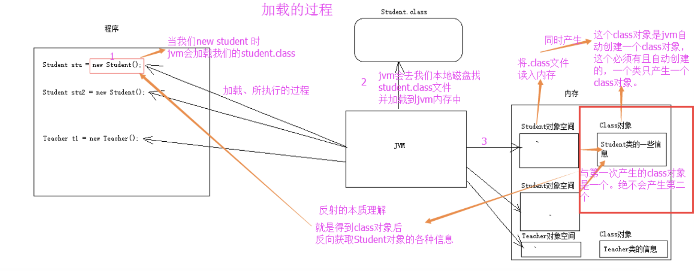

现在是暂时把Java相关的都记在这里，以后肯定会有冗余难以查找的问题，但现在暂时还没想好怎么给这些词条分类，不过之后一定会fix这个问题。

### 在Java中新建一个可变长的String型字符串(List)
```
List<StringBuilder> rows = new ArrayList<>();
List<String> lst = new ArrayList<>();
```
> int型List的写法是List<Integer>而非List<int>  
> List<Integer>、Integer[]、int[]是可以相互转换的，可以参考[cnblog_会偷袭的猫](https://www.cnblogs.com/cat520/p/10299879.html)，要求java8+
> 常见的list和array的转换是 `l = Arrays.asList(a)`和`a = l.toArray(new String[l.size()]);`
> Arrays.asList(T... a)是一个可变参数的方法，详见“Java可变参数”

### Java中List是不支持List[i]的写法的
```
// 读操作请使用get()
c = l.get(i);

// 写操作请使用set()
l.set(i, val);
```

### String, StringBuffer, StringBuilder的区别
String是字符串的常量，StringBuild和StringBuffer是字符串变量，变量的更改只需修改指针，因此速度要快得多。
> String看上去是可以修改的，但实际上修改过程中Java是新建了一个String对象并回收旧对象，导致速度会变慢

StringBuilder是线程不安全的，StringBuffer是线程安全的，同时因此StringBuilder也是速度最快的

### Java的一行式判断  
```
条件 ? 是 : 否 
// x>y ? x : y;  

if (条件) 执行语句
// if (x>y) x = y+1;
```

### Java中的"for i in list"  
```
for(变量 : 集合) 语句
// for (int i : list) System.out.print(i)
// for (char c : s.toCharArray()) {...}
```

### 匿名数组  
```
new int[] {1, 2, 3, 4, 5}
// String x = Arrays.toString(new int[] {1, 2});
```

### 生成一个类似[1,2,3,4,...,100]的数组  
```
List<Integer> range = IntStream.range(start, end).boxed().collect(Collectors.toList());  
```
> 我吐了，python里list(range(start, end))放在java里能这么费劲


### 遍历string的每个char  
```
for (char c : s.toCharArray()) {
	...
}
```

### Java基本数据类型的相互转换  
```
目标数据类型.valueOf(变量);
// Integer.valueOf(s);
// String.valueOf(1.23);
```

### 字符串的切分  
```
s.substring(i,j)
```

### 二维数组  
```
List<List<Integer>> mtx = new ArrayList();
```

### 数组排序  
```
Arrays.sort(nums);
```

### 获取一个对象的类型  
```
obj.getClass() //获取对象的类，返回值是class类型
obj.getClass().getTypeName() //获取类名，String类型
```
> class类型是java.lang.Class类的对象，java.lang.Class类是用来代表一个运行中的程序的类和接口的（java.lang.Class is used to represent classes and interfaces in a running Java program. ——[官方文档](https://www.oracle.com/technical-resources/articles/java/javareflection.html)）,该类的更多信息详见`Java反射`   

### 关键字 final   
1. 用于修饰类：当用final修饰一个类时，表明这个类不能被继承。
2. 用于修饰方法：用于禁止该方法在子类中被覆盖。
3. 用于修饰变量：对于一个final变量，如果是基本数据类型的变量，则其数值一旦在初始化之后便不能更改；如果是引用类型的变量，则在对其初始化之后便不能再让其指向另一个对象。

### 包（package）
> 为了更好地组织类，Java提供了包机制，用于区别类名的命名空间。  

包的作用  
1. 把功能相似或相关的类或接口组织在同一个包中，方便类的查找和使用。    
2. 如同文件夹一样，包也采用了树形目录的存储方式。同一个包中的类名字是不同的，不同的包中的类的名字是可以相同的，当同时调用两个不同包中相同类名的类时，应该加上包名加以区别。因此，包可以避免名字冲突。  
3. 包也限定了访问权限，拥有包访问权限的类才能访问某个包中的类。  

### 抽象类（abstract）   
在面向对象的概念中，**所有的对象都是通过类来描绘的**，但是反过来，**并不是所有的类都是用来描绘对象的**，如果一个类中没有包含足够的信息来描绘一个具体的对象，这样的类就是**抽象类**。  
> 
- 抽象类除了不能实例化对象之外，类的其它功能依然存在，成员变量、成员方法和构造方法的访问方式和普通类一样。   
- 由于抽象类不能实例化对象，所以抽象类必须被继承，才能被使用。也是因为这个原因，通常在设计阶段决定要不要设计抽象类。    
- 父类包含了子类集合的常见的方法，但是由于父类本身是抽象的，所以不能使用这些方法。

### 反射（Java Reflection）  
oracle官方的描述：  
> Reflection is a feature in the Java programming language. It allows an executing Java program to examine or "introspect" upon itself, and manipulate internal properties of the program. For example, it's possible for a Java class to obtain the names of all its members and display them.  
> 意思是：反射是Java编程语言的一个特性，它允许一个正在运行的Java程序去检查或者“intro-spect”它自己，并且操作程序的内部属性。比如，一个Java的类可以获取所有它的对象并展示它们。

[官方](https://www.oracle.com/technical-resources/articles/java/javareflection.html)给出了这样一段例程：
```
import java.lang.reflect.*;
 
   public class DumpMethods {
      public static void main(String args[])
      {
         try {
            Class c = Class.forName(args[0]);
            Method m[] = c.getDeclaredMethods();
            for (int i = 0; i < m.length; i++)
            System.out.println(m[i].toString());
         }
         catch (Throwable e) {
            System.err.println(e);
         }
      }
   }
```   
传入参数`java.util.Stack`后得到结果：   
```
public java.lang.Object java.util.Stack.push(java.lang.Object)
public synchronized java.lang.Object java.util.Stack.pop()
public synchronized java.lang.Object java.util.Stack.peek()
public boolean java.util.Stack.empty()
public synchronized int java.util.Stack.search(java.lang.Object)
```

`java.util.Stack`类的方法一并它们的参数和返回类型都被列了出来

在这个过程中，显然java.util.Stack是不会被事先编译的，因此也不存在与于代码段中，所以Java需要反射机制来处理这种情况。对于Java反射机制的具体流程，博主[敬业的小码哥](https://blog.csdn.net/sinat_38259539/article/details/71799078)给出了这样的一张流程图：  
   
  

这张图很清晰明了地解释了反射的流程，但这张图也是存在一些小问题的，例如new student()这种构造函数理论上不会激发Java的反射机制。  
官方文档中，说明了如果需要使用类似上述代码中Method这样的反射类（reflection class），有三步流程必须遵守：
1. 获取你想操作的类的`java.lang.Class`对象（obtain a java.lang.Class object for the class that you want to manipulate.）
2. 调用一个类似`getDeclaredMethods`的方法（call a method such as getDeclaredMethods, to get a list of all the methods declared by the class.）
3. 当所需的信息已经到手，接下来的第三步就是反射API区操作信息（Once this information is in hand, then the third step is to use the reflection API to manipulate the information.）

显然，这种机制只会在特定的情况下被激发，官方文档中列举出了[常见的情况](https://www.oracle.com/technical-resources/articles/java/javareflection.html)，也可以查看中文博主[sczyh30](https://www.sczyh30.com/)总结的8种[反射的主要用途](https://www.sczyh30.com/posts/Java/java-reflection-1/)

> 我们在使用 IDE(如 Eclipse，IDEA)时，当我们输入一个对象或类并想调用它的属性或方法时，一按点号，编译器就会自动列出它的属性或方法，这里用到的就是反射。

### @注解  
**Java注解**（Annotation）又称 **Java标注**，是 JDK5.0 引入的一种**注释机制**。  
Java 语言中的类、方法、变量、参数和包等都可以被标注。和Javadoc不同，Java标注可以通过反射获取标注内容。在编译器生成类文件时，标注可以被嵌入到字节码中。Java 虚拟机可以保留标注内容，在运行时可以获取到标注内容。  
> 
Java 定义了一套注解，共有7个，3个在 java.lang 中，剩下4个在 java.lang.annotation 中。  
> 
- \@Override - 检查该方法是否是重写方法。如果发现其父类，或者是引用的接口中并没有该方法时，会报编译错误。
- \@Deprecated - 标记过时方法。如果使用该方法，会报编译警告。
- \@SuppressWarnings - 指示编译器去忽略注解中声明的警告。
> 
作用在其他注解的注解(或者说 元注解)是:  
> 
- \@Retention - 标识这个注解怎么保存，是只在代码中，还是编入class文件中，或者是在运行时可以通过反射访问。
- \@Documented - 标记这些注解是否包含在用户文档中。
- \@Target - 标记这个注解应该是哪种 Java 成员。
- \@Inherited - 标记这个注解是继承于哪个注解类(默认 注解并没有继承于任何子类)
> 
从 Java 7 开始，额外添加了 3 个注解:  
> 
- \@SafeVarargs - Java 7 开始支持，忽略任何使用参数为泛型变量的方法或构造函数调用产生的警告。
- \@FunctionalInterface - Java 8 开始支持，标识一个匿名函数或函数式接口。
- \@Repeatable - Java 8 开始支持，标识某注解可以在同一个声明上使用多次。

> 我也不知道为什么转义符在这个解释器里会被显示出来= =

### 编写一个完美的equals()方法的建议

出自Java核心技术 第一卷：基础知识）

1. 显式参数命名为otherObject,稍后需要将它转换成另一个叫做other的变量（参数名命名，强制转换请参考建议5）

2. 检测this与otherObject是否引用同一个对象 ：if(this == otherObject) return true;（存储地址相同，肯定是同个对象，直接返回true）

3. 检测otherObject是否为null ，如果为null,返回false.if(otherObject == null) return false;

4. 比较this与otherObject是否属于同一个类 （视需求而选择）

> 如果equals的语义在每个子类中有所改变，就使用getClass检测 ：if(getClass()!=otherObject.getClass()) return false; (参考前面分析的第6点)

> 如果所有的子类都拥有统一的语义，就使用instanceof检测 ：if(!(otherObject instanceof ClassName)) return false;（即前面我们所分析的父类car与子类bigCar混合比，我们统一了批次相同即相等）

5. 将otherObject转换为相应的类类型变量：ClassName other = (ClassName) otherObject;

6. 现在开始对所有需要比较的域进行比较 。使用==比较基本类型域，使用equals比较对象域。如果所有的域都匹配，就返回true，否则就返回flase。

> 如果在子类中重新定义equals，就要在其中包含调用super.equals(other)

> 当此方法被重写时，通常有必要重写 hashCode 方法，以维护 hashCode 方法的常规协定，该协定声明 相等对象必须具有相等的哈希码 。

### Java序列化

- 序列化：将对象写入到IO流中
- 反序列化：从IO流中恢复对象
- 意义：序列化机制允许将实现序列化的Java对象转换位字节序列，这些字节序列可以保存在磁盘上，或通过网络传输，以达到以后恢复成原来的对象。序列化机制使得对象可以脱离程序的运行而独立存在。
- 使用场景：所有可在网络上传输的对象都必须是可序列化的，比如RMI（remote method invoke,即远程方法调用），传入的参数或返回的对象都是可序列化的，否则会出错；所有需要保存到磁盘的java对象都必须是可序列化的。通常建议：程序创建的每个JavaBean类都实现Serializeable接口。

### this关键字

this关键字用于引用类的当前实例

### x = new Integer(1) 和 Integer x = 1  

`Integer x = 1`左边被赋值的是包装类，右边是基础类，因此是装箱；  
`x = new Integer(1)`是调用Integer构造函数  
因此 `new Integer(1) == new Integer(1)` 是false；  
`Integer x = 1; Integer y = 1; x == y` 是true；  
> true的原因参考[Java语法糖](https://crazysyaoran.github.io/blog/java-syntactic-sugar/)

### 委派模式

委派模式（Delegate）是面向对象设计模式中常用的一种模式。这种模式的原理为类B和类A是两个互相没有任何关系的类，B具有和A一模一样的方法和属性；并且调用B中的方法，属性就是调用A中同名的方法和属性。B好像就是一个受A授权委托的中介。第三方的代码不需要知道A的存在，也不需要和A发生直接的联系，通过B就可以直接使用A的功能

### 适配器模式

适配器模式把一个类的接口变换成客户端所期待的另一种接口，从而使原本因接口不匹配而无法在一起工作的两个类能够在一起工作。  
> 用电器做例子，笔记本电脑的插头一般都是三相的，即除了阳极、阴极外，还有一个地极。而有些地方的电源插座却只有两极，没有地极。电源插座与笔记本电脑的电源插头不匹配使得笔记本电脑无法使用。这时候一个三相到两相的转换器（适配器）就能解决此问题，而这正像是本模式所做的事情。

具体可以分为用继承关系连接的**类的适配器模式**和委派关系连接的**对象的适配器模式**

用继承关系连接的**类的适配器模式**：
```
public interface Target {
    
    // 这是源类Adaptee也有的方法
    public void sampleOperation1(); 
    
    // 这是源类Adapteee没有的方法
    public void sampleOperation2(); 
    }
}

    /**
    * 上面给出的是目标角色的源代码，这个角色是以一个JAVA接口的形式实现的。
    * 可以看出，这个接口声明了两个方法：sampleOperation1()和sampleOperation2()。
    * 而源角色Adaptee是一个具体类，它有一个sampleOperation1()方法，但是没有sampleOperation2()方法。
    */

public class Adaptee {
    public void sampleOperation1(){}
}

public class Adapter extends Adaptee implements Target {
    /**
     * 由于源类Adaptee没有方法sampleOperation2()
     * 因此适配器补充上这个方法
     */
    @Override
    public void sampleOperation2() {
        //写相关的代码
    }
}

    /**
    * 适配器角色Adapter扩展了Adaptee,同时又实现了目标(Target)接口。
    * 由于Adaptee没有提供sampleOperation2()方法，而目标接口又要求这个方法，因此适配器角色Adapter实现了这个方法。
    */
```

用委派关系连接的**对象的适配器模式**
```
public interface Target {
    /**
     * 这是源类Adaptee也有的方法
     */
    public void sampleOperation1(); 
    /**
     * 这是源类Adapteee没有的方法
     */
    public void sampleOperation2(); 
}

public class Adaptee {

    public void sampleOperation1(){}
    
}

public class Adapter {
    private Adaptee adaptee;
    
    public Adapter(Adaptee adaptee){
        this.adaptee = adaptee;
    }
    /**
     * 源类Adaptee有方法sampleOperation1
     * 因此适配器类直接委派即可
     */
    public void sampleOperation1(){
        this.adaptee.sampleOperation1();
    }
    /**
     * 源类Adaptee没有方法sampleOperation2
     * 因此由适配器类需要补充此方法
     */
    public void sampleOperation2(){
        //写相关的代码
    }
}

```

### Java 8 Stream

Stream可以让你以一种声明的方式处理数据，Stream 使用一种类似用 SQL 语句从数据库查询数据的直观方式来提供一种对 Java 集合运算和表达的高阶抽象。

```
int sum = widgets.stream()
            .filter(w -> w.getColor() == RED)
            .mapToInt(w -> w.getWeight())
            .sum();
```
具体支持的操作参见[菜鸟教程](https://www.runoob.com/java/java8-streams.html)和[官方文档](https://docs.oracle.com/javase/8/docs/api/java/util/stream/package-summary.html)


### Java 8 Lambda 表达式

Lambda 表达式，也称为闭包，它允许把函数作为一个方法的参数进行传递

其表达格式如下：  
```
(parameters) -> expression
```
或  
```
(parameters) -> { statements; }
```

### 标识接口

标识接口是没有任何方法和属性的接口.它仅仅表明它的类属于一个特定的类型,供其他代码来测试允许做一些事情。
> 一些容器例如Ejb容器,servlet容器或运行时环境依赖标记接口识别类是否需要进行某种处理,比如serialialbe接口标记类需要进行序列化操作.  

- java.io.Serializable  
未实现此接口的类将无法使其任何状态序列化或反序列化.为保证 serialVersionUID 值跨不同 java 编译器实现的一致性,序列化类必须声明一个明确的 serialVersionUID 值.

- java.lang.Cloneable  
表明Object.clone()方法可以合法地对该类实例进行按字段复制.实现此接口的类应该使用公共方法重写 Object.clone（它是受保护的）.如果在没有实现 Cloneable 接口的实例上调用 Object 的 clone 方法,则会导致抛出 CloneNotSupportedException 异常.

- java.util.RandomAccess  
用来表明其支持快速（通常是固定时间）随机访问.此接口的主要目的是允许一般的算法更改其行为,从而在将其应用到随机或连续访问列表时能提供良好的性能.

- java.rmi.Remote：   
Remote接口用于标识其方法可以从非本地虚拟机上调用的接口.任何远程对象都必须直接或间接实现此接口.只有在“远程接口”（扩展 java.rmi.Remote 的接口）中指定的这些方法才可远程使用.


### length，length()和size()

- java 中的length 属性是针对数组说的,比如说你声明了一个数组,想知道这个数组的长度则用到了 length 这个属性.
- java 中的length()方法是针对字 符串String说的,如果想看这个字符串的长度则用到 length()这个方法.
- java 中的size()方法是针对泛型集合说的,如果想看这个泛型有多少个元素,就调用此方法来查看!


### throw 与 throws

今天写spring的时候看到了这种写法：
```
public static void function() throws Exception{
		XXX
```
我就没整明白这个XXX的执行情况是什么样的，这个居然连菜鸟教程上也没认真说清楚。

实际上java中throw和throws关键字并不一样：

- throws出现在方法函数头；而throw出现在函数体。
- throws表示出现异常的一种可能性，并不一定会发生这些异常；throw则是抛出了异常，执行throw则一定抛出了某种异常对象。
- 两者都是消极处理异常的方式（这里的消极并不是说这种方式不好），只是抛出或者可能抛出异常，但是不会由函数去处理异常，真正的处理异常由函数的上层调用处理。

因此上述代码的含义是声明function()可能会抛出一个叫做Exception的异常，这个异常可以在上层进行处理。
> 如果直接写Exception而不写出具体是哪种Exception的话编译器会报错`未报告的异常错误java.lang.Exception; 必须对其进行捕获或声明以便抛出`。但在Springboot中框架帮你完成了这个工作因此直接写Exception编译器不会报错。


