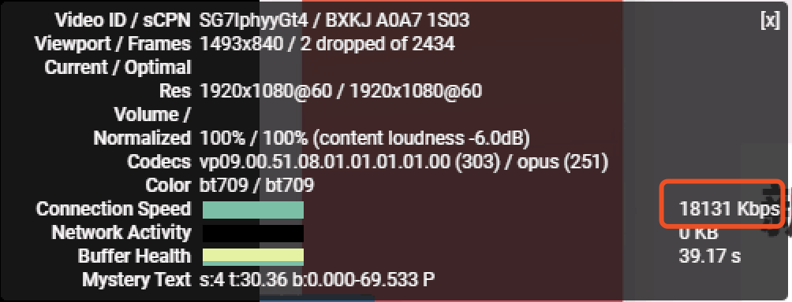
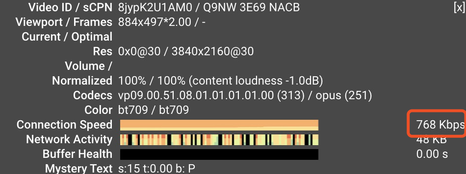

**本文旨在教大家如何 ~~用v2ray搭建自己的VPN~~ 搭建VPN从入门到退款跑路**

## 入门篇

自从去年九月开始听说SS大批被封就一直在心惊胆战，终于今天下定决心撘一个新的v2ray梯子。

### 购买VPS
推荐[搬瓦工](https://bandwagonhost.com)(bandwagonhost)，贵是贵了点，但是稳定性有保障。  

注册账号后order一个最便宜的就行，可以使用优惠码`BWH3HYATVBJW`省6.58%  
搬瓦工支持Alipay和WechatPay，付款完成后邮箱会收到VPS的IP和ssh端口，那边安装好操作系统后还会发一封邮件里面有root的初始密码

### 配置服务器端
ssh连接远程服务器
```
ssh -p 端口号 服务器用户名@ip 
// 例如ssh -p 22 root@119.29.37.63
```
> 这种简单的ssh操作直接使用Teminal就可以完成，复杂的远程操作可以使用相应的软件，Windows推荐Xshell，MAC推荐RoyalTSX

使用初始密码登录root后重置密码
```
passwd root
```

**在root下为vps安装环境：**  
> 具体细节和可能遇到的问题详见[v2ray官方文档](https://www.v2ray.com/chapter_00/install.html)  

安装wget
```
yum -y install wget
```

下载v2ray服务器脚本
```
wget https://install.direct/go.sh
```

安装unzip
```
yum install -y zip unzip  
```

执行安装
```
bash go.sh
```

相关配置
> 在首次安装完成之后，V2Ray不会自动启动，需要手动运行上述启动命令。而在已经运行V2Ray的VPS上再次执行安装脚本，安装脚本会自动停止V2Ray 进程，升级V2Ray程序，然后自动运行V2Ray。在升级过程中，配置文件不会被修改。  

```
// 启动
systemctl start v2ray

// 停止
systemctl stop v2ray

// 重启
systemctl restart v2ray

// 开机自启
systemctl enable v2ray
```

配置文件  
> 如果你按照上面的命令执行安装完成之后，服务端其实是不需要再进行任何配置的，配置文件位于`/etc/v2ray/config.json`，可以用cat进行查看：  

```
cat /etc/v2ray/config.json
```

防火墙开放端口
> 有的vps端口默认不开放，可能导致连接不成功，如果有这种情况，详细配置见CentOs开放端口的方法

```
// 查看已开放端口
firewall-cmd --zone=public --list-ports

// 添加开放端口
firewall-cmd --zone=public --add-port=80/tcp --permanent
```

**MAC客户端**  
> Windows用户这部分可以参考[四个空格的博客](https://www.4spaces.org/build-v2ray-from-0-to-1/)

首先[下载app](https://github.com/Cenmrev/V2RayX/releases)

打开后，右上角v2ray图标 -> Configure.. -> 填写以下内容
- 地址 IP:Port  
> 这里的端口是服务器config.json的端口，不是ssh的端口
- User ID
- alterId, level
- 设置一个喜欢的Tag

> MAC用户如果同时安装过SS可能导致PAC模式不可用，可能会需要修改第一行的Socks5 Port和PAC配置文件的port，具体可以参照[这个issue](https://github.com/Cenmrev/V2RayX/issues/107)
> 我也有同样的问题，但这个issue里的方法对我也并不work，所以我干脆只使用全局模式= =

v2ray图标 -> 开启`Load core`

**DONE**  
测试一下速度吧  
随便找个YouTube视频右键 -> 详细统计信息

这是我朋友家的：  


这是我家电信的：  


我。。。  


这个通常来说是非商用线路带宽太低导致的。如果你的速度也不理想（比如万一你家和我家一样是电信网），在这里我同样给出解决建议：

## 跑路篇

### Just My Socks

> Just My Socks是搬瓦工官方机房（官方shadowsocks服务），虽然现在已经想撇清关系了，但是细心的人可以发工单问一下，会发现客服都是同一批人。Just My Socks目前提供5条线路（5个IP），包括搬瓦工CN2 GIA线路，并且保证IP可用，当IP被墙后，Just My Socks会后台自动换成可用IP。    

官网：[https://justmysocks.net](https://justmysocks.net)（已被墙）   [https://justmysocks2.net](https://justmysocks2.net)（正常访问）

注册账号后可以支付宝付款，使用优惠码`JMS9272283`后包年大概是417.27比上面介绍的332.45也就只贵了八十四块八毛二

> 不想自己搭梯子的，怕被墙的，还想追求速度的都可以考虑justmysocks的CN2 GIA，CN2 GIA就是电信的商用线路，不管哪个运营商出国就这个带宽最大

### 搬瓦工退款
[https://bwh88.net/refund.php](https://bwh88.net/refund.php)  
也可以登录后选择Billing -> Refunds  
> 这里注意只有注册账户30天内可以全额退款
> 当然你也可以等到第29天再退

点击红色按钮“Request cancellation of all services & full refund” -> 点击Reply -> 回复"I agree"注意不要包含其他文字

大概一个小时后收到邮件通知办理成功，支付宝的话大概两个工作日退款到账。至此，你就和我一样，前面的努力就算全都白费了~诶嘿~  
> 当然你也可以告诉自己：“权当练习科学上网和服务器搭建了，没准以后还得搭。”——但显然你很清楚你只是在安慰自己


### End of the Story

现在你可以去justmysocks上随便买一个梯子了 XD  
by the way, 这个免费机场上也有很多飞机`https://free-ss.site`(需翻墙)，说不定有几个比你自己搭的还要快哦XD


