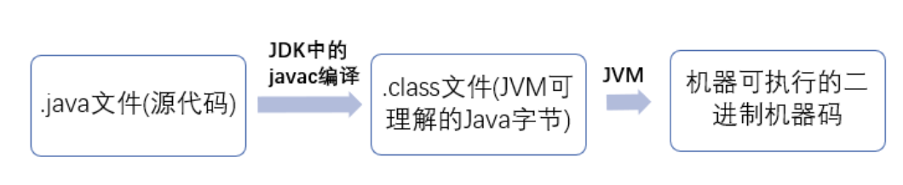

这是一篇之前浩宁推荐的[Java Guide](https://github.com/Snailclimb/JavaGuide)的读书笔记，我把一些对我有用的内容尽量简略的记录在这里，方便以后复习和查阅。

# 基础

## 基础知识系统总结

### JVM，JDK和JRE

JVM（Java Virtual Machine）是运行Java字节码（.class文件）的虚拟机  


JRE（Java Runtime Environment）是Java运行环境，是运行已编译的Java程序所需的所有内容的集合，包括 Java 虚拟机（JVM），Java 类库，java 命令和其他的一些基础构件。  

JDK（Java Development Kits）是功能齐全的Java SDK，它包含JRE以及编译器（javac）和一些其他工具如javadoc和jdb，它能够创建和编译程序。

> 如果你只是为了运行一下 Java 程序的话，那么你只需要安装 JRE 就可以了。如果你需要进行一些 Java 编程方面的工作，那么你就需要安装 JDK 了。但是，这不是绝对的。有时，即使您不打算在计算机上进行任何 Java 开发，仍然需要安装 JDK。例如，如果要使用 JSP 部署 Web 应用程序，那么从技术上讲，您只是在应用程序服务器中运行 Java 程序。那你为什么需要 JDK 呢？因为应用程序服务器会将 JSP 转换为 Java servlet，并且需要使用 JDK 来编译 servlet。

### Oracle JDK 和 OpenJDK

OpenJDK 是一个参考模型并且是完全开源的，而Oracle JDK 是OpenJDK 的一个实现，并不是完全开源的。

### Java的主类

java的主类是唯一一个包含main()方法的类。

### Java应用程序与小程序的差别

应用程序是从主线程（main()方法）启动。applet小程序没有main()方法，主要是嵌在浏览器页面上运行（调用init()或是run()）来启动。

### override（重写）与overload（重载）

overload是方法名相同，参数类型和顺序不同。构造方法（构造器）可以被overload，不能被override。

### 多态

所谓多态就是指程序中定义的引用变量所指向的具体类型和通过该引用变量发出的方法调用在编程时并不确定，而是在程序运行期间才确定，即一个引用变量到底会指向哪个类的实例对象，该引用变量发出的方法调用到底是哪个类中实现的方法，必须在由程序运行期间才能决定。

在Java中有两种形式可以实现多态：继承（多个子类对同一方法的重写）和接口（实现接口并覆盖接口中同一方法）。

### 在一个静态方法内调用一个非静态成员是非法的  

由于静态方法可以不通过对象进行调用，因此在静态方法里，不能调用其他非静态变量，也不可以访问非静态变量成员。

### 接口和抽象类的区别

接口是行为的抽象，抽象类是对类的抽象

### 重写equals()方法就一定同时要重写hashCode()方法

因为要求如果两个对象通过调用equals方法是相等的，那么这两个对象调用hashCode方法必须返回相同的整数。

### 序列化与transient关键字

序列化：将对象写入到IO流中；  反序列化：从IO流中恢复对象  
序列化机制允许将实现序列化的Java对象转换位字节序列，这些字节序列可以保存在磁盘上，或通过网络传输，以达到以后恢复成原来的对象。序列化机制使得对象可以脱离程序的运行而独立存在。

transient 关键字的作用是阻止实例中那些用此关键字修饰的的变量序列化；当对象被反序列化时，被 transient 修饰的变量值不会被持久化和恢复。transient 只能修饰变量，不能修饰类和方法。

### 获取键盘输入的两种方法

- Scanner  
```
Scanner input = new Scanner(System.in);
String s  = input.nextLine();
input.close();
```
- BufferReader  
```
BufferedReader input = new BufferedReader(new InputStreamReader(System.in));
String s = input.readLine();
```

### Collection工具类和Arrays工具类

Collections 工具类常用方法:
- 排序
- 查找,替换操作
- 同步控制(不推荐，需要线程安全的集合类型时请考虑使用 JUC 包下的并发集合)

Arrays工具类常见操作  
- 排序 : sort()
- 查找 : binarySearch()
- 比较: equals()
- 填充 : fill()
- 转列表: asList()
- 转字符串 : toString()
- 复制: copyOf()


## 基础知识易错点

### null.equals()

null.euqals('tst')会导致空指针报错，所以要写成'tst'.equals(null)

建议使用`java.util.Objects#equals`工具类
```
Objects.equals(null,"SnailClimb");
```

> 
我们看一下java.util.Objects#equals的源码就知道原因了。
```
public static boolean equals(Object a, Object b) {
        return (a == b) || (a != null && a.equals(b));
    }
```

### 包装类型的比较
```
new Integer(1) == new Integer(1);  // false
(new Integer(1)).equals(new Integer(1));  // true
```

### BigDecimal 与 BigInteger
为了避免精度丢失，我们可以使用java.Math包下的BigDecimal类来替代float和double
```
// 禁止使用 new BigDecimal(0.1f)的写法，因为只有String是正确精度的，0.1f本身就丢失了精度

BigDecimal a = new BigDecimal("1.0");
BigDecimal b = new BigDecimal("0.9");
BigDecimal x = a.subtract(b);  // 0.1
```

### Arrays.asList()

Arrays.asList(a)得到的集合对象不能像真正的集合那样对其进行使用集合的方法，原因是asList将数组转换为集合后,底层其实还是数组。Arrays.asList()体现的是适配器模式，底层还是数组。

>
```
List l = Arrays.asList(new String[] {"hehe", "haha"});
System.out.println(l.getClass());  // 打印出来的结果是class java.util.Arrays$ArrayList
```

上述代码打印的结果是`class java.util.Arrays$ArrayList`这说明`Arrays.asList()`方法返回的并不是`java.util.ArrayList`，而是`java.util.Arrays`的一个内部类,这个内部类并没有实现集合的修改方法或者说并没有重写这些方法。

```
String[] str = new String[] {“fk”, "u"};
List lst = Arrays.asList(str);

// 情况1 lst.add("java")会抛出异常
// 情况2 str[0] = "love" 那么lst.get(0)也会随之修改
```

那么如何正确的将Array转化为ArrayList：  

```
// 使用 Java8 的Stream

Integer [] myArray = { 1, 2, 3 };
List myList = Arrays.stream(myArray).collect(Collectors.toList());
// 基本类型也可以实现转换（依赖boxed的装箱操作）
int [] myArray2 = { 1, 2, 3 };
List myList = Arrays.stream(myArray2).boxed().collect(Collectors.toList());
```

另外，Arrays.asList()是泛型方法，传入的对象必须是对象数组。
>
```
int[] myArray = { 1, 2, 3 };
List myList = Arrays.asList(myArray);
System.out.println(myList.size());  // 1
System.out.println(myList.get(0));  // 数组地址值
System.out.println(myList.get(1));  // 报错：ArrayIndexOutOfBoundsException
int [] array=(int[]) myList.get(0);
System.out.println(array[0]);  // 1
```

当传入一个原生数据类型数组时，Arrays.asList() 的真正得到的参数就不是数组中的元素，而是**数组对象本身**。此时List 的唯一元素就是这个数组，这也就解释了上面的代码。

## 重要知识点详解

// TODO PASS

# 并发

## 面试题总结

### Java 程序天生就是多线程程序

我们可以通过 JMX 来看一下一个普通的 Java 程序有哪些线程，代码如下。
```
public class MultiThread {
	public static void main(String[] args) {
		// 获取 Java 线程管理 MXBean
	ThreadMXBean threadMXBean = ManagementFactory.getThreadMXBean();
		// 不需要获取同步的 monitor 和 synchronizer 信息，仅获取线程和线程堆栈信息
		ThreadInfo[] threadInfos = threadMXBean.dumpAllThreads(false, false);
		// 遍历线程信息，仅打印线程 ID 和线程名称信息
		for (ThreadInfo threadInfo : threadInfos) {
			System.out.println("[" + threadInfo.getThreadId() + "] " + threadInfo.getThreadName());
		}
	}
}
```
上述程序输出如下
> 输出内容可能不同，不用太纠结下面每个线程的作用，只用知道 main 线程执行 main 方法即可   
```
[5] Attach Listener //添加事件
[4] Signal Dispatcher // 分发处理给 JVM 信号的线程
[3] Finalizer //调用对象 finalize 方法的线程
[2] Reference Handler //清除 reference 线程
[1] main //main 线程,程序入口
```


