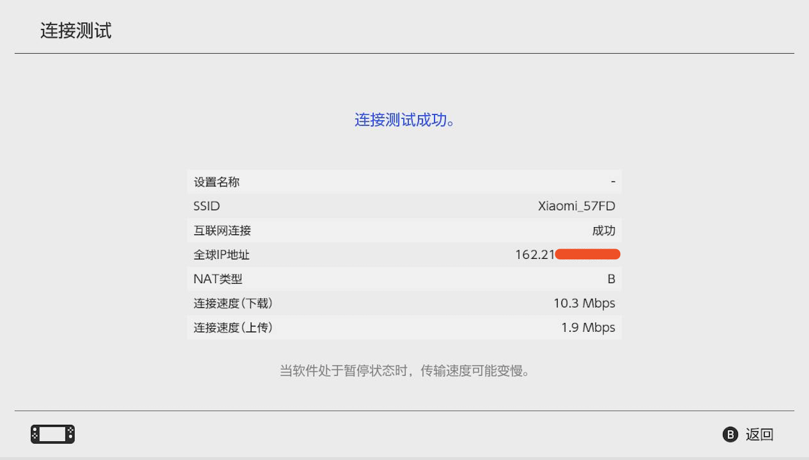

我又来更新翻墙教程了XD 

这次是给NS翻墙，因为仅仅使用加速器是不能用NS连接Facebook和Twitter来发布内容的，但如果只是为了联机和下载，建议直接使用加速器，速度会快很多。

这次使用的是shadowsocks代理的方法为NS翻墙。

### 首先是PC/MAC端配置代理：  
shadowsocks -> 偏好设置 -> HTTP选项卡 ->  

`HTTP代理监听地址`里填本机的内网IP；`监听端口`可以默认也可以自定义；勾选开启HTTP代理服务器。
> 内网IP查看方法：MAC可以在右上角WIFI图标 -> 打开网络偏好设置中查看；或者Terminal -> `ifconfig` 一般在en0中 
> WINDOWS用户可以cmd -> `ipconfig`

### 然后是ns端的配置：

设置 -> 互联网 -> 互联网设置 -> 选择要使用的热点 -> 更改设置 -> 在代理服务器设置中选择开启，然后填写刚才PC/MAC端监听的地址和端口

### 连接测试

速度还是比不上加速器的效果 ，但是上个facebook啥的还是够了。

附上一张今天大家一起参加钓鱼活动的照片  

