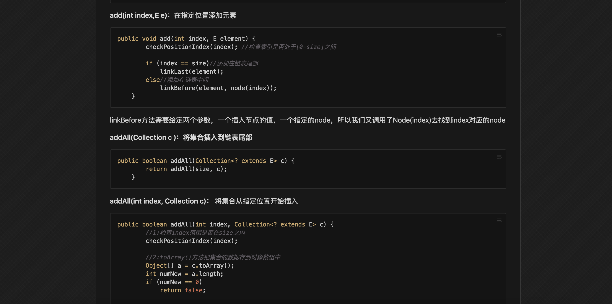

今天来更一个小东西，之前总是左边github右边sublime来写Java Guide笔记，我的所有IDE都是暗色主题的，然后目光不停的在一明一暗两种颜色之前切换，很快就感觉眼睛要瞎掉了，试过MAC自带的反色感觉并不实用以后终于决定去找一个能给github改颜色的脚本：

### [GitHub-Dark](https://github.com/StylishThemes/GitHub-Dark)

随便截了张效果图，还是很不错的：  

支持[usercss](https://raw.githubusercontent.com/StylishThemes/GitHub-Dark/master/github-dark.user.css)，[Script](https://raw.githubusercontent.com/StylishThemes/GitHub-Dark-Script/master/github-dark-script.user.js)和[手动](https://raw.githubusercontent.com/StylishThemes/GitHub-Dark/master/github-dark.css)三种安装方式，前两种需要相关的脚本管理软件如usercss[点击安装](https://chrome.google.com/webstore/detail/user-css/okpjlejfhacmgjkmknjhadmkdbcldfcb/related)，暴力猴等脚本管理插件，亲测前两种均可用，手动的更多是为开发者准备的所以没有试= =。

