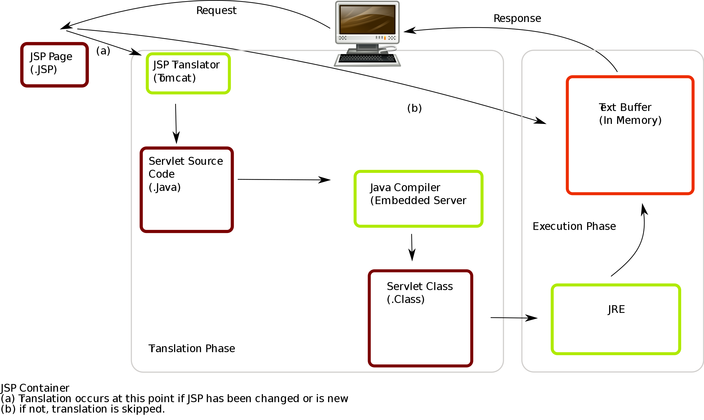

今天和日晨开会讨论了很久，我真的很佩服他对知识这种追根溯源的钻劲，如果不是他今天非要整明白网web server端的具体业务流程，可能我又会随便拿个框架来得过且过了。

讨论的内容很多，主要记录一下apache,tomcat,jsp,java这些东西到底是怎么组合在一起就变成了一个服务器的。

### 首先tomcat干了啥：

 

流程图里，电脑是client，它请求一个jsp（或者因为某种action被拦截器监听到后触发了业务逻辑并以jsp文件的形式得到返回），Tomcat可以被理解为一个jsp解释器或者“编译器”，它把jsp文件解释成java文件，然后经过java编译器(javac)编译成.class的jre可执行文件，然后经过一个text buffer后作为response送回client。

### apache和Tomcat的关系

Apache是一个软件基金会，Apache http server和Tomcat（全称Apache Tomcat）都是它资助的。通常我们说的apache指的是Apache http server。

- apache是web服务器（静态解析，如HTML），tomcat是java应用服务器（动态解析，如JSP、PHP）；

- tomcat只是一个servlet(jsp也翻译成servlet)容器，可以认为是apache的扩展，但是可以独立于apache运行。

### jsp是啥

JSP（全称JavaServer Pages）是一种动态网页技术标准。JSP部署于网络服务器上，可以响应客户端发送的请求，并根据请求内容动态地生成HTML、XML或其他格式文档的Web网页，然后返回给请求者。JSP技术以Java语言作为脚本语言，为用户的HTTP请求提供服务，并能与服务器上的其它Java程序共同处理复杂的业务需求。

> 今天还讨论了很多别的，但我现在实在是困得什么都想不起来了...明天想到什么会继续写= =

