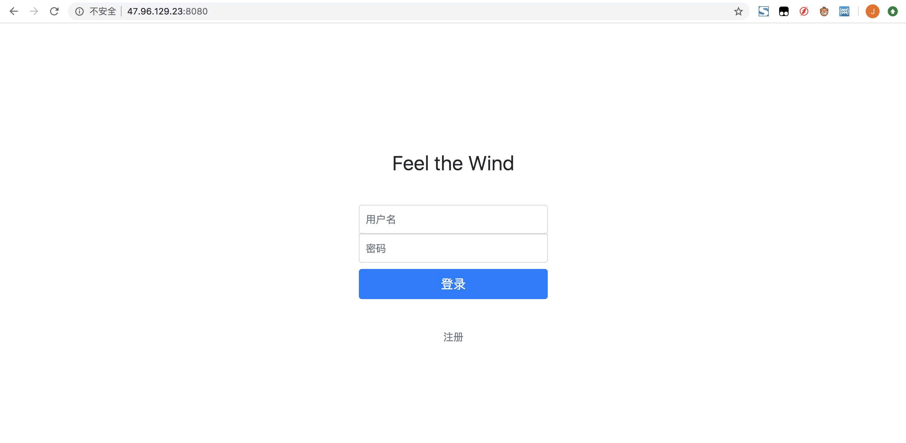

最近一直在用springboot写一个新项目，其实基本每天除了吃饭睡觉就是在写代码，虽然停更了几天但并不是在摸鱼...

其实中途积累了很多，但是最近确实抽不出空，等回头一定要抽时间把springboot这部分内容做一个总结。v0.1版本刚刚部署上去，可以放一张登录界面给你们看一下（主页太丑就先不放了233）



这里主要总结一下阿里云使用过程中遇到的一些问题：

- 阿里云没有初始登录密码，需要去实例里自己设置
- 阿里云需要手动设置安全组规则，否则入方向只有22和443端口是开放的
- 想通过web版的控制台操作服务器的话需要配置IP白名单
- 记得关闭防火墙
```
systemctl stop firewalld.service  // 关闭
systemctl disable firewalld.service  // 开机不启动
```

> 
最后我要记录一下我今天遇到的特别神奇的事情：
> 
- 本地maven打包jar  					[成功]
- java -jar xx.jar  				[成功]
- 本地访问localhost:8080 				[成功]
- git push/服务器git clone+检测md5 	[成功]
- 服务器 java -jar xx.jar			[成功]
- 服务器关闭防火墙						[成功]
- 服务器 curl localhost:8080			[不响应]
> 
我：？？？
> 

> 
我人都傻了，这怎么可能？正当我绝望到要截图发ticket的时候，它居然又好了？？
> 
我佛了。。所以下次可以试着让子弹飞一会是么。。
> 
令人头大。


