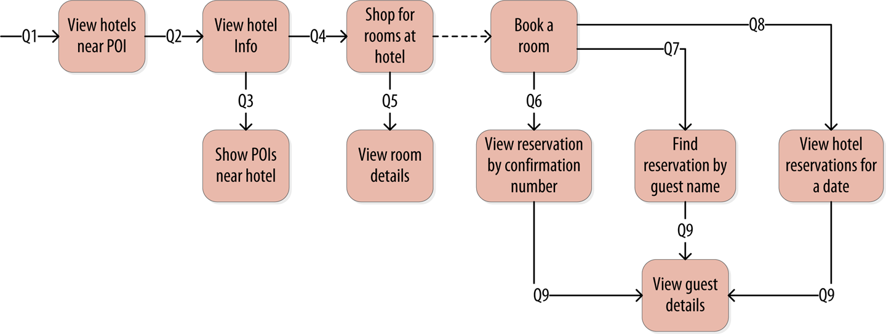
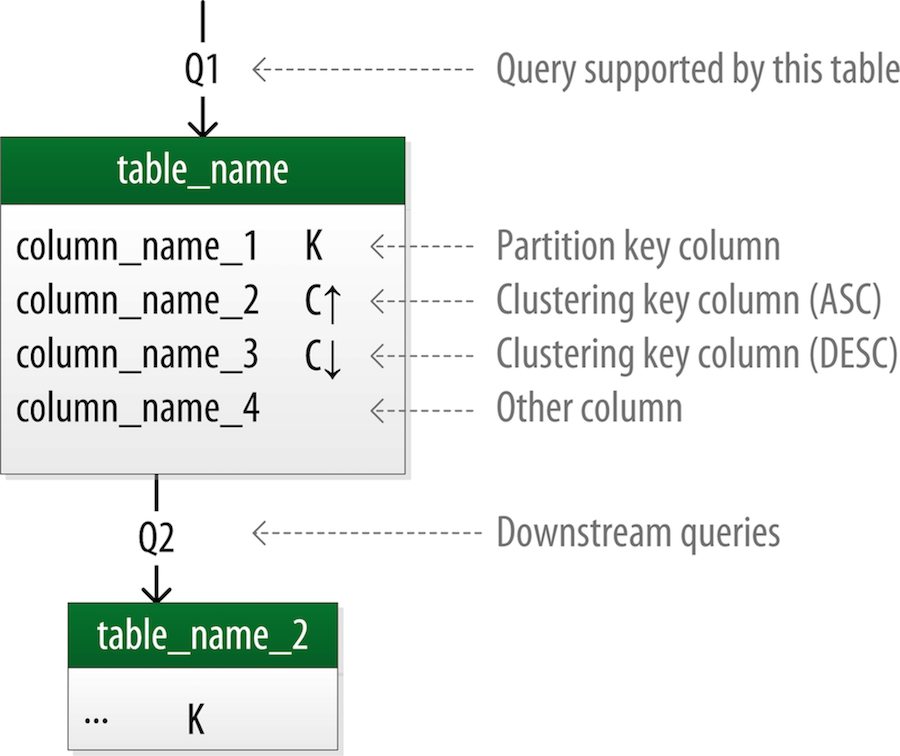
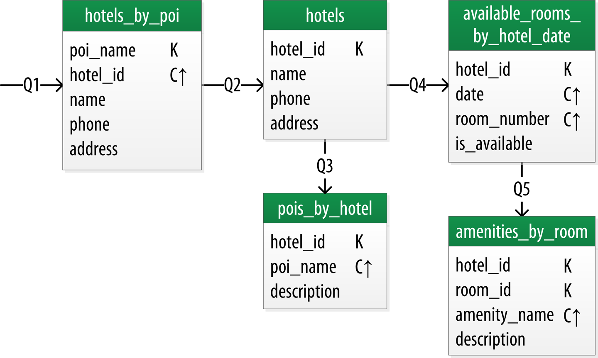
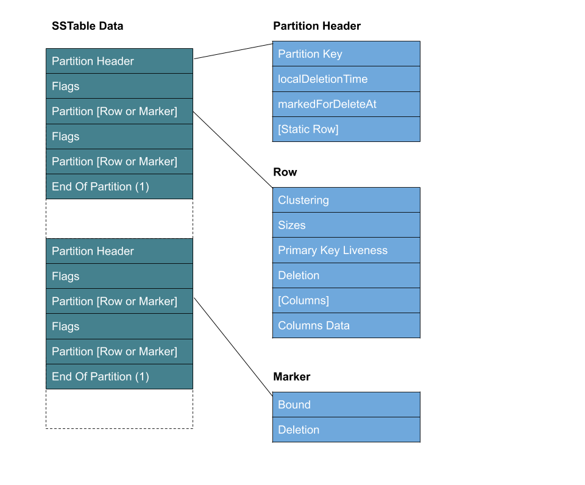
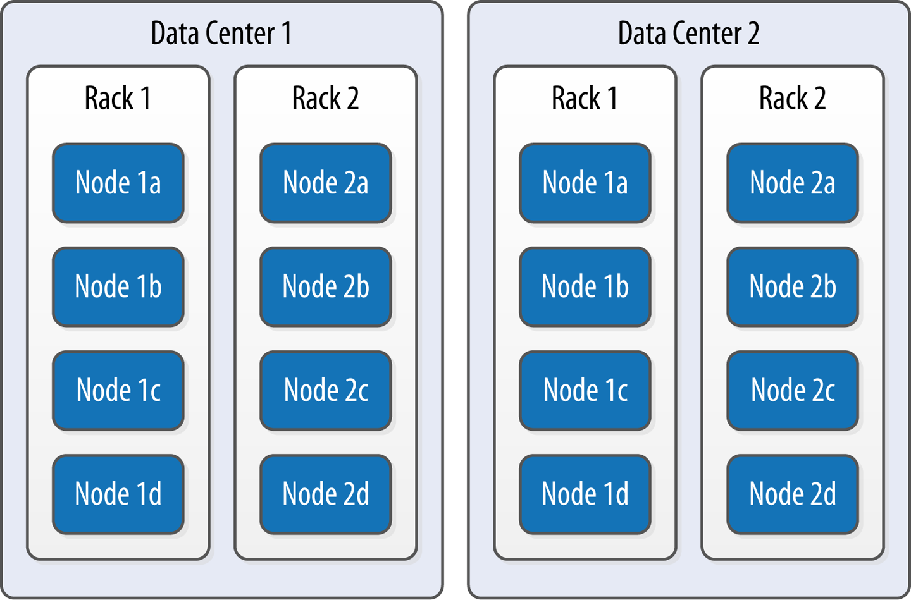
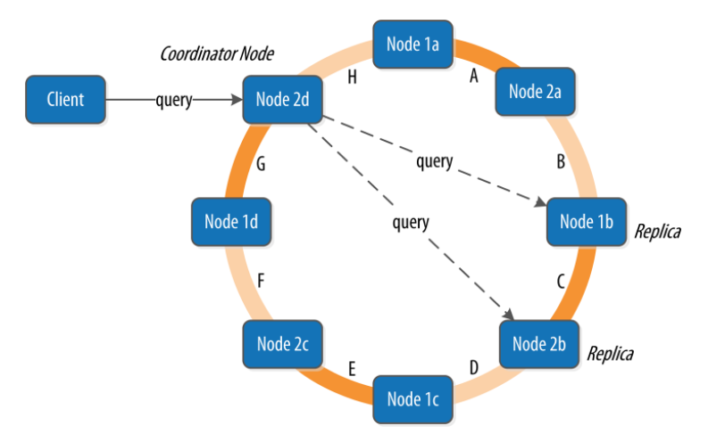
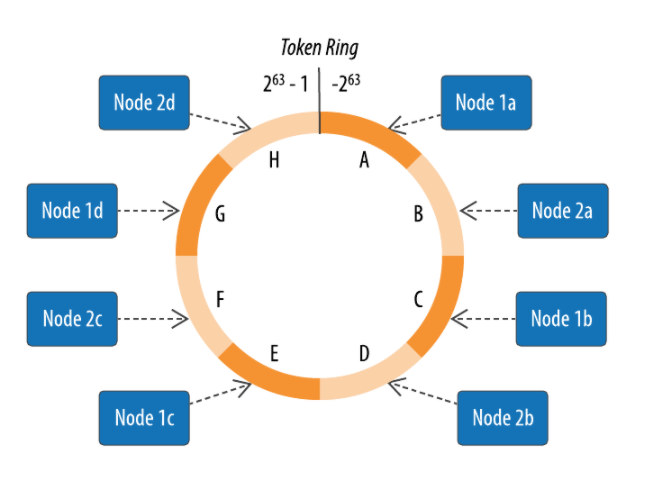
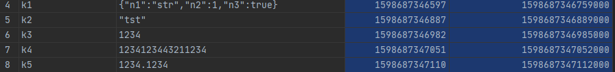

本篇文章是学习《Cassandra权威指南（第二版）》的笔记

#### 集合数据类型

cassandra除了基本数据类型以外还提供了几种集合数据类型：set、list、map和用户自定义类型（UDT）。

> map的键和值可以是除了计数器以外的任何类型，可以作为项目中jsonString的代替

#### 二级索引陷阱

以下情况不推荐使用二级索引：有很大基数的列，数据基数非常低的列（应尽量保证每个索引中包含的行不太多但也不太少）以及经常更新或是删除的列。

> Cassandra 3.4 版本后支持SASI二级索引，支持对建立了索引的列完成不等性搜索（大于或小于），还可以使用心得CQL LIKE关键字对建立了索引的列完成文本搜索。传统的二级搜索实际上是新建了一个隐藏的索引表，而SASI是为每个SSTable计算SASI索引后，将索引作为SSTable文件的一部分进行存储，因此不需要从另外的表中读数据。但是与反规范化的设计相比，SASI索引还是要读取更多的节点。

#### 主键（primary key）、分区键（partition key）、集群键（clustering key）、联合键（Composite/Compound Key）

参考[stackoverflow的这篇问答](https://stackoverflow.com/questions/24949676/difference-between-partition-key-composite-key-and-clustering-key-in-cassandra)

**主键**作为一个常见概念就是指用于标识数据的一个或者多个列的联合。最简单的如：

```
create table stackoverflow_simple (
  key text PRIMARY KEY,
  data text      
);
```

也有联合主键：

```
create table stackoverflow_composite (
  key_part_one text,
  key_part_two int,
  data text,
  PRIMARY KEY(key_part_one, key_part_two)      
);
```

如上情况时，key的前半部分就被叫做**分区键（partition key）**，而后半部分就被称为**集群键（clustering key）**。注意分区键和集群键均可以是多列：

```
create table stackoverflow_multiple (
  k_part_one text,
  k_part_two int,
  k_clust_one text,
  k_clust_two int,
  k_clust_three uuid,
  data text,
  PRIMARY KEY((k_part_one, k_part_two), k_clust_one, k_clust_two, k_clust_three)      
);
```

**分区键（partition key）** 用于决定区分数据在节点上的分布，而**集群键（clustering key）** 用于决定不同分区下数据的排序。联合键（Composite/Compound Key）就是任意的多列的键

#### Cassandra与RDBMS的区别

本部分参考了部分[桂枝儿](https://zhuanlan.zhihu.com/p/149969643)的翻译。

##### 不存在连接(Join)

cassandra中不存在join操作，cassandra不使用join操作来在不同的数据表之间建立联系，而是使用反规范化的表来表示连接的结果。

##### 没有引用完整性(Referential Integrity)

虽然Cassandra中有batches操作，但是Cassandra本身并没有引用完整性的概念。在SQL中你可以在表中声明foreign key来引用其他表的primary key，但Cassandra中没有这样的硬性要求。

##### 反范式化/反规范化(Denormalization)

在SQL数据库中范式化很重要，但是在Cassandra中却不是这样，Cassandra在数据反范式化时效率最高，并且也是最常见的数据结构。这是由cassandra的查询优先设计决定的。

##### 查询优先的设计模式（QUERY FIRST DESIGN）

在关系型数据库中，我们从概念层面表达我们的数据，并且依此来设计table，并且给每一张表设计primary key和foreign key。当我们需要进行多表查询的时候，我们就会用到SQL的join功能。这个设计的好处是，我们想要查询的数据无论有多复杂，我们总能通过设计一条复杂的SQL查询语言来解决数据需求问题。

与之对立的是，cassandra并不是从数据模型开始设计的，你必须从你的查询需求来设计数据模型。在Cassandra中我们会优先根据我们的查询需求，来设计数据的存储方式 —— 想想一下在业务场景中最常见的查询语句，然后设计table来支持它。

有人会说优先设计查询会限制应用层面的设计，也会限制我们的数据模型。但其实认真思考，慎重考虑你收集数据的目的，然后提炼成查询语言是很合理的。

##### 设计最优存储（DESIGNING FOR OPTIMAL STORAGE）

RDBMS中表如何在磁盘上存储这件事通常对用户是透明的，而cassandra中创建数据模型时，一个关键目标就是要能够搜索最小的分区来满足一个给定的查询。

##### 排序是一个设计时就要考虑的点

在关系型数据库中，数据的排序我们可以灵活的通过`ORDER BY`命令来进行指定排序的返回，也就是说指定的排序必须在查询的时候才能够做调整。

在Cassandra中，排序的处理方式有些不同；排序是一个设计的时候就需要考虑到的事情。针对一个query的结果排序方式是固定的，完全是由建表命令中的提供的集群列决定的。CQL语法确实ORDER BY ，不过只支持集群列指定的顺序排序。

##### 定义应用查询

如下图是一个酒店应用查询：



#### Chebotko图

如下是一个Chebotko图：



> 每一张表都会显示他的title和一系列的表名。K 代表是Primary key， 向上向下的箭头代表clustering key的排序方向。表和表之间的连线代表每一张表希望可以支持的查询语句。

如下图是一个酒店领域逻辑模型：



很明显的可以发现这些表都是面向查询设计的，不同的查询对应着不同的表，而这些表也都是反规范化的。

> 要注意的是设计表的时候要保证主键唯一，否则可能有以外覆盖数据的风险。如上图中的Q1，相同的poi_name可能对应多个hotel_id，因此将hotel_id增加为一个集群列。

#### 读速度与读一致性级别

cassandra中读操作通常比写操作要慢。cassandra为了完成读操作通常需要完成查找，然后必须以同步的方式的等待读操作的响应（基于一致性级别和副本因子），然后还需要完成读修复。

读操作中，更高的一致性级别意味着需要更多节点响应查询，从而提供更大的保证，确保各个副本上的值是一样的。如果两个节点响应时有不同的时间戳则会采用最新的值。然后cassandra会在后台完成读修复：即用新的值更新过期的副本。

读操作时，cassandra会选择一个最近的副本来查询整个对象，而向其他副本请求哈希值还确保返回数据是最新版本。其中snitch的任务就是帮助识别能最快返回的副本。

#### Memtable、SSTable与CommitLog

> 本部分参考了[stackoverflow上的两篇回答](https://stackoverflow.com/questions/34592948/what-is-the-purpose-of-cassandras-commit-log/34594958#34594958)和书中P140-P144和P215-P217

cassandra中单个节点内部的写路径如下：

```
Cassandra Node ---->Commitlog-----------------> Memtable
                         |                       |
                         |                       |
                         |---> Periodically      |---> Periodically
                              sync to  disk          flush to SSTable
```

CommitLog与Memtable的写操作并非并行的，相反必须在commitLog写完成之后才会进行Memtable的写操作。

Memtable、SSTable与CommitLog中只有memtable是放在内存中的，只有在memtable的大小达到阈值后才会把数据打包写到硬盘中的SSTable里。

> 实际上对于每个SSTable会写入多个文件，存储在`$CASSANDRA_HOME/data/data`目录中。其中每个键空间对应一个文件夹，这个文件夹中每个表又对应一个文件夹，其命名为表名加上一个UUID，如`apache-cassandra-2.1.7\data\data\testkeyspace\test4-a744de20e90811eab2dd071c2a7790a2`，每个SSTable由多个文件表示，这些文件的命名规则是`<version>-<generation>-<implementation>-<component>.db`

> SSTable的存储格式如下：
> 


或许你会问，既然CommitLog也是往硬盘上写，那这到底比写SSTable好在哪里。实际上CommitLog针对写操作进行了优化，与SSTable的有序存储不同，CommitLog只是按照cassandra执行顺序进行存储，而且即使是来自不同列的更新commitLog也始终只记录在一个文件中而不需要进行搜索操作。

> 在早期版本中memtable存储在JVM堆中，2.1版本后绝大多数的memtable被移入了原生内存来防止JAVA的内存回收机制带来的性能波动。

另外，memtable向SSTable的刷新输出是一个非阻塞操作：对应一个表可以有多个memtable，其中只有一个是当前的memtable，其余的等待刷新输出。而每个commitLog都维护一个内部的标志位，第一次接受到写操作的时候讲这个标志位置1，而当这个commitLog对应的memtable完成了对SSTable的写操作后这个标志位将被重新置为0，这个标志位也可以用于日志的回滚等操作。

最后，一旦memtable刷新输出到磁盘变为一个SSTable，就将变成不可变的，无法被应用修改。尽管SSTable可以合并，但这种合并只改变它们在磁盘的表示，实际上只是进行归并排序生成新文件并删除旧文件。具体来说，这个步骤叫做合并：键会归并，列会组合，墓碑将被删除，另外会创建一个新索引。 

> cassandra读数据时会同时读取SSTable和memtable中的数据，可以通过`nodetool drain`或`nodetool flush`手动将memtable的数据提交到SSTable中，其中drain会停止接受其他节点的数据，写入SSTable后需要重启这个节点，而flush只是简单的写入到SSTable中。

#### 缓存与提升移交

实际上在一个cassandra节点中，内存中的数据除了memtable外还有缓存数据，外存中除了commitLog和SSTable外还有提示（v2.2+）

**缓存**有三种形式：

- 键缓存：存储分区键到行索引条目的映射，为了更快的读取存储在磁盘上的SSTable，存储在JVM堆中
- 行缓存：会缓存所有的行，可以大大提高经常访问的行的读速度，但是需要更多的内存，存储在堆外内存中。
- 计数器缓存（v2.1+）：通过减少对最常访问的计数器的锁竞争来改善计数器性能

> 其中默认启用键缓存和计数器缓存，而行缓存是禁用的

另外，布隆过滤器也可以被看做是一种读缓存。布隆过滤器是一种检查一个元素是否属于一个集合的非确定算法。之所以说它是非确定性的，是因为可能得到假阳性（误报）结果，但不会有假阴性（漏报）结果。布隆过滤器的做法是使用一个哈希函数将一个数据集中的值映射到一个位数组，如果这个位数组指示元素在集合中不存在那么久不需要再去读集合了，而如果这个过滤器元素如果命中了，还需要访问磁盘来确保确实如此。

> Bloom Filter被广泛应用于Apache Hadoop、Google Bigtable和Squid Proxy Cache等分布式数据库和缓存技术中。

**提示移交**指的是某个写请求由于目标节点不可用时，协调器会创建一个提示，指出“我有一些信息想要交给B，等到B恢复正常时我会重新向它发送请求”，这使得cassandra总是可写的。

> 提示移交有一个比较大的问题就是当一个节点刚刚恢复时会一次性收到大量的请求，而这时正式它最脆弱的时候（因为此时它正努力从故障中恢复），为了解决这个问题cassandra可以将提升存储在一个可配置的时间窗口中，也可以完全禁用掉提示移交。

#### Gossip与故障检测

gossip（意为“八卦”、“流言”）是一种用于允许各个节点跟踪集群中其他节点状态信息的协议，gossiper每秒运行一次，用于故障检测，会维护存活和死亡节点的一个列表。其工作流程如下：

1. 每隔一秒，gossiper在集群中随机选择一个节点并初始化一个与它的一个gossip回话。
2. 每一轮gossip回话包含三次握手：发起者 --(开始会话)--> 接收者 --(回应会话)--> 发起者 --(结束会话)--> 接收者 

gossip使用了Phi累积型故障检测，与传统的“生存/死亡”型的二态评估方法不同，其输出的是一个连续的“可信度”级别。

#### 数据中心、机架与节点



一个机架是相互靠近的一组节点的逻辑组合，可能是一个机架上的物理设备；数据中心是机架的一个逻辑组合，可能位于同一栋建筑并有可靠的网络连接。

#### 协调器与读/写操作的成功性判定



一个客户端可以连接到集群中任意一个节点来启动一个读或者写操作，这个节点称为协调器节点。

书上写的是“对于一个写操作，协调器会联系所有副本（由一致性级别和副本因子决定），副本数达到写操作一致性级别所要求的数目时，就认为这个写操作是成功的”。这句话很奇怪，因为如果“由一致性级别和副本因子决定”，那就不应该任意一个写操作都要联系所有副本，我觉得可能是翻译的问题，所以去找了英文版原文读了一下：

> For a write, the coordinator node contacts all replicas, as determined by the consistency level and replication factor, and considers the write successful when a number of replicas commensurate with the consistency level acknowledge the write.

可见这个矛盾在原版中就是存在的，因此我决定暂且认为是“写操作会去写尽量多的副本而根据设定的一致性级别被满足时认为写操作成功”，这也应该是比较合理的，因为服务器一定是希望所有副本都能持有最新版本的副本。

而读操作书中写的就比较清楚了：

For a read, the coordinator contacts enoughreplicasto ensure the requiredconsistency level is met, and returns the data to the client.

> 对于一个读操作，协调器会联系足够多的副本以确保满足所要求的一致性级别，并向客户端返回数据。

#### 强一致性判定

通常当读写一致性满足R+W>N时认为整个系统满足了强一致性（鸽巢原理可证）。

> R：满足读一致性所需节点数；W：满足写一致性所需节点数；N：总结点数。

#### 副本修复

cassandra支持两种副本修复方式，**读修复**和**逆熵修复**。**读修复**指的是读取数据时的副本同步；**逆熵修复**（有时称为**手动修复**）是修复复制数据的一直Gossip协议，在节点上手动启动，这种修复使用nodetool工具完成，运行`nodetool repair`会让cassandra执行一个主合并，服务器发起一个TreeRequest/TreeResponse会话与相邻接点交换Merkle树（一种表示表中数据的哈希树），如果两个树不匹配就会执行调解（修复）。

#### cassandra的存储控制模块

```
org.apache.cassandra.service.StorageProxy  // 存储代理   
-->  org.apache.cassandra.service.StorageService  // 存储服务
   -->  org.apache.cassandra.db  // 存储引擎
```

#### 环、令牌（token）、虚拟节点

一个数据中心以环的形式存储分区键哈希值的不同区间：



哈希函数作用于分区键得到的结果被称为令牌（token），用以确定其在环上的存储位置。这个哈希函数被称为分区器，用来计算一个分区间的令牌。cassandra提供了不同的分区器，默认的分区器是Murmur3Partitioner，如果要实现自己的分区器，只需创建类并实现org.apache.cassandra.dht.IPartitioner接口。

cassandra2.0以后默认启用虚拟节点（vnode），采用这种方式时，不再是为每个节点分配一个token，而是默认的分配256个token，表示256个虚拟节点。可以通过在cassandra.yaml文件中配置num_tokens来为处理能力不同的节点设置不同的虚拟节点数。

#### 复制策略

根据上一节，每个分区键对应的token的值是唯一的，那么如何存储多个副本并确定其位置呢？

cassandra允许多种副本存放实现，要实现不同算法，只需实现接口`org.apache.casssandra.locator.AbstractReplicationStrategy`。同时cassandra提供了这个接口的两个主要实现`SimpleStrategy`、`NetworkTopologyStrategy`。SimpleStrategy从分区器指示的节点开始，将副本放置在环中的连续节点上。`NetworkTopologyStrategy`允许为每个数据中心确定一个不同的副本因子，一个数据中心会适当地将副本分配到不同机架来得到最大可用性。

> 每个键空间的复制策略是单独设置的，而创建键空间时必须指定复制策略

#### 时间戳

cassandra自动为各个列值生成一个时间戳，可以通过write()函数查询，另外这个时间戳与`System.currentTimeMillis()`是基本一致的。

```
select globalId,content,startTime,writetime(content) from test2;
```



> startTime是`System.currentTimeMillis()`生成的，与最右边一列的writetime(content)是基本一致的。

#### 生存时间(TTL)

如：

```
select key, value, ttl(value)
```

默认ttl是null，即不过期。也可以为一条记录加上ttl（单位为秒）：

```
update table USING TTL 3600 SET value='xxx' WHERE key='xxx';
```

3600秒后value会变为null。

> 如果希望为整个行设置TTL，必须在INSERT或者UODATE命令中为**每一个非主键列**提供一个TTL值。