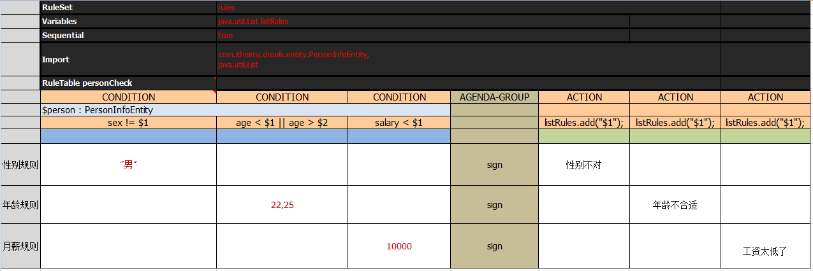

## 1. 规则引擎概述

### 1.1 什么是规则引擎

**规则引擎**，全称为**业务规则管理系统**（BRMS, Business Rule Management System)。规则引擎的主要思想是将应用程序中的业务决策部分分离出来，并使用预定义的语义模块编写业务决策（业务规则），由用户或开发者在需要时进行配置、管理。

需要注意的是规则引擎并不是一个具体的技术框架，而是指的一类系统，即业务规则管理系统。目前市面上具体的规则引擎产品有：drools、VisualRules、iLog等。

规则引擎实现了将业务决策输出平台。

系统中引入规则引擎后，业务规则不再以程序代码的形式驻留在系统中，取而代之的是处理规则的规则引擎，业务规则存储在规则库中，完全独立于程序。业务人员可以像管理数据一样对业务规则进行管理，比如查询、添加、更新、统计、提交业务规则等。业务规则被加载到规则引擎中供应用系统调用。

### 1.2 使用规则引擎的优势

使用规则引擎的优势如下：

1. 业务规则与系统代码分离，实现业务规则的集中管理

2. 在不重启服务的情况下可随时对业务规则进行扩展和维护

3. 可以动态修改业务规则，从而快速响应需求变更

4. 规则引擎是相对独立的，只关心业务规则，使得业务分析人员也可以参与编辑、维护系统的业务规则

5. 减少了硬编码业务规则的成本和风险

6. 使用规则引擎提供的规则编辑工具，使复杂的业务规则实现变得的简单

### 1.3 规则引擎应用场景

对于一些存在比较复杂的业务规则并且业务规则会频繁变动的系统比较适合使用规则引擎，如下：

1. 风险控制系统 - 风险贷款、风险评估

2. 反欺诈项目 - 银行贷款、征信验证

3. 决策平台系统 - 财务计算

4. 促销平台系统 - 满减、打折、加价购

## 2. Hello World

### 2.1 业务场景说明

业务场景：消费者在图书商城购买图书，下单后需要在支付页面显示订单优惠后的价格。具体优惠规则如下：

| 规则编号 | 规则名称 | 描述                               |
| :------- | :------- | :--------------------------------- |
| 1        | 规则一   | 所购图书总价在100元以下的没有优惠  |
| 2        | 规则二   | 所购图书总价在100到200元的优惠20元 |
| 3        | 规则三   | 所购图书总价在200到300元的优惠50元 |
| 4        | 规则四   | 所购图书总价在300元以上的优惠100元 |

现在需要根据上面的规则计算优惠后的价格。

### 2.2 开发实现

创建maven工程

```xml
<dependency>
    <groupId>org.drools</groupId>
    <artifactId>drools-compiler</artifactId>
    <version>7.10.0.Final</version>
</dependency>
```

创建resources/META-INF/kmodule.xml配置文件

```xml
<?xml version="1.0" encoding="UTF-8" ?>
<kmodule xmlns="http://www.drools.org/xsd/kmodule">
    <!--
        name:指定kbase的名称，可以任意，但是需要唯一
        packages:指定规则文件的目录
        default:指定当前kbase是否为默认
    -->
    <kbase name="myKbase1" packages="rules" default="true">
        <!--
            name:指定ksession名称，可以任意，但是需要唯一
            default:指定当前session是否为默认
        -->
        <ksession name="ksession-rule" default="true"/>
    </kbase>
</kmodule>
```

创建实体类Order

```java
package com.itheima.drools.entity;

/**
 * 订单
 */
public class Order {
    @Getter @Setter private Double originalPrice;  // 订单原始价格，即优惠前价格
    @Getter @Setter private Double realPrice;  // 订单真实价格，即优惠后价格

    public String toString() {
        return "Order{" +
                "originalPrice=" + originalPrice +
                ", realPrice=" + realPrice +
                '}';
    }
}
```

创建规则文件resources/rules/bookDiscount.drl（具体见第4章 - Drools基础语法）

```java
//图书优惠规则
package book.discount
import com.itheima.drools.entity.Order

//规则一：所购图书总价在100元以下的没有优惠
rule "book_discount_1"
    when
        $order:Order(originalPrice < 100)
    then
        $order.setRealPrice($order.getOriginalPrice());
        System.out.println("成功匹配到规则一：所购图书总价在100元以下的没有优惠");
end

//规则二：所购图书总价在100到200元的优惠20元
rule "book_discount_2"
    when
        $order:Order(originalPrice < 200 && originalPrice >= 100)
    then
        $order.setRealPrice($order.getOriginalPrice() - 20);
        System.out.println("成功匹配到规则二：所购图书总价在100到200元的优惠20元");
end

//规则三：所购图书总价在200到300元的优惠50元
rule "book_discount_3"
    when
        $order:Order(originalPrice < 300 && originalPrice >= 200)
    then
        $order.setRealPrice($order.getOriginalPrice() - 50);
        System.out.println("成功匹配到规则三：所购图书总价在200到300元的优惠50元");
end

//规则四：所购图书总价在300元以上的优惠100元
rule "book_discount_4"
    when
        $order:Order(originalPrice >= 300)
    then
        $order.setRealPrice($order.getOriginalPrice() - 100);
        System.out.println("成功匹配到规则四：所购图书总价在300元以上的优惠100元");
end
```

编写单元测试

```java
@Test
public void test1(){
    KieServices kieServices = KieServices.Factory.get();
    KieContainer kieClasspathContainer = kieServices.getKieClasspathContainer();
    //会话对象，用于和规则引擎交互
    KieSession kieSession = kieClasspathContainer.newKieSession();

    //构造订单对象，设置原始价格，由规则引擎根据优惠规则计算优惠后的价格
    Order order = new Order();
    order.setOriginalPrice(210D);

    //将数据提供给规则引擎，规则引擎会根据提供的数据进行规则匹配
    kieSession.insert(order);

    //激活规则引擎，如果规则匹配成功则执行规则
    kieSession.fireAllRules();
    //关闭会话
    kieSession.dispose();
}
```

### 2.3 小结

#### 2.3.1 规则引擎构成

drools规则引擎由以下三部分构成：

- Working Memory（工作内存）
- Rule Base（规则库）
- Inference Engine（推理引擎）

其中Inference Engine（推理引擎）又包括：

- Pattern Matcher（匹配器）     具体匹配哪一个规则，由这个完成
- Agenda(议程)
- Execution Engine（执行引擎）

如下图所示：


#### 2.3.2 相关概念说明

**Working Memory**：工作内存，drools规则引擎会从Working Memory中获取数据并和规则文件中定义的规则进行模式匹配，所以我们开发的应用程序只需要将我们的数据插入到Working Memory中即可，例如本案例中我们调用kieSession.insert(order)就是将order对象插入到了工作内存中。

**Fact**：事实，是指在drools 规则应用当中，将一个**普通的JavaBean插入到Working Memory后的对象**就是Fact对象，例如本案例中的Order对象就属于Fact对象。Fact对象是我们的应用和规则引擎进行数据交互的桥梁或通道。

**Rule Base**：规则库，我们在规则文件中定义的规则都会被加载到规则库中。

**Pattern Matcher**：匹配器，将Rule Base中的所有规则与Working Memory中的Fact对象进行模式匹配，匹配成功的规则将被激活并放入Agenda中。

**Agenda**：议程，用于存放通过匹配器进行模式匹配后被激活的规则。

**Execution Engine**：执行引擎，执行Agenda中被激活的规则。

#### 2.3.3 规则引擎执行过程


#### 2.3.4 KIE简介

KIE（Knowledge Is Everything），知识就是一切的简称。JBoss一系列项目的总称，包括OptaPlanner、Drools、UberFire、jBPM以及一些与它们相关联的项目如Guvnor。它们之间有一定的关联，通用一些API。比如涉及到构建（building）、部署（deploying）和加载（loading）等方面都会以KIE作为前缀来表示这些是通用的API。


通过上图可以看到，Drools是整个KIE项目中的一个组件，Drools中还包括一个Drools-WB的模块，它是一个可视化的规则编辑器。

在第三章中本文将详细探讨有关KIE的各种问题。

## 3. KIE

### 3.1 KIE的生命周期

官网文档中将KIE生命周期分成8个阶段，翻译如下：

- 编写 - 编写规则文件，比如：DRL，BPMN2、决策表、实体类等。
- 构建 - 构建一个可以发布部署的组件，对于KIE来说是JAR文件。
- 测试 - 部署之前对规则进行测试。
- 部署 - 利用Maven仓库将jar部署到应用程序。
- 使用 - 程序加载jar文件，通过KieContainer对其进行解析创建KieSession。
- 执行 - 通过KieSession对象的API与Drools引擎进行交互，执行规则。
- 交互 - 用户通过命令行或者UI与引擎进行交互。
- 管理 - 管理KieSession或者KieContainer对象。

> 原文如下：
>
> Author
> 	Authoring of knowledge using a UI metaphor, such as: DRL, BPMN2, decision table, class models.
>
> Build
> 	Builds the authored knowledge into deployable units.
> 	For KIE this unit is a JAR.
>
> Test
> 	Test KIE knowedge before it’s deployed to the application.
>
> Deploy
> 	Deploys the unit to a location where applications may utilize (consume) them.
> 	KIE uses Maven style repository.
>
> Utilize
> 	The loading of a JAR to provide a KIE session (KieSession), for which the application can interact with.
> 	KIE exposes the JAR at runtime via a KIE container (KieContainer).
> 	KieSessions, for the runtime’s to interact with, are created from the KieContainer.
>
> Run
> 	System interaction with the KieSession, via API.
>
> Work
> 	User interaction with the KieSession, via command line or UI.
>
> Manage
> 	Manage any KieSession or KieContainer.

**有关为什么Drools读不到程序运行期生成的配置文件**

从源码上来说，是因为Drools调用了sun.msic包下Laucher类的获取ClassLoader，ClassLoader将配置文件xml和drl作为类加载进来（单步的时候惊奇的发现SPI机制也是使用了基本相同的调用路径）。而显然这部分工作是在程序执行前就完成了编译的。

从KIE的生命周期上来说，在程序执行期是无法重新将新的规则文件进行“编写-构建-测试-部署”这些流程的。

如果希望在运行期更改规则，那么应该使用KieFileSystem来管理虚拟文件系统。

### 3.2 KIE中与Drools有关的组件


- KieContainer是一个KieBase的容器。提供了获取KieBase的方法和创建KieSession的方法。
- KieBase是一个知识仓库，包含了若干的规则、流程、方法等，在Drools中主要就是规则和方法，KieBase本身并不包含运行时的数据之类的，如果需要执行规则KieBase中的规则的话，就需要根据KieBase创建KieSession。
- KieSession就是一个跟Drools引擎打交道的会话，其基于KieBase创建，它会包含运行时数据，包含“事实Fact”，并对运行时数据实时进行规则运算。

### 3.3 KieSession的持久化（钝化与唤醒）

利用Marshaller可以对kiesession完成钝化与唤醒。工具类如下：

```java
import org.kie.api.marshalling.Marshaller;
/**
 * 将给定Session钝化
 * @param kieSession 需要钝化的session
 * @return byte[]类型钝化结果
 */
public byte[] passivateSession(KieSession kieSession) {
    ByteArrayOutputStream baos = new ByteArrayOutputStream();
    Marshaller marshaller = 
        KieServices.Factory.get().getMarshallers().newMarshaller(kieSession.getKieBase());
    byte[] byteArray = null;
    try {
        marshaller.marshall(baos, kSession);
        byteArray = baos.toByteArray();
        baos.close();
    } catch (IOException e) {
        e.printStackTrace();
    }
    return byteArray;
}
/**
 * 唤醒，将钝化字节串恢复成session
 * @param byteArray 钝化字节串
 * @return session
 */
public KieSession awakeSession(byte[] byteArray){
    KieSession kSession = null;
    try {
        InputStream is = new ByteArrayInputStream(byteArray);
        kSession = marshaller.unmarshall(is);
    }catch(Exception e){
        e.printStackTrace();
    }
    return kSession;
}
```

### 3.4 运行期更改规则的策略 - KieFileSystem

```java
this.kfs = kieServices.newKieFileSystem();
kfs.writeKModuleXML(kieModuleModel.toXML());
```

```java
this.kfs.delete("src/main/resources/com.rules/ruleSet1.drl");
this.kfs.write("src/main/resources/com.rules/ruleSet1.drl", newRule);
KieBuilder kieBuilder = kieServices.newKieBuilder( kfs ).buildAll();
assertEquals( 0, kieBuilder.getResults().getMessages( Message.Level.ERROR ).size() );

this.kieContainer = 
kieServices.newKieContainer(kieServices.getRepository().getDefaultReleaseId());
this.kSession = kieContainer.newKieSession("ksession-rule1");
```


## 4. Drools基础语法

### 4.1 规则文件构成

在使用Drools时非常重要的一个工作就是编写规则文件，通常规则文件的后缀为.drl。

> drl 是 Drools Rule Language 的缩写

一套完整的规则文件内容构成如下：

| 关键字   | 描述                                                         |
| :------- | :----------------------------------------------------------- |
| package  | 包名，只限于逻辑上的管理，同一个包名下的查询或者函数可以直接调用 |
| import   | 用于导入类或者静态方法                                       |
| global   | 全局变量                                                     |
| function | 自定义函数                                                   |
| query    | 查询                                                         |
| rule end | 规则体                                                       |

> Drools支持的规则文件，除了drl形式，还有Excel文件类型的。

### 4.2 规则体语法结构

规则体是规则文件内容中的重要组成部分，是进行业务规则判断、处理业务结果的部分。

规则体语法结构如下：

```java
rule "ruleName"
    attributes
    when
        LHS 
    then
        RHS
end
```

**rule**：关键字，表示规则开始，参数为规则的唯一名称。

**attributes**：规则属性，是rule与when之间的参数，为可选项。

**when**：关键字，后面跟规则的条件部分。

**LHS**(Left Hand Side)：是规则的条件部分的通用名称。它由零个或多个条件元素组成。**如果LHS为空，则它将被视为始终为true的条件元素**。  （左手边）

**then**：关键字，后面跟规则的结果部分。

**RHS**(Right Hand Side)：是规则的后果或行动部分的通用名称。 （右手边）

**end**：关键字，表示一个规则结束。


### 4.3 注释

在drl形式的规则文件中使用注释和Java类中使用注释一致，分为单行注释和多行注释。

单行注释用"//"进行标记，多行注释以`/*`开始，以`*/`结束。

```drl
//规则rule1的注释，这是一个单行注释
rule "rule1"
    when
    then
        System.out.println("rule1触发");
end

/*
规则rule2的注释，
这是一个多行注释
*/
rule "rule2"
    when
    then
        System.out.println("rule2触发");
end
```


### 4.4 Pattern模式匹配

如上所述，Drools中的匹配器可以将Rule Base中的所有规则与Working Memory中的Fact对象进行模式匹配，那么就需要在规则体的LHS部分定义规则并进行模式匹配。LHS部分由一个或者多个条件组成，条件又称为pattern。

**pattern的语法结构为：绑定变量名:Object(Field约束)**

其中绑定变量名可以省略，通常绑定变量名的命名一般建议以$开始。如果定义了绑定变量名，就可以在规则体的RHS部分使用此绑定变量名来操作相应的Fact对象。Field约束部分是需要返回true或者false的0个或多个表达式。

例如第三章的Hello World：

```java
//规则二：所购图书总价在100到200元的优惠20元
rule "book_discount_2"
    when
        //Order为类型约束，originalPrice为属性约束
        $order:Order(originalPrice < 200 && originalPrice >= 100)
    then
        $order.setRealPrice($order.getOriginalPrice() - 20);
        System.out.println("成功匹配到规则二：所购图书总价在100到200元的优惠20元");
end
```

通过上面的例子我们可以知道，匹配的条件为：

1. 工作内存中必须存在Order这种类型的Fact对象 - 类型约束

2. Fact对象的originalPrice属性值必须小于200且大于等于100 - 属性约束


以上条件必须同时满足当前规则才有可能被激活。

 

LHS部分还可以定义多个pattern，多个pattern之间可以使用and或者or进行连接，也可以不写，默认连接为and。

```java
//规则二：所购图书总价在100到200元的优惠20元
rule "book_discount_2"
    when
        $order:Order($op:originalPrice < 200 && originalPrice >= 100) and
        $customer:Customer(age > 20 && gender=='male')
    then
        System.out.println("$op=" + $op);
        $order.setRealPrice($order.getOriginalPrice() - 20);
        System.out.println("成功匹配到规则二：所购图书总价在100到200元的优惠20元");
end
```


### 4.5 比较操作符

Drools提供的比较操作符，如下表：

| 符号         | 说明                                                         |
| :----------- | :----------------------------------------------------------- |
| >            | 大于                                                         |
| <            | 小于                                                         |
| >=           | 大于等于                                                     |
| <=           | 小于等于                                                     |
| ==           | 等于                                                         |
| !=           | 不等于                                                       |
| contains     | 检查一个Fact对象的某个属性值是否包含一个指定的对象值         |
| not contains | 检查一个Fact对象的某个属性值是否不包含一个指定的对象值       |
| memberOf     | 判断一个Fact对象的某个属性是否在一个或多个集合中             |
| not memberOf | 判断一个Fact对象的某个属性是否不在一个或多个集合中           |
| matches      | 判断一个Fact对象的属性是否与提供的标准的Java正则表达式进行匹配 |
| not matches  | 判断一个Fact对象的属性是否不与提供的标准的Java正则表达式进行匹配 |

- **contains | not contains语法结构**

  Object(Field[Collection/Array] contains value)

  Object(Field[Collection/Array] not contains value)

- **memberOf | not memberOf语法结构**

  Object(field memberOf value[Collection/Array])

  Object(field not memberOf value[Collection/Array])

- **matches | not matches语法结构**

  Object(field matches "正则表达式")

  Object(field not matches "正则表达式")

### 4.6 规则过滤器

通过规则过滤器可以实现执行指定规则：

```java
KieServices kieServices = KieServices.Factory.get();
KieContainer kieClasspathContainer = kieServices.getKieClasspathContainer();
KieSession kieSession = kieClasspathContainer.newKieSession();

ComparisonOperatorEntity comparisonOperatorEntity = new ComparisonOperatorEntity();
comparisonOperatorEntity.setNames("张三");
List<String> list = new ArrayList<String>();
list.add("张三");
list.add("李四");
comparisonOperatorEntity.setList(list);
kieSession.insert(comparisonOperatorEntity);

//通过规则过滤器实现只执行指定规则
kieSession.fireAllRules(new RuleNameEqualsAgendaFilter("rule_comparison_memberOf"));

kieSession.dispose();
```


### 4.7 关键字

Drools的关键字分为：硬关键字(Hard keywords)和软关键字(Soft keywords)。

**硬关键字是我们在规则文件中定义包名或者规则名时明确不能使用的，否则程序会报错**。软关键字虽然可以使用，但是不建议使用。

硬关键字包括：true false null

软关键字包括：lock-on-active date-effective date-expires no-loop auto-focus activation-group agenda-group ruleflow-group entry-point duration package import dialect salience enabled attributes rule extend when then template query declare function global eval not in or and exists forall accumulate collect from action reverse result end over init

```java
rule true  // 不可以
rule "true"  // 可以
```

### 4.8 Drools内置方法

规则文件的`RHS`部分的主要作用是通过**插入，删除或修改工作内存中的Fact数据**，来达到控制规则引擎执行的目的。Drools提供了一些方法可以用来操作工作内存中的数据，**操作完成后规则引擎会重新进行相关规则的匹配，**原来没有匹配成功的规则在修改数据完成后有可能就会匹配成功了。

#### 4.8.1 update方法

**update方法的作用是更新工作内存中的数据，并让相关的规则重新匹配。**   （要避免死循环）

```java
package student
import com.itheima.drools.entity.Student

/*
 当前规则文件用于测试Drools提供的内置方法
*/

rule "rule_student_age小于10岁"
    when
        $s:Student(age < 10)
    then
        $s.setAge(15);
        update($s);//更新数据，导致相关的规则会重新匹配
        System.out.println("规则rule_student_age小于10岁触发");
end

rule "rule_student_age小于20岁同时大于10岁"
    when
        $s:Student(age < 20 && age > 10)
    then
        $s.setAge(25);
        update($s);//更新数据，导致相关的规则会重新匹配
        System.out.println("规则rule_student_age小于20岁同时大于10岁触发");
end

rule "rule_student_age大于20岁"
    when
        $s:Student(age > 20)
    then
        System.out.println("规则rule_student_age大于20岁触发");
end
```


```java
KieServices kieServices = KieServices.Factory.get();
KieContainer kieClasspathContainer = kieServices.getKieClasspathContainer();
KieSession kieSession = kieClasspathContainer.newKieSession();

Student student = new Student();
student.setAge(5);

//将数据提供给规则引擎，规则引擎会根据提供的数据进行规则匹配，如果规则匹配成功则执行规则
kieSession.insert(student);

kieSession.fireAllRules();
kieSession.dispose();
```


通过控制台的输出可以看到规则文件中定义的三个规则都触发了。

在更新数据时需要注意防止发生死循环。

#### 4.8.2 insert方法

insert方法的作用是向工作内存中插入数据，**并让相关的规则重新匹配**。

```java
package student
import com.itheima.drools.entity.Student

/*
 当前规则文件用于测试Drools提供的内置方法
*/

rule "rule_student_age等于10岁"
    when
        $s:Student(age == 10)
    then
        Student student = new Student();
        student.setAge(5);
        insert(student);//插入数据，导致相关的规则会重新匹配
        System.out.println("规则rule_student_age等于10岁触发");
end

rule "rule_student_age小于10岁"
    when
        $s:Student(age < 10)
    then
        $s.setAge(15);
        update($s);
        System.out.println("规则rule_student_age小于10岁触发");
end

rule "rule_student_age小于20岁同时大于10岁"
    when
        $s:Student(age < 20 && age > 10)
    then
        $s.setAge(25);
        update($s);
        System.out.println("规则rule_student_age小于20岁同时大于10岁触发");
end

rule "rule_student_age大于20岁"
    when
        $s:Student(age > 20)
    then
        System.out.println("规则rule_student_age大于20岁触发");
end
```


```java
KieServices kieServices = KieServices.Factory.get();
KieContainer kieClasspathContainer = kieServices.getKieClasspathContainer();
KieSession kieSession = kieClasspathContainer.newKieSession();

Student student = new Student();
student.setAge(10);

// 将数据提供给规则引擎，规则引擎会根据提供的数据进行规则匹配，如果规则匹配成功则执行规则
kieSession.insert(student);

kieSession.fireAllRules();
kieSession.dispose();
```


通过控制台输出可以发现，四个规则都触发了，这是因为首先进行规则匹配时只有第一个规则可以匹配成功，但是在第一个规则中向工作内存中插入了一个数据导致重新进行规则匹配，此时第二个规则可以匹配成功。在第二个规则中进行了数据修改导致第三个规则也可以匹配成功，以此类推最终四个规则都匹配成功并执行了。

#### 4.8.3 retract方法

retract方法的作用是删除工作内存中的数据，并让相关的规则重新匹配。

```java
package student
import com.itheima.drools.entity.Student

/*
 当前规则文件用于测试Drools提供的内置方法
*/

rule "rule_student_age等于10岁时删除数据"
    /*
    salience：设置当前规则的执行优先级，数值越大越优先执行，默认值为0.
    因为当前规则的匹配条件和下面规则的匹配条件相同，为了保证先执行当前规则，需要设置优先级
    */
    salience 100 
    when
        $s:Student(age == 10)
    then
        retract($s);//retract方法的作用是删除工作内存中的数据，并让相关的规则重新匹配。
        System.out.println("规则rule_student_age等于10岁时删除数据触发");
end

rule "rule_student_age等于10岁"
    when
        $s:Student(age == 10)
    then
        Student student = new Student();
        student.setAge(5);
        insert(student);
        System.out.println("规则rule_student_age等于10岁触发");
end

rule "rule_student_age小于10岁"
    when
        $s:Student(age < 10)
    then
        $s.setAge(15);
        update($s);
        System.out.println("规则rule_student_age小于10岁触发");
end

rule "rule_student_age小于20岁同时大于10岁"
    when
        $s:Student(age < 20 && age > 10)
    then
        $s.setAge(25);
        update($s);
        System.out.println("规则rule_student_age小于20岁同时大于10岁触发");
end

rule "rule_student_age大于20岁"
    when
        $s:Student(age > 20)
    then
        System.out.println("规则rule_student_age大于20岁触发");
end
```


```java
KieServices kieServices = KieServices.Factory.get();
KieContainer kieClasspathContainer = kieServices.getKieClasspathContainer();
KieSession kieSession = kieClasspathContainer.newKieSession();

Student student = new Student();
student.setAge(10);

//将数据提供给规则引擎，规则引擎会根据提供的数据进行规则匹配，如果规则匹配成功则执行规则
kieSession.insert(student);

kieSession.fireAllRules();
kieSession.dispose();
```

通过控制台输出可以发现，只有第一个规则触发了，因为在第一个规则中将工作内存中的数据删除了导致第二个规则并没有匹配成功。

#### 4.8.4 modify方法

modify用于更新Fact对象：

```java
rule "modify stilton"
when
    $stilton : Cheese(type == "stilton")
then
    modify( $stilton ){
        setPrice( 20 ),
        setAge( "overripe" )
    }
end
```

### 4.9 跨类规则交叉匹配

跨类规则交叉匹配，会输出所有满足条件的组合

```java
rule Rule1
when
    $product : Product();
    $product1 : Product1();
then
    System.out.println($product+ "~" + $product1);
end
```


```java
Product product_1 = new Product();
Product product_2 = new Product();
Product1 product1_1 = new Product1();
Product1 product1_2 = new Product1();

KieServices ks = KieServices.Factory.get();
KieContainer kieContainer = ks.getKieClasspathContainer();
KieSession kSession = kieContainer.newKieSession("ksession-rule1");

kSession.insert(product_1);
kSession.insert(product1_1);
kSession.insert(product_2);
kSession.insert(product1_2);

int count = kSession.fireAllRules();
```

将输出：

```
org.codeless.condition.test.Product@c65a5ef~org.codeless.condition.test.Product1@7997b197
org.codeless.condition.test.Product@c65a5ef~org.codeless.condition.test.Product1@460f76a6
org.codeless.condition.test.Product@11dee337~org.codeless.condition.test.Product1@7997b197
org.codeless.condition.test.Product@11dee337~org.codeless.condition.test.Product1@460f76a6
```

### 4.10 逻辑运算符

最常用的逻辑运算符（分隔符）是逗号，它相当于“AND”：

```
Person( age > 50, weight > 80 )
```

另外“&&”代表"AND"，“||”代表“OR”，且“&&”优先于“||”。注意逗号与“&&”和“||”不能混合使用：

```java
Person( ( age > 50, weight > 80 ) || height > 2 ) // 会编译错误 
// 使用此种方法替代 
Person( ( age > 50 && weight > 80 ) || height > 2 )
```

### 4.11 强制类型转换

在使用内部类的时候，往往需要将其转换为父类，在规则中可以通过“#”来进行强制转换：

```
Person( name == "mark", address#LongAddress.country == "uk" )
```

上面的例子将Address强制转换为LongAddress.，这样使得getter方法变得可用。如果无法强制转换，表达式计算的结果为false。强制转换也支持全路径的写法：

```java
Person( name == "mark", address#org.domain.LongAddress.country == "uk" )
```

多次内部转换语法：

```java
Person( name == "mark", address#LongAddress.country#DetailedCountry.population > 10000000 )
```

也可以使用instanceof操作符进行判断，判断之后将进一步使用该属性进行比较。

```java
Person( name == "mark", address instanceof LongAddress, address.country == "uk" )
```

### 4.12 List和Map的访问

List：

```java
// 和childList(0).getAge() == 18效果相同 
Person( childList[0].age == 18 )
```

Map：

```
// 和credentialMap.get("jsmith").isValid()相同
Person( credentialMap["jsmith"].valid )
```


## 5. 规则属性  attributes

规则体的构成如下：

```java
rule "ruleName"
    attributes  // 本章内容
    when
        LHS
    then
        RHS
end
```

Drools中提供的属性如下表(部分属性)：

| 属性名           | 说明                                               |
| :--------------- | :------------------------------------------------- |
| salience         | 指定规则执行优先级                                 |
| dialect          | 指定规则使用的语言类型，取值为java和mvel           |
| enabled          | 指定规则是否启用                                   |
| date-effective   | 指定规则生效时间                                   |
| date-expires     | 指定规则失效时间                                   |
| activation-group | 激活分组，具有相同分组名称的规则只能有一个规则触发 |
| agenda-group     | 议程分组，只有获取焦点的组中的规则才有可能触发     |
| timer            | 定时器，指定规则触发的时间                         |
| auto-focus       | 自动获取焦点，一般结合agenda-group一起使用         |
| no-loop          | 防止死循环                                         |

### 5.1 enabled属性

enabled属性对应的取值为true和false，默认值为true。

用于指定当前规则是否启用，如果设置的值为false则当前规则无论是否匹配成功都不会触发

```java
rule "rule_comparison_notMemberOf"
    //指定当前规则不可用，当前规则无论是否匹配成功都不会执行
    enabled false
    when
        ComparisonOperatorEntity(names not memberOf list)
    then
        System.out.println("规则rule_comparison_notMemberOf触发");
end
```

### 5.2 dialect属性

dialect属性用于指定当前规则使用的语言类型，取值为java和mvel，默认值为java。

> mvel是一种基于java语法的表达式语言。

mvel像正则表达式一样，有直接支持集合、数组和字符串匹配的操作符。

mvel还提供了用来配置和构造字符串的模板语言。

mvel表达式内容包括属性表达式，布尔表达式，方法调用，变量赋值，函数定义等。

### 5.3 salience属性

salience属性用于指定规则的执行优先级，**取值类型为Integer**。**数值越大越优先执行**。每个规则都有一个默认的执行顺序，如果不设置salience属性，规则体的执行顺序为由上到下（但在分布式状态下不一定严格从上到下）。

可以通过创建规则文件salience.drl来测试salience属性，内容如下：

```java
package test.salience

rule "rule_1"
    when
        eval(true)
    then
        System.out.println("规则rule_1触发");
end
    
rule "rule_2"
    when
        eval(true)
    then
        System.out.println("规则rule_2触发");
end

rule "rule_3"
    when
        eval(true)
    then
        System.out.println("规则rule_3触发");
end
```


通过控制台可以看到，由于以上三个规则没有设置salience属性，所以执行的顺序是按照规则文件中规则的顺序由上到下执行的。接下来修改一下文件内容：

```java
package testsalience

rule "rule_1"
    salience 9
    when
        eval(true)
    then
        System.out.println("规则rule_1触发");
end

rule "rule_2"
    salience 10
    when
        eval(true)
    then
        System.out.println("规则rule_2触发");
end

rule "rule_3"
    salience 8
    when
        eval(true)
    then
        System.out.println("规则rule_3触发");
end
```


通过控制台可以看到，规则文件执行的顺序是按照我们设置的salience值由大到小顺序执行的。

建议在编写规则时使用salience属性明确指定执行优先级。

### 5.4 no-loop属性

no-loop属性用于防止死循环，当规则通过update之类的函数修改了Fact对象时，可能使当前规则再次被激活从而导致死循环。取值类型为Boolean，默认值为false。

```java
package testnoloop
import com.itheima.drools.entity.Student
/*
    此规则文件用于测试no-loop属性
*/
rule "rule_noloop"
    when
        // no-loop true
        $student:Student(age == 25)
    then
        update($student);//注意此处执行update会导致当前规则重新被激活
        System.out.println("规则rule_noloop触发");
end
```


```java
KieServices kieServices = KieServices.Factory.get();
KieContainer kieClasspathContainer = kieServices.getKieClasspathContainer();
KieSession kieSession = kieClasspathContainer.newKieSession();

Student student = new Student();
student.setAge(25);

//将数据提供给规则引擎，规则引擎会根据提供的数据进行规则匹配，如果规则匹配成功则执行规则
kieSession.insert(student);

kieSession.fireAllRules();
kieSession.dispose();
```


通过控制台可以看到，由于没有设置no-loop属性的值，所以发生了死循环。接下来设置no-loop的值为true再次测试则不会发生死循环。

### 5.5 activation-group属性

activation-group属性是指**激活分组**，取值为String类型。具有相同分组名称的规则只能有一个规则被触发。

```java
package testactivationgroup
/*
    此规则文件用于测试activation-group属性
*/
    
rule "rule_activationgroup_1"
    activation-group "mygroup"
    when
    then
        System.out.println("规则rule_activationgroup_1触发");
end

rule "rule_activationgroup_2"
    activation-group "mygroup"
    when
    then
        System.out.println("规则rule_activationgroup_2触发");
end
```


```java
KieServices kieServices = KieServices.Factory.get();
KieContainer kieClasspathContainer = kieServices.getKieClasspathContainer();
KieSession kieSession = kieClasspathContainer.newKieSession();
kieSession.fireAllRules();
kieSession.dispose();
```


通过控制台可以发现，上面的两个规则因为属于同一个分组，所以只有一个触发了。同一个分组中的多个规则如果都能够匹配成功，具体哪一个最终能够被触发可以通过salience属性确定。

### 5.6 agenda-group属性

agenda组允许将规则分组评估。通过调用setFocus将agenda group压入堆栈

```
ksession.getAgenda().getAgendaGroup( "GROUP_NAME" ).setFocus();
```

agenda总是会先评估堆栈顶的group，当该组所有rule都fire完毕后才弹出，继续评估下一个组。

```java
package testagendagroup
/*
    此规则文件用于测试agenda-group属性
*/
rule "rule_agendagroup_1"
    agenda-group "myagendagroup_1"
    when
    then
        System.out.println("规则rule_agendagroup_1触发");
end

rule "rule_agendagroup_2"
    agenda-group "myagendagroup_1"
    when
    then
        System.out.println("规则rule_agendagroup_2触发");
end
//========================================================
rule "rule_agendagroup_3"
    agenda-group "myagendagroup_2"
    when
    then
        System.out.println("规则rule_agendagroup_3触发");
end

rule "rule_agendagroup_4"
    agenda-group "myagendagroup_2"
    when
    then
        System.out.println("规则rule_agendagroup_4触发");
end
```


```java
KieServices kieServices = KieServices.Factory.get();
KieContainer kieClasspathContainer = kieServices.getKieClasspathContainer();
KieSession kieSession = kieClasspathContainer.newKieSession();

//设置焦点，对应agenda-group分组中的规则才可能被触发
kieSession.getAgenda().getAgendaGroup("myagendagroup_1").setFocus();

kieSession.fireAllRules();
kieSession.dispose();
```

通过控制台可以看到，只有获取焦点的分组中的规则才会触发。与activation-group不同的是，activation-group定义的分组中只能够有一个规则可以被触发，而agenda-group分组中的多个规则都可以被触发。

### 5.7 auto-focus属性

auto-focus属性为**自动获取焦点**，取值类型为Boolean，默认值为false。一般结合agenda-group属性使用，当一个议程分组未获取焦点时，可以设置auto-focus属性来控制。

```java
package testagendagroup

rule "rule_agendagroup_1"
    agenda-group "myagendagroup_1"
    when
    then
        System.out.println("规则rule_agendagroup_1触发");
end

rule "rule_agendagroup_2"
    agenda-group "myagendagroup_1"
    when
    then
        System.out.println("规则rule_agendagroup_2触发");
end
//========================================================
rule "rule_agendagroup_3"
    agenda-group "myagendagroup_2"
    auto-focus true //自动获取焦点
    when
    then
        System.out.println("规则rule_agendagroup_3触发");
end

rule "rule_agendagroup_4"
    agenda-group "myagendagroup_2"
    auto-focus true //自动获取焦点
    when
    then
        System.out.println("规则rule_agendagroup_4触发");
end
```


```java
KieServices kieServices = KieServices.Factory.get();
KieContainer kieClasspathContainer = kieServices.getKieClasspathContainer();
KieSession kieSession = kieClasspathContainer.newKieSession();
kieSession.fireAllRules();
kieSession.dispose();
```

通过控制台可以看到，设置auto-focus属性为true的规则都触发了。

> 同一个组，只要有一个规则设置了`auto-focus true`，其他的规则不论设不设置都会起作用。

### 5.8 timer属性

timer属性可以通过定时器的方式指定规则执行的时间，使用方式有两种：

**方式一**：timer (int: <initial delay> <repeat interval>?)

此种方式遵循java.util.Timer对象的使用方式，第一个参数表示几秒后执行，第二个参数表示每隔几秒执行一次，第二个参数为可选。

**方式二**：timer(cron: <cron expression>) 

此种方式使用标准的unix cron表达式的使用方式来定义规则执行的时间。


```java
package testtimer
import java.text.SimpleDateFormat
import java.util.Date
/*
    此规则文件用于测试timer属性
*/

rule "rule_timer_1"
    timer (5s 2s) //含义：5秒后触发，然后每隔2秒触发一次
    when
    then
        System.out.println("规则rule_timer_1触发，触发时间为：" + 
                         new SimpleDateFormat("yyyy-MM-dd HH:mm:ss").format(new Date()));
end

rule "rule_timer_2"
    timer (cron:0/1 * * * * ?) //含义：每隔1秒触发一次
    when
    then
        System.out.println("规则rule_timer_2触发，触发时间为：" + 
                         new SimpleDateFormat("yyyy-MM-dd HH:mm:ss").format(new Date()));
end
```


```java
KieServices kieServices = KieServices.Factory.get();
KieContainer kieClasspathContainer = kieServices.getKieClasspathContainer();
final KieSession kieSession = kieClasspathContainer.newKieSession();

new Thread(new Runnable() {
    public void run() {
        //启动规则引擎进行规则匹配，直到调用halt方法才结束规则引擎
        kieSession.fireUntilHalt();
    }
}).start();

Thread.sleep(10000);
//结束规则引擎
kieSession.halt();
kieSession.dispose();
```

> 单元测试的代码和以前的有所不同，因为规则文件中使用到了timer进行定时执行，需要程序能够持续一段时间才能够看到定时器触发的效果。

### 5.9 date-effective属性

date-effective属性**用于指定规则的生效时间**，即只有当前系统时间大于等于设置的时间或者日期规则才有可能触发。默认日期格式为：dd-MMM-yyyy。用户也可以自定义日期格式。

```
package testdateeffective
/*
    此规则文件用于测试date-effective属性
*/
rule "rule_dateeffective_1"
    date-effective "2020-10-01 10:00"
    when
    then
        System.out.println("规则rule_dateeffective_1触发");
end
```


```java
// 不设置日期格式的话会报错
System.setProperty("drools.dateformat","yyyy-MM-dd HH:mm");
KieServices kieServices = KieServices.Factory.get();
KieContainer kieClasspathContainer = kieServices.getKieClasspathContainer();
KieSession kieSession = kieClasspathContainer.newKieSession();
kieSession.fireAllRules();
kieSession.dispose();
```

> 上面的代码需要设置日期格式，否则在规则文件中写的日期格式和默认的日期格式不匹配程序会报错。

### 5.10 date-expires属性

date-expires属性用于指定规则的**失效时间**，即只有当前系统时间小于设置的时间或者日期规则才有可能触发。默认日期格式为：dd-MMM-yyyy。用户也可以自定义日期格式。

```
package testdateexpires
/*
    此规则文件用于测试date-expires属性
*/

rule "rule_dateexpires_1"
    date-expires "2019-10-01 10:00"
    when
    then
        System.out.println("规则rule_dateexpires_1触发");
end
```


```java
// 不设置日期格式的话会报错
System.setProperty("drools.dateformat","yyyy-MM-dd HH:mm");
KieServices kieServices = KieServices.Factory.get();
KieContainer kieClasspathContainer = kieServices.getKieClasspathContainer();
KieSession kieSession = kieClasspathContainer.newKieSession();
kieSession.fireAllRules();
kieSession.dispose();
```

> 上面的代码需要设置日期格式，否则在规则文件中写的日期格式和默认的日期格式不匹配程序会报错。

## 6. Drools高级语法

### 6.1 global全局变量

global关键字用于在规则文件中**定义全局变量**，它可以让应用程序的对象在规则文件中能够被访问。可以用来为规则文件提供数据或服务。

语法结构为：**global 对象类型 对象名称**

在使用global定义的全局变量时有两点需要注意：

1. 如果对象类型为**包装类型**时，在一个规则中改变了global的值，那么**只针对当前规则有效**，对其他规则中的global不会有影响。可以理解为它是当前规则代码中的global副本，规则内部修改不会影响全局的使用。

2. 如果对象类型为**集合类型或JavaBean**时，在一个规则中改变了global的值，对java代码和所有规则都有效。

下面我们通过代码进行验证：

创建UserService类

```java
package com.itheima.drools.service;

public class UserService {
    public void save(){
        System.out.println("UserService.save()...");
    }
}
```

编写规则文件/resources/rules/global.drl

```java
package testglobal
/*
    此规则文件用于测试global全局变量
*/

global java.lang.Integer count //定义一个包装类型的全局变量
global com.itheima.drools.service.UserService userService //定义一个JavaBean类型的全局变量
global java.util.List gList //定义一个集合类型的全局变量

rule "rule_global_1"
    when
    then
        count += 10; //全局变量计算，只对当前规则有效，其他规则不受影响
        userService.save();//调用全局变量的方法
        gList.add("itcast");//向集合类型的全局变量中添加元素，Java代码和所有规则都受影响
        gList.add("itheima");
        System.out.println("count=" + count);
        System.out.println("gList.size=" + gList.size());
end

rule "rule_global_2"
    when
    then
        userService.save();
        System.out.println("count=" + count);
        System.out.println("gList.size=" + gList.size());
end
```

编写单元测试

```java
KieServices kieServices = KieServices.Factory.get();
KieContainer kieClasspathContainer = kieServices.getKieClasspathContainer();
KieSession kieSession = kieClasspathContainer.newKieSession();

//设置全局变量，名称和类型必须和规则文件中定义的全局变量名称对应
kieSession.setGlobal("userService",new UserService());
kieSession.setGlobal("count",5);
List list = new ArrayList();//size为0
kieSession.setGlobal("gList",list);

kieSession.fireAllRules();
kieSession.dispose();

//因为在规则中为全局变量添加了两个元素，所以现在的size为2
System.out.println(list.size());
```

> 后面的代码中定义了全局变量以后，前面的test都需要加，不然会出错。 
>
> 另外要注意marshaller钝化kieSession时不会记录global变量的值

### 6.2 query查询

query查询提供了一种**查询working memory中符合约束条件的Fact对象**的简单方法。它仅包含规则文件中的LHS部分，不用指定“when”和“then”部分并且以end结束。具体语法结构如下：

```
query 查询的名称(可选参数)
    LHS
end
```


具体操作步骤：

```java
package testquery
import com.itheima.drools.entity.Student
/*
    此规则文件用于测试query查询
*/

//不带参数的查询
//当前query用于查询Working Memory中age>10的Student对象
query "query_1"
    $student:Student(age > 10)
end

//带有参数的查询
//当前query用于查询Working Memory中age>10同时name需要和传递的参数name相同的Student对象
query "query_2"(String sname)
    $student:Student(age > 20 && name == sname)
end
```


```java
KieServices kieServices = KieServices.Factory.get();
KieContainer kieClasspathContainer = kieServices.getKieClasspathContainer();
KieSession kieSession = kieClasspathContainer.newKieSession();

Student student1 = new Student();
student1.setName("张三");
student1.setAge(12);

Student student2 = new Student();
student2.setName("李四");
student2.setAge(8);

Student student3 = new Student();
student3.setName("王五");
student3.setAge(22);

//将对象插入Working Memory中
kieSession.insert(student1);
kieSession.insert(student2);
kieSession.insert(student3);

//调用规则文件中的查询
QueryResults results1 = kieSession.getQueryResults("query_1");
int size = results1.size();
System.out.println("size=" + size);
for (QueryResultsRow row : results1) {
    Student student = (Student) row.get("$student");
    System.out.println(student);
}

//调用规则文件中的查询
QueryResults results2 = kieSession.getQueryResults("query_2","王五");
size = results2.size();
System.out.println("size=" + size);
for (QueryResultsRow row : results2) {
    Student student = (Student) row.get("$student");
    System.out.println(student);
}
kieSession.fireAllRules();
kieSession.dispose();
```


### 6.3 function函数

function关键字用于在规则文件中定义函数，就相当于java类中的方法一样。可以在规则体中调用定义的函数。使用函数的好处是可以将业务逻辑集中放置在一个地方，根据需要可以对函数进行修改。

函数定义的语法结构如下：

```java
function 返回值类型 函数名(可选参数){
    //逻辑代码
}
```

具体操作步骤：

```java
package testfunction
import com.itheima.drools.entity.Student
/*
    此规则文件用于测试function函数
*/

//定义一个函数
function String sayHello(String name){
    return "hello " + name;
}

rule "rule_function_1"
    when
        $student:Student(name != null)
    then
        //调用上面定义的函数
        String ret = sayHello($student.getName());
        System.out.println(ret);
end
```


```java
KieServices kieServices = KieServices.Factory.get();
KieContainer kieClasspathContainer = kieServices.getKieClasspathContainer();
KieSession kieSession = kieClasspathContainer.newKieSession();

Student student = new Student();
student.setName("小明");

kieSession.insert(student);

kieSession.fireAllRules();
kieSession.dispose();
```


### 6.4 LHS加强

前面我们已经知道了在规则体中的LHS部分是**介于when和then之间的部分**，主要用于模式匹配，只有匹配结果为true时，才会触发RHS部分的执行。本章节我们会针对LHS部分学习几个新的用法。

#### 6.4.1 复合值限制in/not in

复合值限制是指超过一种匹配值的限制条件，类似于SQL语句中的in关键字。Drools规则体中的LHS部分可以使用in或者not in进行复合值的匹配。具体语法结构如下：

**Object(field in (比较值1,比较值2...))**

举例：

```java
$s:Student(name in ("张三","李四","王五"))
$s:Student(name not in ("张三","李四","王五"))
```


#### 6.4.2 条件元素eval

eval用于规则体的LHS部分，并返回一个Boolean类型的值。语法结构如下：

**eval(表达式)**

举例：

```
eval(true)
eval(false)
eval(1 == 1)
```


#### 6.4.3 条件元素not

not用于判断Working Memory中是否存在某个Fact对象，如果不存在则返回true，如果存在则返回false。语法结构如下：

**not Object(可选属性约束)**

举例：

```java
not s:Student()
not s:Student(age < 10)
```


#### 6.4.4 条件元素exists

exists的作用与not相反，用于判断Working Memory中是否存在某个Fact对象，如果存在则返回true，不存在则返回false。语法结构如下：

**exists Object(可选属性约束)**

举例：

```java
exists Student()
exists Student(age < 10 && name != null)
```


可能有人会有疑问，我们前面在LHS部分进行条件编写时并没有使用exists也可以达到判断Working Memory中是否存在某个符合条件的Fact元素的目的，那么我们使用exists还有什么意义？

两者的区别：当向Working Memory中加入多个满足条件的Fact对象时，使用了exists的规则执行一次，不使用exists的规则会执行多次。

例如：

规则文件(只有规则体)：

```java
rule "使用exists的规则"
    when
        exists Student()
    then
        System.out.println("规则：使用exists的规则触发");
end

rule "没有使用exists的规则"
    when
        Student()
    then
        System.out.println("规则：没有使用exists的规则触发");
end
```


Java代码：

```
kieSession.insert(new Student());
kieSession.insert(new Student());
kieSession.fireAllRules();
```


上面第一个规则只会执行一次，因为Working Memory中存在两个满足条件的Fact对象，第二个规则会执行两次。

#### 6.4.5 规则继承

规则之间可以使用extends关键字进行规则条件部分的继承，类似于java类之间的继承。

例如：

```java
rule "rule_1"
    when
        Student(age > 10)
    then
        System.out.println("规则：rule_1触发");
end

rule "rule_2" extends "rule_1" //继承上面的规则
    when
        /*
        此处的条件虽然只写了一个，但是从上面的规则继承了一个条件，
        所以当前规则存在两个条件，即Student(age < 20)和Student(age > 10)
        */
        Student(age < 20) 
    then
        System.out.println("规则：rule_2触发");
end
```

#### 6.4.6 字符比较str

str操作用来比较一个字符串是否以指定字符串开头或结尾，也可以用于比较字符串的长度。

```java
Message( routingValue str[startsWith] "R1" ) 
Message( routingValue str[endsWith] "R2" ) 
Message( routingValue str[length] 17 )
```

#### 6.4.7 日历calendar

日历可以单独应用于规则中，也可以和timer结合使用在规则中使用。通过属性calendars来定义日历。

如果是多个日历，则不同日历之间用逗号进行分割。在Drools中，日历的概念只是将日历属性所选择的时间映射成布尔值，设置为规则的属性，控制规则的触发。Drools可以通过计算当期日期和时间来决定是否允许规则的触发。

#### 6.4.8 Nested Call（嵌套调用）

LHS部分不支持如`fact.xxx().xxx`嵌套调用，只能支持到Fact的往下一层`fact.xxx`

如果需要嵌套调用则需要`from`关键词，如：

```java
$a : A();
$b : B() from $a.getB()
$c : C(toString()=="233") from $b.getC();
```

### 6.5 RHS加强

RHS部分是规则体的重要组成部分，当LHS部分的条件匹配成功后，对应的RHS部分就会触发执行。一般在RHS部分中需要进行业务处理。

在RHS部分Drools为我们提供了一个内置对象，名称就是drools。本小节我们来介绍几个drools对象提供的方法。

#### 6.5.1 halt

halt方法的作用是**立即终止后面所有规则的执行**。

```java
package testhalt
rule "rule_halt_1"
    when
    then
        System.out.println("规则：rule_halt_1触发");
        drools.halt();//立即终止后面所有规则执行
end

//当前规则并不会触发，因为上面的规则调用了halt方法导致后面所有规则都不会执行
rule "rule_halt_2"
    when
    then
        System.out.println("规则：rule_halt_2触发");
end
```


#### 6.5.2 getWorkingMemory

getWorkingMemory方法的作用是返回工作内存对象。

```java
package testgetWorkingMemory
rule "rule_getWorkingMemory"
    when
    then
        System.out.println(drools.getWorkingMemory());
end
```


#### 6.5.3 getRule

getRule方法的作用是返回规则对象。

```java
package testgetRule
rule "rule_getRule"
    when
    then
        System.out.println(drools.getRule());
end
```


### 6.6 规则文件编码规范

我们在进行drl类型的规则文件编写时尽量遵循如下规范：

- 所有的规则文件(.drl)应统一放在一个规定的文件夹中，如：/rules文件夹
- 书写的每个规则应尽量加上注释。注释要清晰明了，言简意赅
- 同一类型的对象尽量放在一个规则文件中，如所有Student类型的对象尽量放在一个规则文件中
- 规则结果部分(RHS)尽量不要有条件语句，如if(...)，尽量不要有复杂的逻辑和深层次的嵌套语句
- 每个规则最好都加上salience属性，明确执行顺序
- Drools默认dialect为"Java"，尽量避免使用dialect "mvel"

## 7. Spring整合Drools

### 7.1 Spring简单整合Drools

在项目中使用Drools时往往会跟Spring整合来使用：

创建maven工程drools_spring并配置pom.xml

```xml
<?xml version="1.0" encoding="UTF-8"?>
<project xmlns="http://maven.apache.org/POM/4.0.0"
         xmlns:xsi="http://www.w3.org/2001/XMLSchema-instance"
         xsi:schemaLocation="http://maven.apache.org/POM/4.0.0 http://maven.apache.org/xsd/maven-4.0.0.xsd">
    <modelVersion>4.0.0</modelVersion>
    <groupId>com.itheima</groupId>
    <artifactId>drools_spring</artifactId>
    <version>1.0-SNAPSHOT</version>
    <properties>
        <drools.version>7.10.0.Final</drools.version>
        <spring.version>5.0.5.RELEASE</spring.version>
    </properties>
    <dependencies>
        <dependency>
            <groupId>org.drools</groupId>
            <artifactId>drools-compiler</artifactId>
            <version>${drools.version}</version>
        </dependency>
        <dependency>
            <groupId>junit</groupId>
            <artifactId>junit</artifactId>
            <version>4.12</version>
        </dependency>
        <dependency>
            <groupId>org.kie</groupId>
            <artifactId>kie-spring</artifactId>
            <version>${drools.version}</version>
            <!--注意：此处必须排除传递过来的依赖，否则会跟我们自己导入的Spring jar包产生冲突-->
            <exclusions>
                <exclusion>
                    <groupId>org.springframework</groupId>
                    <artifactId>spring-tx</artifactId>
                </exclusion>
                <exclusion>
                    <groupId>org.springframework</groupId>
                    <artifactId>spring-beans</artifactId>
                </exclusion>
                <exclusion>
                    <groupId>org.springframework</groupId>
                    <artifactId>spring-core</artifactId>
                </exclusion>
                <exclusion>
                    <groupId>org.springframework</groupId>
                    <artifactId>spring-context</artifactId>
                </exclusion>
            </exclusions>
        </dependency>
        <dependency>
            <groupId>org.springframework</groupId>
            <artifactId>spring-context</artifactId>
            <version>${spring.version}</version>
        </dependency>
        <dependency>
            <groupId>org.springframework</groupId>
            <artifactId>spring-context-support</artifactId>
            <version>${spring.version}</version>
        </dependency>
        <dependency>
            <groupId>org.springframework</groupId>
            <artifactId>spring-test</artifactId>
            <version>${spring.version}</version>
        </dependency>
        <dependency>
            <groupId>org.springframework</groupId>
            <artifactId>spring-tx</artifactId>
            <version>${spring.version}</version>
        </dependency>
    </dependencies>
</project>
```


创建规则目录/resources/rules，中rules目录中创建规则文件helloworld.drl

```java
package helloworld

rule "rule_helloworld"
    when
        eval(true)
    then
        System.out.println("规则：rule_helloworld触发...");
end
```


创建Spring配置文件/resources/spring.xml

```xml
<?xml version="1.0" encoding="UTF-8"?>
<beans xmlns="http://www.springframework.org/schema/beans"
       xmlns:xsi="http://www.w3.org/2001/XMLSchema-instance"
       xmlns:kie="http://drools.org/schema/kie-spring"
       xsi:schemaLocation="http://www.springframework.org/schema/beans
                            http://www.springframework.org/schema/beans/spring-beans.xsd
                            http://drools.org/schema/kie-spring
                            http://drools.org/schema/kie-spring.xsd">
    <kie:kmodule id="kmodule">
        <kie:kbase name="kbase" packages="rules">
            <kie:ksession name="ksession"></kie:ksession>
        </kie:kbase>
    </kie:kmodule>
    <bean class="org.kie.spring.annotations.KModuleAnnotationPostProcessor"></bean>
</beans>
```


编写单元测试类

```java
package com.itheima.test;

import org.junit.Test;
import org.junit.runner.RunWith;
import org.kie.api.KieBase;
import org.kie.api.cdi.KBase;
import org.springframework.test.context.ContextConfiguration;
import org.springframework.test.context.junit4.SpringJUnit4ClassRunner;

@RunWith(SpringJUnit4ClassRunner.class)
@ContextConfiguration(locations = "classpath:spring.xml")
public class DroolsSpringTest {
    @KBase("kbase")
    private KieBase kieBase;//注入KieBase对象
    @Test
    public void test1(){
        KieSession kieSession = kieBase.newKieSession();
        kieSession.fireAllRules();
        kieSession.dispose();
    }
}
```


### 7.2 Spring整合Drools+web

本小节我们来进行Drools和Spring Web的整合。具体操作步骤如下：

创建maven的war工程drools_springweb并在pom.xml文件中导入相关maven坐标

```xml
<?xml version="1.0" encoding="UTF-8"?>
<project xmlns="http://maven.apache.org/POM/4.0.0" xmlns:xsi="http://www.w3.org/2001/XMLSchema-instance"
  xsi:schemaLocation="http://maven.apache.org/POM/4.0.0 http://maven.apache.org/xsd/maven-4.0.0.xsd">
  <modelVersion>4.0.0</modelVersion>
  <groupId>com.itheima</groupId>
  <artifactId>drools_springweb</artifactId>
  <version>1.0-SNAPSHOT</version>
  <packaging>war</packaging>
  <properties>
    <project.build.sourceEncoding>UTF-8</project.build.sourceEncoding>
    <maven.compiler.source>1.8</maven.compiler.source>
    <maven.compiler.target>1.8</maven.compiler.target>
    <drools.version>7.10.0.Final</drools.version>
    <spring.version>5.0.5.RELEASE</spring.version>
  </properties>
  <dependencies>
    <dependency>
      <groupId>org.drools</groupId>
      <artifactId>drools-compiler</artifactId>
      <version>${drools.version}</version>
    </dependency>
    <dependency>
      <groupId>junit</groupId>
      <artifactId>junit</artifactId>
      <version>4.12</version>
    </dependency>
    <dependency>
      <groupId>org.kie</groupId>
      <artifactId>kie-spring</artifactId>
      <version>${drools.version}</version>
      <!--注意：此处必须排除传递过来的依赖，否则会跟我们自己导入的Spring jar包产生冲突-->
      <exclusions>
        <exclusion>
          <groupId>org.springframework</groupId>
          <artifactId>spring-tx</artifactId>
        </exclusion>
        <exclusion>
          <groupId>org.springframework</groupId>
          <artifactId>spring-beans</artifactId>
        </exclusion>
        <exclusion>
          <groupId>org.springframework</groupId>
          <artifactId>spring-core</artifactId>
        </exclusion>
        <exclusion>
          <groupId>org.springframework</groupId>
          <artifactId>spring-context</artifactId>
        </exclusion>
      </exclusions>
    </dependency>
    <dependency>
      <groupId>org.springframework</groupId>
      <artifactId>spring-context</artifactId>
      <version>${spring.version}</version>
    </dependency>
    <dependency>
      <groupId>org.springframework</groupId>
      <artifactId>spring-context-support</artifactId>
      <version>${spring.version}</version>
    </dependency>
    <dependency>
      <groupId>org.springframework</groupId>
      <artifactId>spring-test</artifactId>
      <version>${spring.version}</version>
    </dependency>
    <dependency>
      <groupId>org.springframework</groupId>
      <artifactId>spring-tx</artifactId>
      <version>${spring.version}</version>
    </dependency>
    <dependency>
      <groupId>org.springframework</groupId>
      <artifactId>spring-web</artifactId>
      <version>${spring.version}</version>
    </dependency>
    <dependency>
      <groupId>org.springframework</groupId>
      <artifactId>spring-webmvc</artifactId>
      <version>${spring.version}</version>
    </dependency>
  </dependencies>
  <build>
    <plugins>
      <plugin>
        <groupId>org.apache.tomcat.maven</groupId>
        <artifactId>tomcat7-maven-plugin</artifactId>
        <version>2.2</version>   自己加的版本号，不加的话，会报错
        <configuration>
          <!-- 指定端口 -->
          <port>80</port>
          <!-- 请求路径 -->
          <path>/</path>
        </configuration>
      </plugin>
    </plugins>
  </build>
</project>
```


配置web.xml

```xml
<!DOCTYPE web-app PUBLIC
 "-//Sun Microsystems, Inc.//DTD Web Application 2.3//EN"
 "http://java.sun.com/dtd/web-app_2_3.dtd" >
<web-app>
  <display-name>Archetype Created Web Application</display-name>
  <servlet>
    <servlet-name>springmvc</servlet-name>
    <servlet-class>org.springframework.web.servlet.DispatcherServlet</servlet-class>
    <!-- 指定加载的配置文件 ，通过参数contextConfigLocation加载 -->
    <init-param>
      <param-name>contextConfigLocation</param-name>
      <param-value>classpath:springmvc.xml</param-value>
    </init-param>
    <load-on-startup>1</load-on-startup>
  </servlet>
  <servlet-mapping>
    <servlet-name>springmvc</servlet-name>
    <url-pattern>*.do</url-pattern>
  </servlet-mapping>
</web-app>
```


第三步：创建/resources/springmvc.xml文件

```xml
<?xml version="1.0" encoding="UTF-8"?>
<beans xmlns="http://www.springframework.org/schema/beans"
       xmlns:xsi="http://www.w3.org/2001/XMLSchema-instance"
       xmlns:context="http://www.springframework.org/schema/context"
       xmlns:mvc="http://www.springframework.org/schema/mvc"
       xmlns:kie="http://drools.org/schema/kie-spring"
       xsi:schemaLocation="http://www.springframework.org/schema/beans
       http://www.springframework.org/schema/beans/spring-beans.xsd
       http://drools.org/schema/kie-spring
       http://drools.org/schema/kie-spring.xsd
       http://www.springframework.org/schema/mvc
       http://www.springframework.org/schema/mvc/spring-mvc.xsd
       http://www.springframework.org/schema/context
       http://www.springframework.org/schema/context/spring-context.xsd">

    <kie:kmodule id="kmodule">
        <kie:kbase name="kbase" packages="rules">
            <kie:ksession name="ksession"></kie:ksession>
        </kie:kbase>
    </kie:kmodule>

    <bean class="org.kie.spring.annotations.KModuleAnnotationPostProcessor"/>

    <!--spring批量扫描-->
    <context:component-scan base-package="com.itheima" />
    <context:annotation-config/>
    <!--springMVC注解驱动-->
    <mvc:annotation-driven/>
</beans>
```


第四步：创建规则文件/resources/rules/helloworld.drl

```
package helloworld

rule "rule_helloworld"
    when
        eval(true)
    then
        System.out.println("规则：rule_helloworld触发...");
end
```


第五步：创建RuleService

```java
package com.itheima.service;

import org.kie.api.KieBase;
import org.kie.api.cdi.KBase;
import org.kie.api.runtime.KieSession;
import org.springframework.stereotype.Service;

@Service
public class RuleService {
    @KBase("kbase")
    private KieBase kieBase;
    public void rule(){
        KieSession kieSession = kieBase.newKieSession();
        kieSession.fireAllRules();
        kieSession.dispose();
    }
}
```


第六步：创建HelloController

```java
package com.itheima.controller;

import com.itheima.service.RuleService;
import org.springframework.beans.factory.annotation.Autowired;
import org.springframework.web.bind.annotation.RequestMapping;
import org.springframework.web.bind.annotation.RestController;

@RestController
@RequestMapping("/hello")
public class HelloController {
    @Autowired
    private RuleService ruleService;
    @RequestMapping("/rule")
    public String rule(){
        ruleService.rule();
        return "OK";
    }
}
```


### 7.3 Spring Boot整合Drools

目前在企业开发中Spring Boot已经成为主流，本小节我们来进行Spring Boot整合Drools。具体操作步骤：

创建maven工程drools_springboot并配置pom.xml

```xml
<?xml version="1.0" encoding="UTF-8"?>
<project xmlns="http://maven.apache.org/POM/4.0.0"
         xmlns:xsi="http://www.w3.org/2001/XMLSchema-instance"
         xsi:schemaLocation="http://maven.apache.org/POM/4.0.0 http://maven.apache.org/xsd/maven-4.0.0.xsd">
    <parent>
        <groupId>org.springframework.boot</groupId>
        <artifactId>spring-boot-starters</artifactId>
        <version>2.0.6.RELEASE</version>
    </parent>
    <modelVersion>4.0.0</modelVersion>
    <groupId>com.itheima</groupId>
    <artifactId>drools_springboot</artifactId>
    <version>1.0-SNAPSHOT</version>
    <dependencies>
        <dependency>
            <groupId>org.springframework.boot</groupId>
            <artifactId>spring-boot-starter-web</artifactId>
        </dependency>
        <dependency>
            <groupId>org.springframework.boot</groupId>
            <artifactId>spring-boot-starter-aop</artifactId>
        </dependency>
        <dependency>
            <groupId>org.springframework.boot</groupId>
            <artifactId>spring-boot-starter-test</artifactId>
        </dependency>
        <dependency>
            <groupId>commons-lang</groupId>
            <artifactId>commons-lang</artifactId>
            <version>2.6</version>
        </dependency>
        <!--drools规则引擎-->
        <dependency>
            <groupId>org.drools</groupId>
            <artifactId>drools-core</artifactId>
            <version>7.6.0.Final</version>
        </dependency>
        <dependency>
            <groupId>org.drools</groupId>
            <artifactId>drools-compiler</artifactId>
            <version>7.6.0.Final</version>
        </dependency>
        <dependency>
            <groupId>org.drools</groupId>
            <artifactId>drools-templates</artifactId>
            <version>7.6.0.Final</version>
        </dependency>
        <dependency>
            <groupId>org.kie</groupId>
            <artifactId>kie-api</artifactId>
            <version>7.6.0.Final</version>
        </dependency>
        <dependency>
            <groupId>org.kie</groupId>
            <artifactId>kie-spring</artifactId>
            <exclusions>
                <exclusion>
                    <groupId>org.springframework</groupId>
                    <artifactId>spring-tx</artifactId>
                </exclusion>
                <exclusion>
                    <groupId>org.springframework</groupId>
                    <artifactId>spring-beans</artifactId>
                </exclusion>
                <exclusion>
                    <groupId>org.springframework</groupId>
                    <artifactId>spring-core</artifactId>
                </exclusion>
                <exclusion>
                    <groupId>org.springframework</groupId>
                    <artifactId>spring-context</artifactId>
                </exclusion>
            </exclusions>
            <version>7.6.0.Final</version>
        </dependency>
    </dependencies>
    <build>
        <finalName>${project.artifactId}</finalName>
        <resources>
            <resource>
                <directory>src/main/java</directory>
                <includes>
                    <include>**/*.xml</include>
                </includes>
                <filtering>false</filtering>
            </resource>
            <resource>
                <directory>src/main/resources</directory>
                <includes>
                    <include>**/*.*</include>
                </includes>
                <filtering>false</filtering>
            </resource>
        </resources>
        <plugins>
            <plugin>
                <groupId>org.apache.maven.plugins</groupId>
                <artifactId>maven-compiler-plugin</artifactId>
                <version>2.3.2</version>
                <configuration>
                    <source>1.8</source>
                    <target>1.8</target>
                </configuration>
            </plugin>
        </plugins>
    </build>
</project>
```


创建/resources/application.yml文件

```
server:
  port: 8080
spring:
  application:
    name: drools_springboot
```


创建规则文件/resources/rules/helloworld.drl

```
package helloworld
rule "rule_helloworld"
    when
        eval(true)
    then
        System.out.println("规则：rule_helloworld触发...");
end
```


第四步：编写配置类DroolsConfig

```java
package com.itheima.drools.config;
import org.kie.api.KieBase;
import org.kie.api.KieServices;
import org.kie.api.builder.KieBuilder;
import org.kie.api.builder.KieFileSystem;
import org.kie.api.builder.KieRepository;
import org.kie.api.runtime.KieContainer;
import org.kie.api.runtime.KieSession;
import org.kie.internal.io.ResourceFactory;
import org.kie.spring.KModuleBeanFactoryPostProcessor;
import org.springframework.boot.autoconfigure.condition.ConditionalOnMissingBean;
import org.springframework.context.annotation.Bean;
import org.springframework.context.annotation.Configuration;
import org.springframework.core.io.support.PathMatchingResourcePatternResolver;
import org.springframework.core.io.support.ResourcePatternResolver;
import org.springframework.core.io.Resource;
import java.io.IOException;
/**
 * 规则引擎配置类
 */
@Configuration
public class DroolsConfig {
    //指定规则文件存放的目录
    private static final String RULES_PATH = "rules/";
    private final KieServices kieServices = KieServices.Factory.get();
    @Bean
    @ConditionalOnMissingBean
    public KieFileSystem kieFileSystem() throws IOException {
        KieFileSystem kieFileSystem = kieServices.newKieFileSystem();
        ResourcePatternResolver resourcePatternResolver = 
            new PathMatchingResourcePatternResolver();
        Resource[] files = 
            resourcePatternResolver.getResources("classpath*:" + RULES_PATH + "*.*");
        String path = null;
        for (Resource file : files) {
            path = RULES_PATH + file.getFilename();
            kieFileSystem.write(ResourceFactory.newClassPathResource(path, "UTF-8"));
        }
        return kieFileSystem;
    }
    @Bean
    @ConditionalOnMissingBean
    public KieContainer kieContainer() throws IOException {
        KieRepository kieRepository = kieServices.getRepository();
        kieRepository.addKieModule(kieRepository::getDefaultReleaseId);
        KieBuilder kieBuilder = kieServices.newKieBuilder(kieFileSystem());
        kieBuilder.buildAll();
        return kieServices.newKieContainer(kieRepository.getDefaultReleaseId());
    }
    @Bean
    @ConditionalOnMissingBean
    public KieBase kieBase() throws IOException {
        return kieContainer().getKieBase();
    }
    @Bean
    @ConditionalOnMissingBean
    public KModuleBeanFactoryPostProcessor kiePostProcessor() {
        return new KModuleBeanFactoryPostProcessor();
    }
}
```


创建RuleService类

```java
package com.itheima.drools.service;

import org.kie.api.KieBase;
import org.kie.api.runtime.KieSession;
import org.springframework.beans.factory.annotation.Autowired;
import org.springframework.stereotype.Service;

@Service
public class RuleService {
    @Autowired
    private KieBase kieBase;
    public void rule(){
        KieSession kieSession = kieBase.newKieSession();
        kieSession.fireAllRules();
        kieSession.dispose();
    }
}
```


创建HelloController类

```java
package com.itheima.drools.controller;

import com.itheima.drools.service.RuleService;
import org.springframework.beans.factory.annotation.Autowired;
import org.springframework.web.bind.annotation.RequestMapping;
import org.springframework.web.bind.annotation.RestController;

@RestController
@RequestMapping("/hello")
public class HelloController {
    @Autowired
    private RuleService ruleService;
    @RequestMapping("/rule")
    public String rule(){
        ruleService.rule();
        return "OK";
    }
}
```


创建启动类DroolsApplication

```java
package com.itheima.drools;

import org.springframework.boot.SpringApplication;
import org.springframework.boot.autoconfigure.SpringBootApplication;

@SpringBootApplication
public class DroolsApplication {
    public static void main(String[] args) {
        SpringApplication.run(DroolsApplication.class,args);
    }
}
```


启动服务，访问http://localhost:8080/hello/rule

## 8. 决策表

Drools除了支持drl形式的文件外还支持xls格式的文件（即Excel文件）。这种xls格式的文件通常称为决策表（decision table）。

决策表（decision table）是一个“精确而紧凑的”表示条件逻辑的方式，非常适合商业级别的规则。决策表与现有的drl文件可以无缝替换。Drools提供了相应的API可以将xls文件编译为drl格式的字符串。

### 8.1 决策表格式




 ### 8.2 决策表语法

决策表语法：

| 关键字       | 说明                                                         | 是否必须                                                     |
| :----------- | :----------------------------------------------------------- | :----------------------------------------------------------- |
| RuleSet      | 相当于drl文件中的package                                     | 必须，只能有一个。如果没有设置RuleSet对应的值则使用默认值rule_table |
| Sequential   | 取值为Boolean类型。true表示规则按照表格自上到下的顺序执行，false表示乱序 | 可选                                                         |
| Import       | 相当于drl文件中的import，如果引入多个类则类之间用逗号分隔    | 可选                                                         |
| Variables    | 相当于drl文件中的global，用于定义全局变量，如果有多个全局变量则中间用逗号分隔 | 可选                                                         |
| RuleTable    | 它指示了后面将会有一批rule，RuleTable的名称将会作为以后生成rule的前缀 | 必须                                                         |
| CONDITION    | 规则条件关键字，相当于drl文件中的when。下面两行则表示 LHS 部分，第三行则为注释行，不计为规则部分，从第四行开始，每一行表示一条规则 | 每个规则表至少有一个                                         |
| ACTION       | 规则结果关键字，相当于drl文件中的then                        | 每个规则表至少有一个                                         |
| NO-LOOP      | 相当于drl文件中的no-loop                                     | 可选                                                         |
| AGENDA-GROUP | 相当于drl文件中的agenda-group                                | 可选                                                         |

在决策表中还经常使用到占位符，语法为$后面加数字，用于替换每条规则中设置的具体值。

 ### 8.3 从决策表生成kieSession

Drools提供的将xls文件编译为drl格式字符串的API如下：

```java
String realPath = "C:\\testRule.xls"; //决策表xls的文件路径
File file = new File(realPath);
InputStream is = new FileInputStream(file);
SpreadsheetCompiler compiler = new SpreadsheetCompiler();
String drl = compiler.compile(is, InputType.XLS);
```


Drools还提供了基于drl格式字符串创建KieSession的API：

```java
KieHelper kieHelper = new KieHelper();
kieHelper.addContent(drl, ResourceType.DRL);
KieSession session = kieHelper.build().newKieSession();
```

为了应对可能出现的drl语法错误，应该对drl编译结果进行检验：

```java
public static KieSession createKieSessionFromDRL(String drl) throws Exception{
	KieHelper kieHelper = new KieHelper();
	kieHelper.addContent(drl, ResourceType.DRL);
	Results results = kieHelper.verify();
	if (results.hasMessages(Message.Level.WARNING, Message.Level.ERROR)) {
		List<Message> messages = results.getMessages(Message.Level.WARNING, Message.Level.ERROR);
		for (Message message : messages) {
			System.out.println("Error: "+message.getText());
		}
		// throw new IllegalStateException("Compilation errors were found. Check the logs.");
	}
	return kieHelper.build().newKieSession();
}
```

