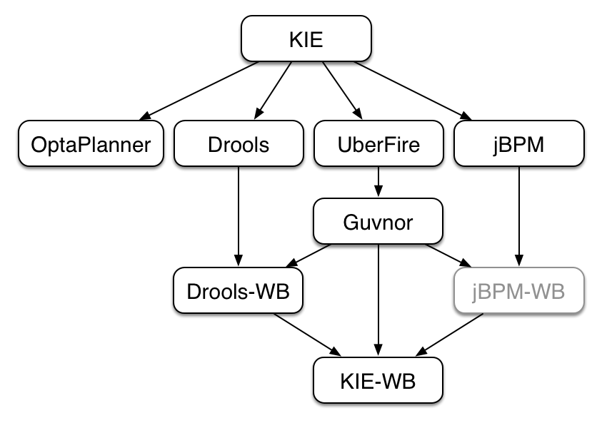
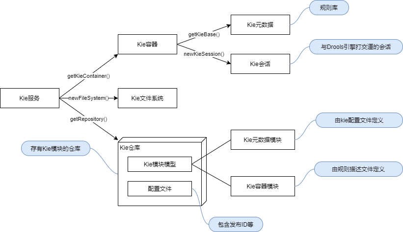
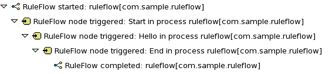
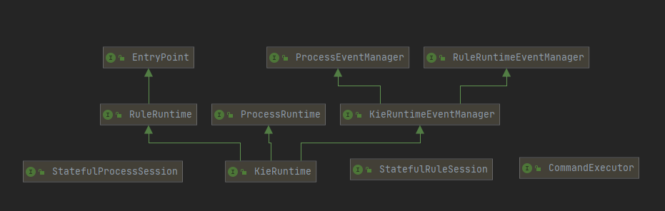
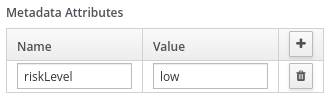
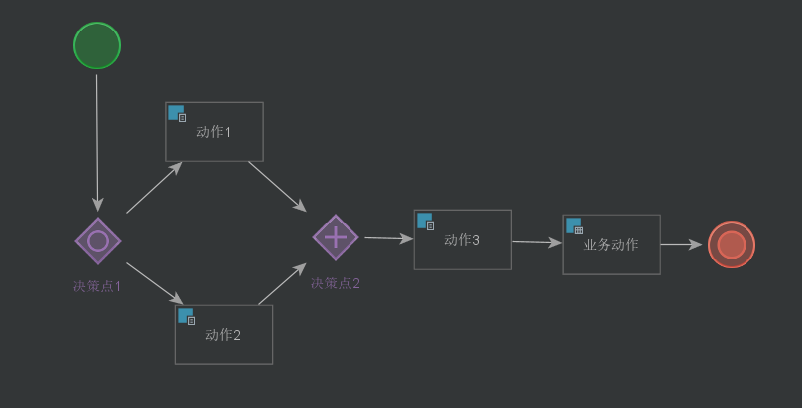
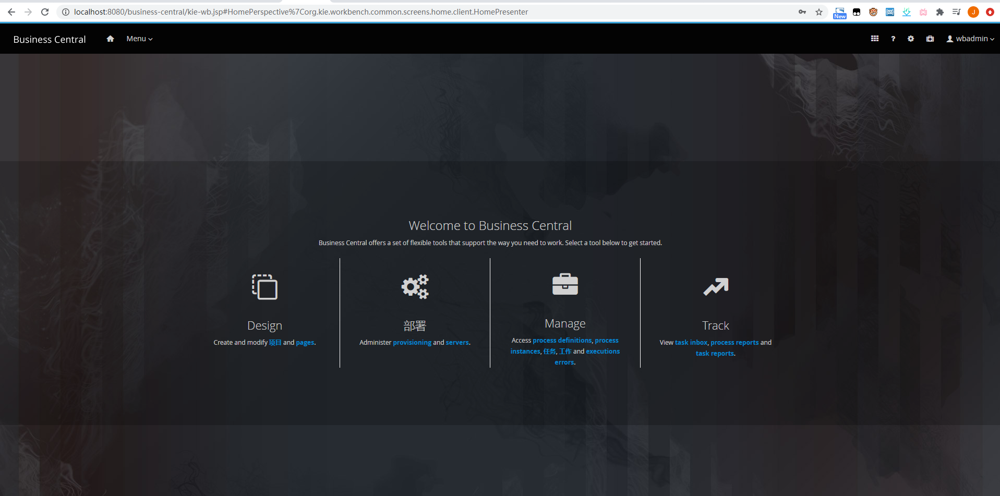
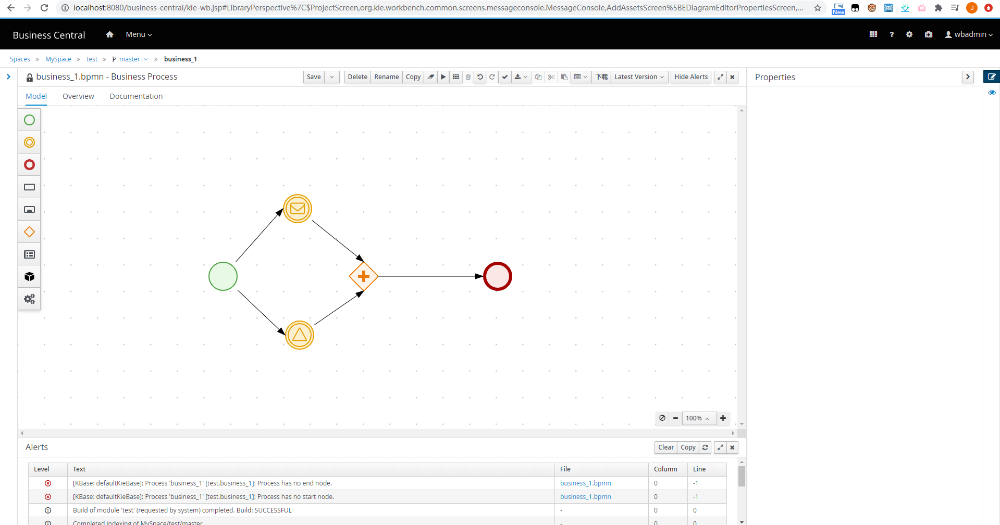
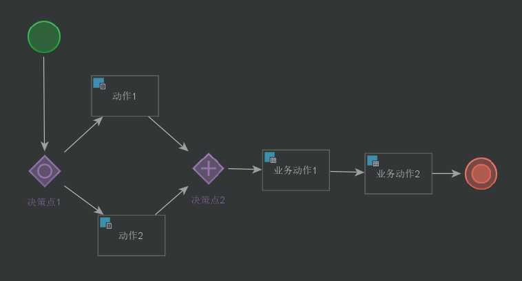

#### 什么是BPMN?

**BPMN (Business Process Model and Notation, 业务流程模型与符号/业务流程建模标记法)** 是一套标准化的，易于理解的，可视化的建模语言。通过BPMN可以用符号和图形化的方法定义业务流程。此外，[BPMN官网](http://www.bpmn.org/)指出，BPMN可以为企业提供以图形符号理解其内部业务流程的能力，并使组织能够以标准化的方式传达这些流程。

#### 为什么使用BPMN?

BPMN允许我们用一种清晰且一致的方式掌握和记录组织的业务流程，技术人员和非技术人员都很容易理解，这样确保所有相关成员都参与到流程中来，也可以更有效的响应流程中发现的各种问题。

BPMN有如下**优点**：

- BPMN是非营利组织OMG联盟指定的行业标准
- 通过业务流程图为企业提供定义和理解其程序的能力
- 为行业内的通用概念提供了一套标准化的符号表示
- 减少了业务流程设计和实施之间的沟通障碍
- 简单易学，但功能强大。足以描述复杂的业务流程

#### 什么是jBPM？

jBPM是KIE（Knowledge Is Everything，知识就是一切）的一个子项目，它是一个轻量级的开源BPM（Business Process Management, 业务流程管理）套件，是对上述的BPMN标准的一种实现，用纯Java编写。允许使用者在业务流程和程序的整个生命周期中对其进行建模、执行和监视。

> KIE（Knowledge Is Everything），知识就是一切的简称。JBoss一系列项目的总称，包括OptaPlanner、Drools、UberFire、jBPM以及一些与它们相关联的项目如Guvnor。它们之间有一定的关联，通用一些API。比如涉及到构建（building）、部署（deploying）和加载（loading）等方面都会以KIE作为前缀来表示这些是通用的API。



核心业务是一个纯java组件，允许你灵活的执行业务流程，这部分可以被包装成一个服务，也可以直接嵌入到应用程序中。

#### jBPM 与 Drools 的区别和联系

jBPM是一个工作流引擎，Drools是一个规则引擎。如果需要带有规则的工作流，那么这两者通常被集成在一起使用。

以下文字摘自jBPM官方文档1.1节：

> jBPM is not just an isolated jBPM engine. Complex business logic can be modeled as a combination of business processes with business rules and complex event processing. jBPM can be combined with the [Drools project](https://drools.org/) to support one unified environment that integrates these paradigms where you model your business logic as a combination of processes, rules and events.

> 【译】jBPM不仅仅是一个孤立的jBPM引擎。 可以将复杂的业务逻辑建模为业务流程与业务规则和复杂事件处理的组合。 jBPM可以与Drools组合在一起，以支持一个统一的环境，该环境集成了这些范式，您可以在其中将业务逻辑建模为流程，规则和事件的组合。

#### 为什么jBPM与Drools配合的很好？

之前总结过与drools相关的组件：




构建jbpm使用的同样是上面这些组件。实际上，KIE（Knowledge Is Everything）的想法就是把所有的抽象知识存成一个知识库（KieRespository），然后再应用这些知识/范式对外部进行管理，控制和监视。

#### jBPM+Drools解决了什么业务痛点？

- 两者结合可以随意个性化设计不同的复杂业务流程
- 两者完全解耦，可以分别设计并随意搭配
- 两者共用同一套知识库，在同一上下文中运行。因此编码简单，整个系统也更轻量级，支持同时维护更多的业务进程。

#### logger

可以为session注册一个logger，记录session中process的运行过程

```
import org.kie.api.KieServices;
import org.kie.api.logger.KieRuntimeLogger;
...
KieRuntimeLogger logger = KieServices.Factory.get().getLoggers().newFileLogger(ksession, "test");
// add invocations to the jBPM engine here,
// e.g. ksession.startProcess(processId);
...
logger.close()
```

这个log文件以xml的格式存储，也可以用插件打开，如官方推荐的drools-eclipse-plugin：



#### CorrelationAwareProcessRuntime

KieSession实现了StatefulRuleSession, StatefulProcessSession, CommandExecutor, KieRuntime四个接口，其中KieRuntime继承自ProcessRuntime。startProcess()方法就是由ProcessRuntime定义的。



但是有的时候对于一个process，我们可能需要一个自定义的标识，而非ProcessRuntime.startProcess()提供的自动生成的Id，此时可以使用CorrelationAwareProcessRuntime.startProcess()方法。

```
/**
* Start a new process instance.  The process (definition) that should
* be used is referenced by the given process id.  Parameters can be passed
* to the process instance (as name-value pairs), and these will be set
* as variables of the process instance.
*
* @param processId  the id of the process that should be started
* @param correlationKey custom correlation key that can be used to identify process instance
* @param parameters  the process variables that should be set when starting the process instance
* @return the ProcessInstance that represents the instance of the process that was started
*/
ProcessInstance startProcess(String processId, CorrelationKey correlationKey, Map<String, Object> parameters);

```

这通常用于长时间运行的process，因此需要启用持久性才能永久存储关联信息。

#### 线程

一个包含了逻辑上多个线程的单一jBPM process在技术上是在一个线程中执行的，这是为了避免不同技术线程之间的复杂通信，以及确保不同线程协调工作而导致的额外逻辑和额外开销（如避免竞争和死锁）。

因此在同一个process中逻辑并行的过程实际上是串行执行的，因此可能有阻塞的问题。因此在process中调用服务应当尽量异步调用，避免阻塞jBPM引擎。

HumanTask（需要人参与的任务）是异步调用的典型示例，因为为我们不希望jBPM引擎等到人工参与者对请求做出响应之后再进行调用。HumanTask节点被触发时，HumanTask handler将在分配的参与者的任务列表上创建一个新任务。接着jBPM引擎将继续执行其他任务，并且handler将在用户完成任务后异步通知jBPM引擎。

#### RuntimeManager

RuntimeManager允许用户以标准的模式使用KIE API，只需要实现RuntimeManager接口并实现对应的方法（详见RuntimeManager和RuntimeEngine的接口定义）。策略上，分为Singleton strategy和Per request strategy。类似我写的规则引擎里的fire()和localFire()，另一种策略是Per process instance strategy，三种策略详见[jBPM文档-7.4.2](https://docs.jboss.org/jbpm/release/7.44.0.Final/jbpm-docs/html_single/#_strategies)。

SampleCode：

```
// first configure environment that will be used by RuntimeManager
RuntimeEnvironment environment = RuntimeEnvironmentBuilder.Factory.get()
    .newDefaultInMemoryBuilder()
    .addAsset(ResourceFactory.newClassPathResource("BPMN2-ScriptTask.bpmn2"), ResourceType.BPMN2)
    .get();

// next create RuntimeManager - in this case singleton strategy is chosen
RuntimeManager manager = RuntimeManagerFactory.Factory.get().newSingletonRuntimeManager(environment);

// then get RuntimeEngine out of manager - using empty context as singleton does not keep track of runtime engine as there is only one
RuntimeEngine runtimeEngine = manager.getRuntimeEngine(EmptyContext.get());

// get KieSession from runtime runtimeEngine - already initialized with all handlers, listeners, etc that were configured on the environment
KieSession ksession = runtimeEngine.getKieSession();

// add invocations to the jBPM engine here,
// e.g. ksession.startProcess(processId);

// and last dispose the runtime engine
manager.disposeRuntimeEngine(runtimeEngine)
```

可以通过以上方法自动生成RuntimeEnvironment，也可以重写接口自定义生成方法，详见接口定义RuntimeEnvironment、RuntimeEnvironmentBuilder、RuntimeEnvironmentBuilderFactory。

#### BPMN2.0与jBPM6.x+

BPMN2.0不仅定义了如BPMN1.x的图形化表示业务流程的标准，还额外给出了各种元素的执行语义（execution semantics）以及如何用XML语法对业务流程进行定义和存储。

jBPM6以后允许用BPMN2.0定义的XML标准对process进行定义，但是jBPM至今为止还没有支持所有的BPMN2.0定义的元素，不过其支持了所有的有关指定可执行进程（executable process）的元素。

> BPMN2.0中还包括了一些与编排和协作有关的定义。

#### jBPM元素

详见[文档-8.1](https://docs.jboss.org/jbpm/release/7.44.0.Final/jbpm-docs/html_single/#_what_is_bpmn_2_0)

#### Metadata Attributes 与 Process Variables

在Business Central中可以为asset添加两种变量，Metadata Attributes 与 Process Variables。Process Variables类似于编程语言中的一个有类型有值的变量，而Metadata Attributes是一种键值对

> 原文：The**Metadata Attributes**entries are similar to**Process Variables**tags in that they enable new`metaData`extensions to BPMN diagrams. However, process variable tags modify the behavior of specific process variables, such as whether a certain variable is`required`or`readonly`, whereas metadata attributes are key-value definitions that modify the behavior of the overall process.

例如将riskLevel设为low：

对应XML：

```
<bpmn2:process id="approvals" name="approvals" isExecutable="true" processType="Public">
  <bpmn2:extensionElements>
    <tns:metaData name="riskLevel">
      <tns:metaValue><![CDATA[low]]></tns:metaValue>
    </tns:metaData>
  </bpmn2:extensionElements>
```

然后将其绑定到一个过程开始事件的监听器上：

```
public class MyListener implements ProcessEventListener {
    ...
    @Override
    public void beforeProcessStarted(ProcessStartedEvent event) {
        Map < String, Object > metadata = event.getProcessInstance().getProcess().getMetaData();
        if (metadata.containsKey("low")) {
            // Implement some action for that metadata attribute
        }
    }
}
```

#### 非单一输入输出的task和event

对于非单一输入输出的情况，建议使用gateway。如果实在需要给同一个task或event连接多个输入或输出，需要将JVM的系统属性jbpm.enable.multi.con设置为true，如果是在多个机器上运行Business Central 和 KIE Server，则要保证每台机器上都设置了jbpm.enable.multi.con为true。

#### Other things

##### BPMN语法

BPMN中共有五组主要的元素：swimlanes（pools 和 lane）、flow elements、connecting objects、data。

各元素的用法见[这里](https://www.visual-paradigm.com/guide/bpmn/what-is-bpmn/)

##### jBPM安装与使用

IDEA中有JetBrains提供的可视化编辑流程图并生成xml的插件，但是似乎对IDEA版本有限制，~~太新太旧都不work（[参考这里](https://stackoverflow.com/questions/34906536/jboss-drools-bpmn-intellij-plugin)）我的应该是太新，暂时没来得及试其他版本的IDEA或者其他的jbpm插件，以后有时间会去试一下。~~ 本问题已解决。方法：手动下载最新版插件 -> 安装失败查看当前IDEA版本能安装的最新版的插件（<202.6397.43）=> 下载安装202.6397.20

编辑UI如下：



另外 [jBPM官网](https://www.jbpm.org/learn/gettingStarted.html)提供了JBPM的源码，可以直接运行或者docker运行。直接运行会被公司的杀毒软件拦截= =docker版本没问题，运行起来之后可以通过web进行操作。






##### ruleFlow（规则流）

当jbpm的工作流中被施加了drools规则时，这个工作流就变成了规则流（rule flow）

在工作流中对元素定义被其施加的规则：

```
<!--    businessRuleTask-->
<businessRuleTask id="_jbpm-unique-6" name="业务动作" g:ruleFlowGroup="Group1" >
  <ioSpecification>
    <inputSet>
    </inputSet>
    <outputSet>
    </outputSet>
  </ioSpecification>
</businessRuleTask>
```

```
<!--    sequenceFlow-->
<sequenceFlow id="_jbpm-unique-1-_2" sourceRef="_jbpm-unique-1" targetRef="_2" name="constraint" tns:priority="1" tns:ruleFlowGroup="Group2">
  <conditionExpression xsi:type="tFormalExpression" language="http://www.java.com/java" >
  	return true;
  </conditionExpression>
</sequenceFlow>
```

同时drl文件中定义对应的group

```
package com.javacodegeeks.drools
 
import com.javacodegeeks.drools.Message;
 
rule "One"
ruleflow-group "Group1"
    when
        m : Message( status == Message.HELLO, myMessage : message )
    then
        System.out.println( myMessage );
        m.setMessage( "Goodbye cruel world" );
        m.setStatus( Message.GOODBYE );
        update( m );
end

rule "Two"
ruleflow-group "Group1"
    when
        Message( status == Message.GOODBYE, myMessage : message )
    then
        System.out.println( myMessage );
end

```

这样，只有在规则流组“ Group1”被激活时才能触发第一条规则，Group2同理。

##### drools与jBPM结合使用的进一步探究

之前一直没想明白，一个工作流里没有数据怎么去做判断和流程控制。实际上数据都是放在drools中判断的。通过绑定jBPM与ruleGroup，可以控制在流程里的哪一步对KieSession中数据进行判断。这样一来，数据就被解耦出来了。

具体来说，一个规则流的工作方式类似于一组独立的规则。当流程（process）运行到某个绑定了规则（rule）的节点（node），会自动进行规则匹配（fire），当本节点内没有规则可以匹配（fire），进程将进入下一节点。

比如如下规则：

```
rule "One"
ruleflow-group "Group1"
    when
        m : Message( status == Message.HELLO, myMessage : message )
    then
        System.out.println( myMessage );
        m.setMessage( "Goodbye cruel world" );
        m.setStatus( Message.GOODBYE );
        update( m );
end

rule "Two"
ruleflow-group "Group2"
    when
        Message( status == Message.GOODBYE, myMessage : message )
    then
        System.out.println( myMessage );
end
```

对应如下流程（业务动作1绑定规则流组Group1，业务动作2绑定规则流组Group2）：

```
...
    <businessRuleTask id="_jbpm-unique-5" name="业务动作1" g:ruleFlowGroup="Group1" >
      <ioSpecification>
        <inputSet>
        </inputSet>
        <outputSet>
        </outputSet>
      </ioSpecification>
    </businessRuleTask>

    <businessRuleTask id="_jbpm-unique-6" name="业务动作2" g:ruleFlowGroup="Group2" >
      <ioSpecification>
        <inputSet>
        </inputSet>
        <outputSet>
        </outputSet>
      </ioSpecification>
    </businessRuleTask>
...
```



执行结果：

```
Rule is fired
Goodbye cruel world
```

### 