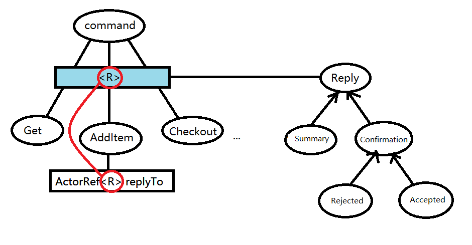

#### 领域建模

##### 聚合（Aggregates）

- 聚合是一组始终需要保持一致的业务对象。因此，我们在事务中作为一个整体保存和更新聚合。
- 聚合根是一个作为聚合入口点的类。所有业务操作都应该通过根。这样，聚合根就可以保证聚合保持一致的状态。

##### 编写Entity

从图上看结构大概是这样的：


Entity类继承的`EventSourcedBehaviorWithEnforcedReplies`类的构造方法接收三个参数：

```
public class ShoppingCartEntity
    extends EventSourcedBehaviorWithEnforcedReplies<
        ShoppingCartEntity.Command, ShoppingCartEntity.Event, ShoppingCartEntity.ShoppingCart>
```

> 在为CQRS聚合建模时，建议使用EventSourcedBehaviorWithEnforcedReplies。使用强制答复需要一个command handlers来返回ReplyEffect，以强制开发人员明确答复。

这三个参数分别对应图中的command and reply、state 和 event。这三个参数都是在ShoppingCartEntity内部定义的。

###### 模型状态（state）

lagom中以状态转换的方式来表示一个entity的各种操作，我理解这样做会很方便链式操作。

```
@Value
@JsonDeserialize
static final class ShoppingCart implements CompressedJsonable {

  public final PMap<String, Integer> items;
  public final Optional<Instant> checkoutDate;
  public static final ShoppingCart EMPTY = new ShoppingCart(HashTreePMap.empty(), null);

  @JsonCreator
  ShoppingCart(PMap<String, Integer> items, Instant checkoutDate) {
    this.items = Preconditions.checkNotNull(items, "items");
    this.checkoutDate = Optional.ofNullable(checkoutDate);
  }

  ShoppingCart removeItem(String itemId) {
    PMap<String, Integer> newItems = items.minus(itemId);
    return new ShoppingCart(newItems, null);
  }

  ShoppingCart updateItem(String itemId, int quantity) {
    PMap<String, Integer> newItems = items.plus(itemId, quantity);
    return new ShoppingCart(newItems, null);
  }

  // 这里还有一些状态检测函数如isEmpty()等

}
```

###### 利用AKKA Type建模command and reply

这部分看的是真的头大，很多东西都被底层的akka type封装了，所以写顶层接口实现的时候一脸懵逼。

试着画了一下结构图：



Entity类中有一个Command接口：

```
interface Command<R> extends Jsonable {}
```

代表不同command操作的类都实现这个command接口：

```
@Value
@JsonDeserialize
static final class AddItem implements Command<Confirmation>, CompressedJsonable {
    public final String itemId;
    public final int quantity;
    public final ActorRef<Confirmation> replyTo;

    @JsonCreator
    AddItem(String itemId, int quantity, ActorRef<Confirmation> replyTo) {
        this.itemId = Preconditions.checkNotNull(itemId, "itemId");
        this.quantity = quantity;
        this.replyTo = replyTo;
    }
}
```

其成员变量`ActorRef<R> replyTo`是Akka Type中用于包装回复信息的对象。（在上面代码中，这个R，也就是回复消息类型，是`Confirmation`）

在上图中可以看到不同的Reply类型代表了不同类别的回复。比如Summary用于封装包含内容（如查询结果）的回复：

```
@Value
@JsonDeserialize
static final class Summary implements Reply {
    public Map<String, Integer> getItems() {
        return items;
    }

    public boolean isCheckedOut() {
        return checkedOut;
    }

    public Optional<Instant> getCheckoutDate() {
        return checkoutDate;
    }

    public final Map<String, Integer> items;
    public final boolean checkedOut;
    public final Optional<Instant> checkoutDate;

    @JsonCreator
    Summary(Map<String, Integer> items, boolean checkedOut, Optional<Instant> checkoutDate) {
        this.items = items;
        this.checkedOut = checkedOut;
        this.checkoutDate = checkoutDate;
    }
}
```

~~基本反正代码结构就是这样，但至于为啥这么写框架就能跑通，我试着看了看akka.type的源码发现一时半会不可能看懂。这就是我为什么不喜欢在框架里写代码——黑盒带来了太多问题，只能死记硬背用法，而且出了BUG还贼难调。~~

好吧后面commandHandler部分有说command是如何对Entity起作用的：哪些验证过程将被应用，以及哪个持久化事件将被触发等等。 

###### Event

state、command和event共同构成了Entity，编写好了state和command剩下的就是编写event，用于定义如何处理不同的事件，其主要就是把消息包装成不同的对象来传递。

首先定义一个通用接口Event

```
public interface Event extends Jsonable, AggregateEvent<Event> {
  // #shopping-cart-event-tag
  /** The tag for shopping cart events used for consuming the journal event stream. */
  AggregateEventShards<Event> TAG = AggregateEventTag.sharded(Event.class, 10);
  // #shopping-cart-event-tag

  @Override
  default AggregateEventTagger<Event> aggregateTag() {
    return TAG;
  }
}
```

其他各种Event均实现这个接口，这样整个项目可以通过反射机制读取各种具体Event

```
@Value
@JsonDeserialize
static final class ItemAdded implements Event {
  public final String shoppingCartId;
  public final String itemId;
  public final int quantity;
  public final Instant eventTime;

  @JsonCreator
  ItemAdded(String shoppingCartId, String itemId, int quantity, Instant eventTime) {
    this.shoppingCartId = Preconditions.checkNotNull(shoppingCartId, "shoppingCartId");
    this.itemId = Preconditions.checkNotNull(itemId, "itemId");
    this.quantity = quantity;
    this.eventTime = eventTime;
  }
}
```

###### Command Handler

当定义好了三要素（command、state、event）后，我们用Command Handler来定义在不同的state下如何处理收到的command，包括何种验证方法将被应用以及最终哪种event将被触发等等。如：

```
@Override
    public CommandHandlerWithReply<Command, Event, ShoppingCart> commandHandler() {
        CommandHandlerWithReplyBuilder<Command, Event, ShoppingCart> builder = newCommandHandlerWithReplyBuilder();
        builder.forState(ShoppingCart::isOpen)
                .onCommand(AddItem.class, this::onAddItem)
                .onCommand(RemoveItem.class, this::onRemoveItem)
                .onCommand(AdjustItemQuantity.class, this::onAdjustItemQuantity)
                .onCommand(Checkout.class, this::onCheckout);

        builder.forState(ShoppingCart::isCheckedOut)
                .onCommand(AddItem.class, 
                cmd -> Effect().reply(cmd.replyTo, new Rejected("Cannot add an item to a checked-out cart")))
                .onCommand(RemoveItem.class, 
                cmd -> Effect().reply(cmd.replyTo, new Rejected("Cannot remove an item to a checked-out cart")))
                .onCommand(AdjustItemQuantity.class, 
                cmd -> Effect().reply(cmd.replyTo, 
                	new Rejected("Cannot adjust item quantity in a checked-out cart")))
                .onCommand(Checkout.class, 
                cmd -> Effect().reply(cmd.replyTo, new Rejected("Cannot checkout a checked-out cart")));

        builder.forAnyState().onCommand(Get.class, this::onGet);
        return builder.build();
    }
```

`onCommand`的两个参数分别是在当前state下接收到的command和需要针对这个command触发的event

###### EventHandler

EventHandler用于处理在什么event发生时会触发哪种state的转换，如：

```
@Override
public EventHandler<ShoppingCart, Event> eventHandler() {
  return newEventHandlerBuilder()
      .forAnyState()
      .onEvent(
          ItemAdded.class,
          (shoppingCart, evt) -> shoppingCart.updateItem(evt.getItemId(), evt.getQuantity()))
      .onEvent(CheckedOut.class, (shoppingCart, evt) -> shoppingCart.checkout(evt.getEventTime()))
      .build();
}
```

我试着总结了event、command、state、commandHandler、eventHandler的关系：

```
command --(command handler)--> event --(event handler)--> state变化 
```

> 我觉得这部分应该就是参考了有限状态机的机制，所以说祖师爷图灵是真的牛批，一百年前的理论现在还能有应用。

##### 事件标注（Tagging the events）与分片（sharding）

为了分片和一些我暂时不知道是啥的功能（in CQRS, we also want to consume those same events and generate read-side views or publish them in a message broker (eg: Kafka) for external consumption），我们需要为不同的事件打标签（tagging），根据event的不同标签可以把不同类别的事件哈希给不同的处理器来处理。

代码上，tagger在Entity中被初始化，在override了父类的方法tagsFor中被调用，lagom框架调用tagsFor为不同event分配分片。

###### 快照（snapshot）

存储快照可以避免每次都从头开始进行事件溯源，如：

```
@Override
public RetentionCriteria retentionCriteria() {
  return RetentionCriteria.snapshotEvery(100, 2);
}

```

详情请见[Akka Doc - snapshot](