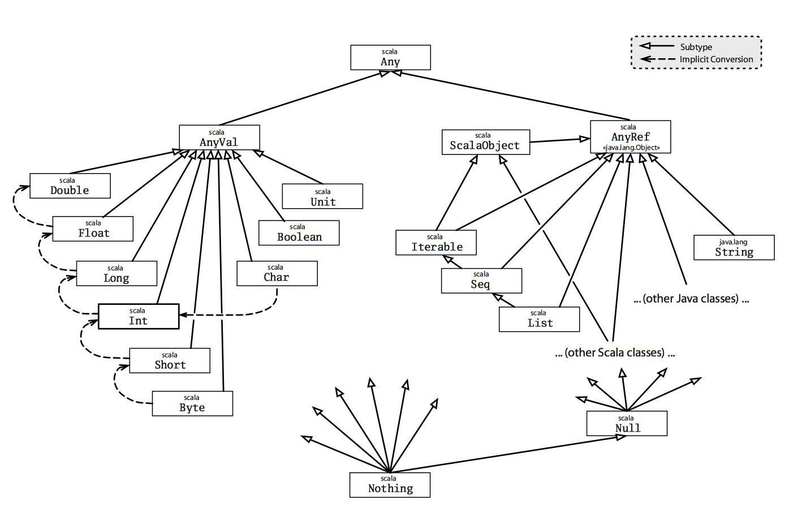

#### Nothing 、Null、Unit 与 Nil

`Nothing`是所有类型的子类型，也称为底部类型。没有一个值是`Nothing`类型的。它的用途之一是给出非正常终止的信号，如抛出异常、程序退出或者一个无限循环（可以理解为它是一个不对值进行定义的表达式的类型，或者是一个不能正常返回的方法）。

`Null`是所有引用类型的子类型（即`AnyRef`的任意子类型）。它有一个单例值由关键字`null`所定义。`Null`主要是使得Scala满足和其他JVM语言的互操作性，但是几乎不应该在Scala代码中使用。我们将在后面的章节中介绍`null`的替代方案。

`Unit`是只有一个元素居留其中的类型，因此是单位类型，其并不对应与C++里的`void`，准确的对应是C++中的`monostate`。而Scala里的`Nothing`才对应于`void`，即无元素居留的类型。

`Nil`则是列表的归纳定义的基始情形，即空列表。

#### 函数/方法定义

scala允许这种方式定义函数：

```
val increment = new Function1[Int, Int]: Int {
  /* code here */
}

// 相当于
val increment = new Function1(x: Int, y: Int): Int {
  /* code here */
}
```

#### 多参数列表

scala允许一个方法有多个参数列表，例如 `trait TraversableOnce` 中定义了左折叠`foldLeft`方法：

```
def foldLeft[B](z: B)(op: (B, A) => B): B
```

其具有两个参数列表，实数的加法左折叠可以写为：

```
val numbers = List(1, 2, 3, 4, 5, 6, 7, 8, 9, 10)
numbers.foldLeft(0, {(m: Int, n: Int) => m + n})
// 或者 numbers.foldLeft(0)(_ + _)
```

这些参数列表也可以先传输一部分用于复用，然后再传给另一部分：

```
val numbers = List(1, 2, 3, 4, 5, 6, 7, 8, 9, 10)
val numberFunc = numbers.foldLeft(List[Int]())_  // 先传了一个Int型的空列表用于第一个参数列表

val squares = numberFunc((xs, x) => xs:+ x*x)
print(squares.toString()) // List(1, 4, 9, 16, 25, 36, 49, 64, 81, 100)

val cubes = numberFunc((xs, x) => xs:+ x*x*x)
print(cubes.toString())  // List(1, 8, 27, 64, 125, 216, 343, 512, 729, 1000)
```

#### 提取器

提取器对象是一个包含有 `unapply` 方法的单例对象。`apply` 方法就像一个构造器，接受参数然后创建一个实例对象，反之 `unapply` 方法接受一个实例对象然后返回最初创建它所用的参数。提取器常用在模式匹配和偏函数中。例如下面的单例对象：

```
object CustomerID {

  def apply(name: String) = s"$name--${Random.nextLong}"

  def unapply(customerID: String): Option[String] = {
    val stringArray: Array[String] = customerID.split("--")
    if (stringArray.tail.nonEmpty) Some(stringArray.head) else None
  }
}
```

scala中常使用case来进行模式匹配，例如：

```
val customer1ID = CustomerID("Sukyoung")  // Sukyoung--23098234908
customer1ID match {
  case CustomerID(name) => println(name)  // prints Sukyoung
  case _ => println("Could not extract a CustomerID")
}
```

当我们调用 `CustomerID("Sukyoung")` ，其实是调用了 `CustomerID.apply("Sukyoung")` 的简化语法。当我们调用 `case CustomerID(name) => println(name)`，就是在调用提取器方法。

因此，提取器可以用来初始化变量：

```
object CustomerID {

  def apply(name: String) = s"$name--${Random.nextLong}"

  def unapply(customerID: String): Option[String] = {
    val stringArray: Array[String] = customerID.split("--")
    if (stringArray.tail.nonEmpty) Some(stringArray.head) else None
  }
}
```

上述代码等价于`val name = CustomerID.unapply(customer2ID).get`

#### 协变与逆变

scala中用方括号表示泛型，Scala支持 泛型类 的类型参数的型变注释，允许它们是协变的，逆变的，或在没有使用注释的情况下是不变的。

```
class Foo[+A] // A covariant class 协变
class Bar[-A] // A contravariant class 逆变
class Baz[A]  // An invariant class 不变
```

**协变**使用`+A`来标注，对于某个类`class List[+A]`，使A成为协变意味着，如果 `A` 是 `B` 的子类型，那么 `List[A]` 就是 `List[B]` 的子类型。**逆变**使用`-A`来标注，对于某个类`class Writer[-A]`，使A成为逆变意味着，如果`A`是`B`的子类型，那么`Writer[B]`是`Writer[A]`的子类型。

协变通常是对父类定义了一个方法F[Parent]，用到了父类相关的属性或方法，子类因为继承了这些属性和方法，因此也可以使用F[Child]；逆变通常是定义了F[Child]，而F[Parent]应该拥有比F[Child]更广义的用法，因此可以用F[Parent]替换F[Child]，例如：

> 如果 `Printer[Cat]` 知道如何在控制台打印出任意 `Cat`，并且 `Printer[Animal]` 知道如何在控制台打印出任意 `Animal`，那么 `Printer[Animal]` 也应该知道如何打印出 `Cat` 就是合理的。 反向关系不适用，因为 `Printer[Cat]` 并不知道如何在控制台打印出任意 `Animal`。 因此，如果我们愿意，我们应该能够用 `Printer[Animal]` 替换 `Printer[Cat]`。

#### 类型上界与类型下界

像`T <: A`这样声明的类型上界表示类型变量`T`应该是类型`A`的子类，如：

```
class PetContainer[P <: Pet](p: P) {  // 声明了P应当是Pet的子类
  def pet: P = p
}
```

#### type关键字

> 参考了[崔鹏飞的文章](https://cuipengfei.me/blog/2013/12/23/desugar-scala-4/)

type关键字用来给类型或者是操作起别名，比如：

```
type People = List[Person]
```

这样就给`List[Person]`起了一个别名`People`：

```
def teenagers(people: People): People = {
  people.filter(person => person.age < 20)
}
```

编译之后没什么神奇的，只是把出现People这个字眼的地方都用`List[Person]`替代了：

```
public List<Person> teenagers(List<Person> people)
{
  return (List)people.filter(new AbstractFunction1() { public static final long serialVersionUID = 0L;
    public final boolean apply(Person person) { return person.age() < 20; }
  });
}
```

同理可以用type给操作命名：

```
type PersonPredicate = Person => Boolean
// 接受一个Person，返回一个Boolean，我们把这一类用来判断一个人是否符合某个条件的操作统称为PersonPredicate。
```

然后我们可以定义以下predicate：

```
val teenagerPred: PersonPredicate = person => person.age < 20
```

实际上：

- 一个类型的type alias，类似于这样的：type t = x。编译器将在所有使用到t的地方把t替换为x。
- 对于一种操作的type alias，编译器将会根据参数列表和返回值类型的不同将其替换为对应的Function0,Function1,Function2 …… 一直到Function22。

#### 反编译scala到java

很喜欢[崔鹏飞](https://cuipengfei.me/tags/Scala/page/2/)的通过反编译scala学习java的方式，所以决定自己也动手试一下：

在IDEA中，编译好的class在target/scala(-x.x)/classes下，右键scala类 - Decompile Scala to Java就可以了

其中`MODULE$`或`Predef..MODULE$`代表默认已有的类，如`println`的反编译结果是`MODULE$.println`

#### lazy关键字

lazy关键字用于懒加载，只需在变量定义时声明即可：

```scala
lazy val str = getStrFromWebService()
```

反编译后可以看到，编译器也是通过同步和加锁的方法完成了懒加载：

```java
private String str;
private volatile boolean bitmap$0;

private String str$lzycompute()
{
  synchronized (this) {
  	if (!this.bitmap$0) {
    this.str = getStrFromWebService();
    this.bitmap$0 = true;
   }
  	return this.str;
  }
}

public String str() {
  return this.bitmap$0 ? this.str : str$lzycompute();
}
```

#### apply

apply方法允许无方法名的调用，如：

```
class Kettle {
  def apply(water: Water) = {
    water.isWarm = true
    water
  }
}

val kettle: Kettle = new Kettle()
kettle(new Water())  // 相当于kettle.apply(new Water())
```

apply也可以被放到object中，比如将apply放到上面Kettle类的伴生类中：

```
object Kettle {
  def apply(water: Water) = {
    water.isWarm = true
    water
  }
}
```

那么就可以直接写成`Kettle(new Water())`。apply方法常用于工厂，比如scala标准库中提供了List和Map的工厂方法：

```
List("a", "b", "c")
Map(1 -> "a", 2 -> "b", 3 -> "c")
```

上面这两行代码并不是在调用List和Map的constructor方法，而是在调用它们伴生类的apply方法。

#### Future Test

```
import scala.concurrent.Future
import scala.concurrent.ExecutionContext.Implicits.global

val value=Future{
  Thread.sleep(1000)
  1
} 

print(value)
Thread.sleep(1000)
print(value.value)
```

#### type X <: Y

参考[stackoverflow上的回答](https://stackoverflow.com/questions/20508529/subtype-in-scala-what-is-type-x-y)

之前写过`type x = y`的含义，相当于给y起了一个别名x；

而`type x <: y`的含义就是例如：

```
trait t{
  type x <: y
}
```

那么要求所有加入了特质t的类中都要有type x且要是y的子类

#### 类（class）与类型（type）

> 参考[hongjiang](https://hongjiang.info/scala-type-and-class/)

```
classOf[List[Int]] == classOf[List[String]]  // 值为true
```

_类(class)与类型(type)是两个不一样的概念(在java里因为早期一直使用class表达type，并且现在也延续这样的习惯)；类型(type)比类(class)更”具体”，任何数据都有类型。类是面向对象系统里对同一类数据的抽象，在没有泛型之前，类型系统不存在高阶概念，直接与类一一映射，而泛型出现之后，就不在一一映射了。比如定义`class List[T] {}`, 可以有`List[Int]` 和 `List[String]`等具体类型，它们的类是同一个`List`，但类型则根据不同的构造参数类型而不同。_

#### 可链式调用的方法定义

```
class A {def method1: A = this }
class B extends A {def method2: B = this}

val b = new B
b.method2.method1  // 可以工作
b.method1.method2  // 不行，提示：error: value method2 is not a member of A
```

解决方法：

```
class A { def method1: this.type = this }  // 利用了this关键字的动态特性
class B extends A { def method2 : this.type = this } 

val b = new B
b.method1.method2  // ok
```

#### 类型投影

scala中的class与type是不同的：

```
class A { 
  class B;  
  def foo(b:B)
}

val a1 = new A
val a2 = new A
typeOf[a1.B] == typeOf[a2.B]  // false

// 因此下面这句话会报错
a1.foo(new a2.B)
// 报错信息：
// <console>:12: error: type mismatch;
// found   : a2.B
// required: a1.B 
```

那么如何不报错呢？在scala里，内部类型(排除定义在object内部的)，想要表达所有的外部类A实例路径下的B类型，即对 `a1.B` 和 `a2.B`及所有的 `an.B`类型找一个共同的父类型，这就是类型投影，用 `A#B`的形式表示。因此可以用`A#B`表示所有的`a1.B`和`a2.B`

```
def foo(b: A#B)
```

#### Cake Pattern

蛋糕模式用于完成依赖注入，其主要思想是：

> 比如A依赖B（B需要注入到A中），那么我们用两个trait把A和B分别包裹起来，命名为AComponent和BComponent，同时把AComponent的自身类型声明为BComponent，这样在使用这两个类的类中声明继承AComponent和BComponent就把两者粘合在了一起

如下面的代码（参考[bluishglc](https://blog.csdn.net/bluishglc/article/details/60739183)）

```
trait EngineComponent {

    trait Engine {
        private var running = false
        def start(): Unit = { /* as before */ }
        def stop(): Unit = {/* as before */ }
        def isRunning: Boolean = running
        def fuelType: FuelType
    }

    protected val engine : Engine

    protected class DieselEngine extends Engine {
        override val fuelType = FuelType.Diesel
    }

}

trait CarComponent {

    this: EngineComponent => // gives access to engine

    trait Car {
        def drive(): Unit
        def park(): Unit
    }

    protected val car: Car

    protected class HondaCar extends Car {
        override def drive() {
            engine.start()
            println("Vroom vroom")
        }
        override def park() { … }
    }
}

//tie them all together
object App extends CarComponent with EngineComponent with FuelTankComponent with GearboxComponent {
    override protected val engine = new DieselEngine()
    override protected val fuelTank = new FuelTank(capacity = 60)
    override protected val gearBox = new FiveGearBox()
    override val car = new HondaCar()
}

App.car.drive()

App.car.park()
```

**值得注意的是**，`trait A {this : X =>}`与在类定义中写明`trait A extends X {}`很像，唯一的区别是当有B要继承A的时候，前者需要同时写明`B extends A with X {/* override here */}`而后者不需要提及X

#### case类

很长的一段时间我都没搞清楚case类被设计出来的用意，一开始我以为它是相当于静态类，后来我以为是为了match-case方法而专门设计出来的，现在我觉得[hongjiang](https://hongjiang.info/scala-pattern-matching-6/)说的比较让我信服：

> 本质上case class是个语法糖，对你的类构造参数增加了getter访问，还有toString, hashCode, equals 等方法； 最重要的是帮你实现了一个伴生对象，这个伴生对象里定义了apply方法和unapply方法。
>
> 从case类的设计目的来看，最重要的是提供构造器模式匹配(且构造时的参数，与解构的结果一致)，另外case类可看作是数据对象，不可变的数据对象。
>
> 因为case类封装的数据有**不变**的特点，以及可以进行模式匹配，所以它在actor中经常使用，很适合封装消息在actor之间传递。

##### 方法的定义

类中用def定义的方法外部可以通过类名调用，但是用val定义的方法外部是不能直接用名字调用的

##### 偏函数

偏函数我理解更像是数学中的分段函数，或者“部分函数”，或者“不连续函数”，或者“枚举函数”。定义方法如下：

```
val pf : PartialFunction[int, String] = {
  case 1 => "One"
  case 2 => "Two"
  case _ => "Other"
}
```

##### 可变（长）参数

类似java中的`T..`，代码实例如下：

```
def echo(args: String*) = {
  for (arg <- args) print(arg + " ")
}
```

#### 结构类型

结构类型就是以匿名的方式约束了类或方法。可以通过type在定义类型时，将其声明为结构类型：

```
type X = { def close():Unit }  // X是一个结构类型，结构类型可以直接用大括号+def的方式来定义

def free(res:X) = res.close  // 约束了res要是一个X结构类型的，这意味着要求res中必须有close方法

free(new { def close()=println("closed") })
```

#### with关键词

with关键词实际上是用于定义复合类型的，如：

```
class A extends B with C with D
```

实际上应解读为：

```
class A extends (B with C with D)
```

其中`(B with C with D)`是一个复合类型：

```
trait A
trait B
def test(x : A with B) = this
print(test(new A with B))

输出为：
> trait A
> trait B
> def test(x: A with B):
> $line3.$read$$iw@605c0fed

```

#### implicitly

参考[baeldung](https://www.baeldung.com/scala/implicitly)

比如我们定义了一个根据物体质量计算重力的函数：

```
def weight(mass: Double, gravitationalConstant: Double): Double =
  mass * gravitationalConstant
```

然后我们希望不要每次把重力系数以参数的方式传递进去，所以我们使用了隐式参数：

```
def weightUsingImplicit(mass: Double)(implicit gravitationalConstant: Double): Double =
  weight(mass, gravitationalConstant)
```

使用时可以在外部定义：

```scala
implicit val G: Double = 9.81
```

而在scala2.8之后引入了implicitly来保证外部一定存在可被隐式调用的变量，否则编译器会报错。使用方法如下：

```scala
def weightUsingImplicitly(mass: Double): Double = {
  val gravitationalConstant = implicitly[Double]
  weight(mass, gravitationalConstant)
}
```

#### 视界 <%

**`<%`**的意思是“view bounds”(视界)，它比**`<:`**适用的范围更广，除了所有的子类型，还允许隐式转换过去的类型。

```
def method [A <% B](arglist): R = ...
// 等价于
def method [A](arglist)(implicit viewAB: A => B): R = ...
```

**`<%`** 除了方法使用之外，class声明类型参数时也可使用：

```
class A[T <% Int]
```

但是无法对trait的类型参数使用 **`<%`**。

```
scala> trait A[T <% Int]
<console>:1: error: traits cannot have type parameters with context bounds `: ...' nor view bounds `<% ...'
```

#### ClassTag与JVM类型擦除

今天看lagom源码的时候读到了这样一段代码：

```scala
val commandClass = implicitly[ClassTag[C]].runtimeClass.asInstanceOf[Class[C]]
```

这个ClassTag激起了我的兴趣，所以去查了一下：[ClassTag](https://www.scala-lang.org/api/2.12.1/scala/reflect/ClassTag.html)存储给定类型T的已擦除类，可通过runtimeClass字段进行访问。

>`ClassTag`s are a weaker special case of scala.reflect.api.TypeTags#TypeTags, in that they wrap only the runtime class of a given type, whereas a `TypeTag` contains all static type information. That is, `ClassTag`s are constructed from knowing only the top-level class of a type, without necessarily knowing all of its argument types. This runtime information is enough for runtime `Array` creation.

类型擦除指的是JVM在编译期会擦除掉泛型的类型，所有泛型都会被编译成被声明的最低父类型（如无类似`<T extends P>`的T均会被编译成Object）

#### 函数的apply方法与andThen链式调用

```
def f : X => Y
// 那么这两者等价：
y = f(x)       
y = f.apply(x)	

// 再定义：
def f2 : Y => Z
// 那么这三者等价：
z = f2(f(x))				
z = f.andThen(f2).apply(x)	 
z = f.andThen(f2)(x)	 
```

#### 函数式编程

函数式编程宣扬的是数据和行为的分离，你的数据要设计成不变的数据结构或者记录类型，而你的行为将被设计成操作特定类型不变记录的纯函数。函数将返回新的值，而不是直接修改其作为参数接受的数据。这些新的值可能就是聚合的新状态，或者是表示一次聚合状态转换的领域事件。   —— 《领域驱动设计精粹》P100

#### Class{xxx}的理解

有关下面这段代码：

```
  override def selectCall(id: String): ServiceCall[SelectReq, Done] = ServiceCall {
    req => select(DiscountPolicyInstance.ForMallPolicy)(req).asInstanceOf[Future[Done]]
  }
```

对于这种`ClassA{xxx}`类名直接后面跟一个大括号的写法一开始我很疑惑，后来查了一下，这应该还是相当于调用类的apply方法，同时省略了装入参的括号。因此`ClassA {xxx}`相当于`(new ClassA).apply({xxx})`

> 去做了个实验，发现括号和花括号都是可以直接用的：

```
class X {
  var c = 1
  def apply(x : Int): X = {var tmp = new X(); tmp.c = x; tmp}
}
var x = new X()
var t = x{3}
t.c
```

#### 正则字符串的分片

```
val x = "(hello)@(world)".r
"hello@world" match {
  case x(i, j) => print(s"$i + $j")
}
```

#### `:=> T`语法糖

反编译了一下代码，发现stackoverflow上说的是正确的，`x:=>Int`与`x:()=>Int`等价

```
object Test extends App {
  def f(x : => Int) = {x}
}
```

反编译结果如下：

```
...
public static int f(final Function0 x) {
      return Test$.MODULE$.f(var0);
}
...
```

#### 以":"结尾的操作符

偶尔看到的scala中的一个很有趣的语法糖：以`:`结尾的操作符调用顺序与普通中缀操作符想反：从右往左。比如`h :: t` 实际是 `t.::(h)`，它的意义在于可以让表达看起来更“顺眼”一些。比如：

```
// 一个Cache单例，提供了 >>: 方法
scala> object Cache { def >>:(data:String) { println(data) } }
defined module Cache

scala> "myData" >>: Cache
myData
```

可以直观的表示将数据追加到cache中。

另外实际应用中最常见的从右往左结合的中缀操作符是 `List` 的 `::` 方法：

```
scala> val list = List()
list: List[Nothing] = List()

scala> "A" :: "B" :: list
res4: List[String] = List(A, B)
```

值得一提的是，List除了存在一个**`::`** 方法， 也存在了一个**`::`** 名字的**case类**(List的子类)。所以，构造一个list可以通过`::`的伴生对象提供的工厂方法，也可以通过Nil的`::`方法：

```
scala> val l = ::("A",Nil) // 这里::是伴生对象, 相当于 ::.apply()
l: scala.collection.immutable.::[String] = List(A)

scala> val l2 = "A" :: Nil // 这里::是方法, 相当于 Nil.::()
l2: List[String] = List(A)

scala> l == l2
res1: Boolean = true
```

#### 函数类型的参数类型是逆变的

即如果`typeOf[A]:>:typeOf[B] == True`那么`typeOf[FunctionX[A]]:<:typeOf[FunctionX[B]]==Ture`。

很好理解，当分不清谁是谁的子类型时可以考虑谁的能力更大，能力更大的那个是子类型。FuncA可以处理更多可能性的对象，因此FuncA是FuncB的子类型

#### x match { case _: XXX => ??? }

匹配x类型，如果是XXX那么执行???

#### union type

在scala中用with关键字来支持intersection type交集类型：

```
X with Y with Z
```

同时scala中还有一种union type来表示__或__的意思“X or Y or Z”。在scala中没有语言级别上支持union type，但可以通过隐式转换来实现：

```scala
class StringOrInt[T]
object StringOrInt {
  implicit object IntWitness extends StringOrInt[Int]
  implicit object StringWitness extends StringOrInt[String]
}


object Bar {
  def foo[T: StringOrInt](x: T) = x match {
    case _: String => println("str")
    case _: Int => println("int")
  }
}
```

或者使用柯里-霍华德同构来实现，在下面一节中会具体说明

#### 用柯里-霍华德同构和函数柯里化来消灭重复代码

本节将叙述我如何通过柯里-霍华德同构和函数柯里化来消灭掉算费中同结构同逻辑不同名类型的重复代码。

上面这句话有点绕口，我具体解释一下：例如在我们定义的vo包含抄见电量、变损电量、线损电量，这三个vo名字不同但内部结构完全相同：都包含了有功电量和无功电量两个vo；同时有功电量和无功电量虽然名字不同但结构也相同：都包含了峰时段电量、平时段电量、谷时段电量、尖峰时段电量、低谷时段电量、总时段电量这六个时段电量；最后这六个时段电量名字不同但结构也相同：都包含电量值度量项和时段信息枚举。

````mermaid
graph LR
* --- 抄见电量
* --- 变损电量
* --- 线损电量
抄见电量 --- 有功电量
抄见电量 --- 无功电量
有功电量 --- 峰时段电量
有功电量 --- 平时段电量
有功电量 --- 谷时段电量
有功电量 --- 尖峰时段电量
有功电量 --- 低谷时段电量
有功电量 --- 总时段电量
峰时段电量 --- 电量值
峰时段电量 --- 时段
````

这就导致了例如需要通过定比计算线损时：
$$
线损电量=(抄见电量+变损电量) \times 定比比例
$$

需要重复开箱装箱抄见和变损里面的电量值才能构造出最终结果的线损电量：

```
def f(x:BigDecimal, y:BigDecimal, r: BigDecimal): BigDecimal = (x + y) * r

def byRatio(wq: 抄见电量, tl:变损电量, r: 定比比例) = {
	线损电量(
		有功电量(
			峰时段电量(
				f(wq.有功电量.峰时段电量.电量.value, tl.有功电量.峰时段电量.电量.value, r.value)
			)
			平时段电量(...)
			...
		)
		无功电量(...)
	)
}
```

结果导致每一种抄见/线损/变损算法里头都要出现12次类似这样的东西：

```
f(wq.有功电量.峰时段电量.电量.value, tl.有功电量.峰时段电量.电量.value, r.value)
```

我写了一种算法之后真的是头都大的，所以下决心今天想办法解决这个问题：

首先我利用柯里霍华德同构来支持联合类型（A或B）：

```scala
type N_O_T[A] = A => Nothing
type O_R[T, U] = N_O_T[N_O_T[T] with N_O_T[U]]
type N_O_T_N_O_T[A] = N_O_T[N_O_T[A]]
type or[T, U] = { type lmd[X] = N_O_T_N_O_T[X] <:< (T O_R U) }
```

接着我编写了一个通用的电量处理方法：

```scala
  /**
   * 处理有功电量或无功电量之间的计算关系
   * 需要更新Option为None的情况
   *
   * 使用方法如：
   * powerHandler2to1(writePowerQuantity.activePower, transLossQuantity.activePower, f_RatioWithTransLoss(ratio)) match { case Left(value) => value case _ => ???}
   * powerHandler2to1(writePowerQuantity.reactivePower, transLossQuantity.reactivePower, f_RatioWithTransLoss(ratio)) match { case Right(value) => value case _ => ???}
   * @param input1 有功电量/无功电量
   * @param input2 有功电量/无功电量
   * @param function 只包含input1和input2的函数，要求其他相关参数通过柯里化的方式传入
   * @return Either[有功电量,无功电量] Left=有功 Right=无功
   */
def powerHandler2to1[T: (ActivePower or ReactivePower)#lmd](input1: T, input2: T, function: (PowerValue, PowerValue) => PowerValue): Either[ActivePower, ReactivePower] = (input1, input2) match {
    case (input1: ActivePower, input2: ActivePower) => Left(ActivePower(
      Option[PeakSegPower](PeakSegPower(function(input1.peakSegPower.get.value, input2.peakSegPower.get.value))),
      Option[ShoulderSegPower](ShoulderSegPower(function(input1.shoulderSegPower.get.value, input2.shoulderSegPower.get.value))),
      Option[ValleySegPower](ValleySegPower(function(input1.valleySegPower.get.value, input2.valleySegPower.get.value))),
      Option[SharpSegPower](SharpSegPower(function(input1.sharpSegPower.get.value, input2.sharpSegPower.get.value))),
      Option[RidgeSegPower](RidgeSegPower(function(input1.ridgeSegPower.get.value, input2.ridgeSegPower.get.value))),
      Option[TotalSegPower](TotalSegPower(function(input1.totalSegPower.get.value, input2.totalSegPower.get.value))),
    ))
    case (input1: ReactivePower, input2: ReactivePower) => Right(ReactivePower(
      Option[PeakSegPower](PeakSegPower(function(input1.peakSegPower.get.value, input2.peakSegPower.get.value))),
      Option[ShoulderSegPower](ShoulderSegPower(function(input1.shoulderSegPower.get.value, input2.shoulderSegPower.get.value))),
      Option[ValleySegPower](ValleySegPower(function(input1.valleySegPower.get.value, input2.valleySegPower.get.value))),
      Option[SharpSegPower](SharpSegPower(function(input1.sharpSegPower.get.value, input2.sharpSegPower.get.value))),
      Option[RidgeSegPower](RidgeSegPower(function(input1.ridgeSegPower.get.value, input2.ridgeSegPower.get.value))),
      Option[TotalSegPower](TotalSegPower(function(input1.totalSegPower.get.value, input2.totalSegPower.get.value))),
    ))
  }
```

function是携带者除了input1和input2以外其他入参的函数。

使用方法如下，例如计算定比线损：
$$
线损电量=(抄见电量+变损电量) \times 定比比例
$$

```scala
def f_RatioWithTransLoss(ratio: Ratio)(write: PowerValue, trans: PowerValue): PowerValue = {
    PowerValue((write.value + trans.value) * ratio.value)
  }

def byRatioWithTransLoss(writePowerQuantity: WritePowerQuantity, transLossQuantity: TransLossQuantity, ratio: Ratio): WireLossQuantity = {
    WireLossQuantity(
      powerHandler2to1(writePowerQuantity.activePower, transLossQuantity.activePower, f_RatioWithTransLoss(ratio)) match { case Left(value) => value case _ => ???},
      powerHandler2to1(writePowerQuantity.reactivePower, transLossQuantity.reactivePower, f_RatioWithTransLoss(ratio)) match { case Right(value) => value case _ => ???},
      writePowerQuantity.period
    )
  }
```

#### 有关协变和逆变的进一步理解

这周末读Function源码的时候结合官方文档有了一些对协变和逆变的新理解：

在java中是不可以出现下面这种写法的：

```scala
class A{};
class B extends A{};
A a = new B();   // 不报错
ArrayList<A> aList = new ArrayList<B>();   // 报错
```

也就是说B是A的子类，但`ArrayList<B>`不是`ArrayList<A>`的子类。这带来了很多不方便，scala为了支持这件事，引入了类型翻转的概念：如果在一个带有泛型的类型A在定义时，泛型列表中有泛型被`+`或`-`修饰，那么这个类型A就被称为可翻转类型，否则被称为不可翻转类型。其中，加号修饰的为协变，减号修饰的为逆变。例如scala中List的定义：

```
type List[+A] = scala.collection.immutable.List[A]
```

这意味着List接受的泛型A是协变的：

```scala
class A; class B extends A

var x = List[A](); 
x = List[B]()    // 不报错
```

而在scala的函数定义中，声明Function作为可翻转类型，入参泛型是逆变的，返回值泛型是协变的：

````scala
trait Function1[@specialized(Specializable.Arg) -T1, @specialized(Specializable.Return) +R] extends AnyRef
````

这意味对于函数F1[A1,B1]，如果存在函数F2[A2,B2]满足：F2拥有比F1更广泛的入参接收能力，同时返回结果是F1返回结果的子集（这保证了能接受F1返回结果的方法就一定能接受F2的返回结果），那么F2就是F1的子类，也即F2可以随意替换F1。这与实际情况一致。

#### type-lambda

type-lambda用于将格式与定义不匹配的泛型转换成符合定义的泛型格式，语法上很像lambda表达式。

定义一个类foo，其泛型是`M[_]`，即一个接受一个单一泛型的类型：

```scala
def foo[M[_]] (f : M[Int]) = f
```

很显然例如`List[T]`是一个满足`M[_]`格式定义的类型，因为其接受且仅接受一个泛型T：

```scala
foo[List] ( List(1,2,3) )  	 // ok
foo( List(1,2,3) )  		// 类型参数可省略，scala具有类型推断能力
```

函数作为一个接受多泛型输入的类型（例如`Function1[-A, +B]`），是不符合这个定义的，那么如何使下面这句话编译通过？

```
foo( (x:Int) => println(x) )
```

type lambda可以把类型转换为符合约束的形式来实现这件事：

```
foo[ ({type X[Y] = Function1[Y, Unit]})#X ] ( (x:Int)=>print(x) ) 
```

`{type X[Y] = Function1[Y, Unit]}`是一个结构类型（structural type），其代表一个满足（可被写成）`Function1[Y,Unit]`格式的任意类型，并给其提供了一个别名`X[Y]`

>在类型声明中，大括号用来表示结构类型(structural type)。例如下面的结构类型`{ def close(): Unit }`表示一个任何存在close方法的类型：
>
>```scala
>def using[ C <% { def close(): Unit } ](resource: C) {
>… 
>}
>```

然后通过投影的方式`(...)#X`获得这个匿名的结构类型`{type X[Y] = Function1[Y, Unit]}`中的X，这个X就是符合foo类型约束的类型。

#### 隐式转换的搜索域

参考[官方文档](https://docs.scala-lang.org/tutorials/FAQ/finding-implicits.html)

1. 首先会在当前代码作用域下查找隐式实体（隐式方法、隐式类、隐式对象）

2. 如果第一条规则查找隐式实体失败，会继续在隐式参数的类型的作用域里查找。

   类型的作用域是指与该类型相关联的全部伴生模块，一个隐式实体的类型T，它的查找范围如下：

   - 如果T被定义为`T with A with B with C`，那么A、B、C都是T的部分，在T的隐式解析过程中，它们的伴生对象都会被搜索
   - 如果T是参数化类型，那么类型参数和与类型参数相关联的部分都算作T的部分，比如`List[String]`的隐式搜索会搜索List的伴生对象和String的伴生对象
   - 如果T是一个单例类型`p.T`，即T是属于某个p对象内，那么这个p对象也会被搜索
   - 如果T是个类型注入`S#T`，那么S和T都会被搜索

#### Type Specialization（类型专门化）

Type Specialization用`@specialized`注释，其作用是为基础类型保留了特定的实现来避免基础类型的装箱拆箱。一个很熟悉的例子就是之前举过的Function1的源码：

```scala
trait Function1[@specialized(Specializable.Arg) -T1, @specialized(Specializable.Return) +R] extends AnyRef
```

编译时，除了定义一个泛型的`Clz[A]`，之外，编译器还会额外生成9个特定的类型：byte,char,double,float,int,long,short,void(scala里的Unit), boolean。但这同时也将容易导致类型爆炸，如果包含两个`@specialized`注释的泛型，编译器就会额外生成9*9=81个类，以此类推。

#### 另一种union type的实现：

```scala
def f[A](a: A)(implicit e: (Int with String with Double) <:< A) = a

f(1); f(1.0); f("1")   	// ok
```

#### <: 和 <:<的区别

`<:`相比`<:<`多了类型推断和允许隐式转换，因此也相对不够严谨。

如下代码，本来Int和List[Int]之间是不满足Int是List[Int]父类的，但是编译器会进行类型推断，将foo构造成foo[Any, List[Int]]：

```scala
def foo[A, B <: A](a: A, b: B) = (a,b)
foo(1, List(1,2,3))   // res1: (Any, List[Int]) = (1,List(1, 2, 3))
```

而`<:<`则编译器就会报错。

同样的，`<:`支持隐式转换：

```scala
def foo[B, A<:B] (a:A,b:B) = print("OK")
class A; class B;
implicit def a2b(a:A) = new B

foo(new A, new B)   	// OK
```

`<:<`编译期报错。

#### 类型证明

一切的起因都是源于我看到了一段用于实现union-type的代码：

```
def f[A](a: A)(implicit ev: (Int with String) <:< A)
```

这段代码使用了“类型证明”的方式对函数进行了定义。这种“证明即程序，命题为类型”的特征与“函数是第一类对象”都是函数化编程的核心特征。

在之前有提过“柯里霍华德同构”，实际上所谓柯里霍华德同构，指的是计算机程序与数学证明之间的同构，也被称为公式为类型对应或命题为类型对应。

实际上，函数式编程背后的核心理论是lambda演算，因此去花了很多时间研究了lambda演算，到邱奇数和自增的定义是都看懂了，加法和乘法的定义没有来得及仔细看。但总觉得理解上还是差了那么点意思，有几个瞬间感觉快要豁然开朗了，但是再仔细想一想又觉得还是没有理解深刻到能实际利用lambda演算自己写出这样的类型证明代码。希望这周能通过读更多的代码

#### scala类型系统



实线是继承关系，虚线是隐式转换。

值得注意的是，Null是右边一枝的类型，因此与AnyVal一枝的几个基础类型（被称为**值类型**，与之对应的是**引用类型** - AnyRef）没有继承关系，也就不存在类型推断：

```
scala> val l:List[Int] = List[Null]()
<console>:7: error: type mismatch;
 found   : List[Null]
 required: List[Int]
```

> 值得注意的是，为了支持自定义值类型。scala在2.10之后将AnyVal的sealed约束去掉了，以允许用户通过继承AnyVal类自定义值类型。当然这种自定义值类型相比于普通类定义要更苛刻，详见[这里](https://hongjiang.info/scala-value-classes/)。

#### universal traits（通用特质）

Alexey Romanov在[这篇回答](https://stackoverflow.com/questions/52797500/what-is-the-use-of-universal-trait-in-scala)中明确说明了universal traits就是因为值类型(value classes)在混入特质时需要特别的限制才发明的。

通用特征指的是那些继承自Any的trait，并且内部成员只有def定义的方法，且没有初始化语句。

#### generalized constraint

问题的来源是为什么这样写不报错：

```scala
class A[T](implicit ev : Int <:< T){
  def f = ev
}
new A[AnyVal].f   //  res0: Int <:< AnyVal = generalized constraint
```

上面这种写法第一眼很像是隐式参数，但仔细一看又不是，因为这是放在类的定义中，而隐式参数应该是放在函数定义中，如类似下面这种（以`def`开头）：

```scala
def f(implicit x : Int)
```

但是上面这种又能成功编译且表达出类型限制的功能；而下面这段代码还是会报错：

```scala
class A[T](implicit ev : Int){
  def f = ev
}
new A[AnyVal]
```

这说明了这种写法表达的并不是隐式参数的意思。所以去查了一下这种写法是什么，以及这个`Int <:< AnyVal = generalized constraint`中`generalized constraint`是啥：

参考[herringtondarkholme](https://herringtondarkholme.github.io/2014/09/30/scala-operator/)，实际上这种写法是scala预定义的一种隐式表达，类似`A =:= Any`就是一种类似和`Map[Int, String]`一样的type，但它作为scala语法糖是一种固定写法。

换言之，scala以这种方式来支持柯里霍华德同构，允许编程者达成“证明即程序、命题为类型”的目的。

#### type class实现随意多态（ad-hoc polymorphism）

 scalaz功能基本上由以下三部分组成：

- 新的数据类型，如：Validation, NonEmptyList ...

- 标准scala类型的延伸类型，如：OptionOps, ListOps ...

- 通过typeclass的随意多态（ad-hoc polymorphism）编程模式实现的大量概括性函数组件库

多态简单来讲就是一项操作可以对任意类型施用（即实现`class A; class B; f(a: A); f(b: B)`，其中A、B无确定的父子兄弟继承关系）。要达到这个目的，有以下几种方式：

- 重载
- 继承
- 模式匹配
- type class

重载会导致f(a: A)和f(b: B)的实现逻辑没有任何关系，且复用性会很差，产生很多冗余代码；继承会导致 f 和A、B两个类产生强耦合，通常要求要拿到且能修改A、B的源码才能实现，另外还要求A、B要继承自同一个父类。模式匹配`def f(x: Any) = x match {...}`可以把类型和操作分开，但是要求能够随时更改tell的源码。

这里主要叙述通过type class的方式来实现随意多态。

首先定义`A_FAble`和`B_FAble`来实现f对A和B的业务逻辑，`AFAble`和`BFAble`都继承自`FAble`

```scala
case class A(); case class B();
trait FAble[T]{
  def handle(t:T)
}

object A_FAble extends FAble[A] {
  override def handle(t: A) = ???
}

object B_FAble extends FAble[B] {
  override def handle(t: B) = ???
}
```

这样 f 的定义就会变得十分简洁：

```scala
def f[T](t:T)(fAble: FAble[T]) = fAble.handle(t)
```

最后，我们不希望每次调用`f`都传进去一个`fAble`，所以我们把`fAble`变成隐式参数，整个源码如下：

```scala
case class A(); case class B();
trait FAble[T]{
  def handle(t:T): String
}

implicit object A_FAble extends FAble[A] {
  override def handle(t: A) = "AAA"
}

implicit object B_FAble extends FAble[B] {
  override def handle(t: B) = "BBB"
}

def f[T](t:T)(implicit fAble: FAble[T]) = fAble.handle(t)

f(A())		// res0: String = AAA
f(B())		// res1: String = BBB
```

因为A和B无继承关系，（如果有继承关系直接定义f接收A和B的父类作为输入就行了），而这种方法很像是通过FAble为A和B的handler增加了继承关系，因此相对比简单的多态`f(A a) = ???; f(B b) = ???`要更优雅，并且完成了对A和B的结构和行为的解耦。

> type class模式来自Haskell，在[stackoverflow](https://stackoverflow.com/questions/7360024/why-is-a-type-class-called-type-class)上有人解释了为什么“type class”被称为“type class”（why a type class is called type class）—— 在Haskell中没有class和type的概念，而type class被看作是“class of types”。在scala的官方文档中没有使用这种“type class”，它是被Haskell程序员发现可以在scala中用这种方法来模拟Haskell中的type class。

#### 有关偏函数（Partial Function）最后要说的

偏函数这个概念从我开始学scala到现在真的是不知道唠叨了多少遍了，在这里对偏函数进行一次总结，对相关概念和定义再进行一次校准。

**偏函数的定义**是：不接受指定输入类型下的所有值，形式通常如下：

```scala
def f:PartialFunction[A,B] = {
	case x => ???
	case y => ???
}
```

**偏函数的原理**：`PartialFunction`是一个trait，继承了`scala.Function1`，其额外定义了几个方法，比如`orElse`，`isDefinedAt`， `andThen`，`applyOrElse`。

`orElse`相当于一个并运算，来把多个偏函数组合起来；`isDefinedAt`返回指定的输入是否有定义， `andThen`来进行方法的连续调用，`applyOrElse`接收2个参数，第一个是调用的参数，第二个是个回调函数。如果第一个调用的参数匹配，返回匹配的值，否则调用回调函数：

```scala
def f:PartialFunction[Int,String] = {
	case 0 => "Zero"
}
f.applyOrElse(1, {num:Int => "One"})  // One
```

#### 隐式转换的冲突问题

之前以为隐式转换是只要在可见域里搜索到一个就可以了，但是后来出了错，所以校正了一下：隐式转换能转换成功除了要求转换前后的类型吻合外，还要求符合这种要求的隐式转换函数定义唯一，以防止出现两个不同逻辑的隐式转换造成歧义：

```scala
case class A(x:Int = 1)
case class B(x:Int = 2)

object A{
  implicit def B2A(b: B) = A(9)
  implicit def B2A1(b: B) = A(8)
}

def f(a: A) = a.x

f(B())  // error
```

报错信息：

```
type mismatch;
 found   : A$A32.this.B
 required: A$A32.this.A
Note that implicit conversions are not applicable because they are ambiguous:
 both method B2A in object A of type (b: A$A32.this.B): A$A32.this.A
 and method B2A1 in object A of type (b: A$A32.this.B): A$A32.this.A
 are possible conversion functions from A$A32.this.B to A$A32.this.A
Error occurred in an application involving default arguments.
def get$$instance$$res0 = /* ###worksheet### generated $$end$$ */ f(B())
```

#### def f[A1 >: A, B, C]

当时看到这句话贼懵，把这个和`def f[A1 >: A with B with C]`弄混了，天然的以为逗号是什么特殊的操作符把A、B、C连接起来 ... 结果最后才发现，应该是A1>:A是一组的，B和C是单独的，意思是f接收三个泛型A1、B、C ...

```
// Test
def y[A >: Int,B >: Int](x:A, z:B) = {println(x); println(z)}
y(1,2)
```

#### (implicit ev: C[A]) 和 (implicit ev: T >: A) 的区别

后者是柯里霍华德同构语法糖，不要求上下文中出现ev，前者是隐式转换，要求上下文中要存在ev:C[A]。

#### 多重隐式转换的写法

scala中允许函数参数的隐式转换：

```scala
class A
class B

implicit def b2a(b:B) = new A()
def f(a: A) = println("QWQ")
implicit val b = new B()

f(b)  // QWQ
```

但是正常是不支持多重隐式转换的：

```scala
import scala.language.implicitConversions

class A
class B
class C

implicit def c2b(c:C) = new B()
implicit def b2a(b:B) = new A()

def f(a: A) = println("QWQ")

implicit val c = new C()

f(c)   // 报错，报错信息：type mismatch; found: C; required: A f(c)
```

但是今天看ruleengine源码的时候发现可以通过隐式参数+隐式转换函数的方式来实现嵌套式隐式转换

```scala
class A
class B
class C

implicit def c2b(implicit c:C) = new B()
implicit def b2a(implicit b:B) = new A()

def f(implicit a: A) = println("QWQ")

implicit val c = new C()

f  // QWQ
```

#### Hello Macro

macro（宏）很像是一种“元编程”的概念，换言之，它赋予编程者编写一种能生成代码的代码。回想起来，C语言中的宏`##define`就颇有macro的意味。Lisp中macro是作为一个十分核心的技术被使用的，因此Lisp也因此拥有了极强的表达能力，至今为止支持macro的编程语言并不多，但很幸运的是这其中包括了scala。

具体来说，macro可以在编译期通过修改AST（Abstract Syntax Tree，抽象语法树）来完成对编译后的文件产生影响，macro的编写也是围绕AST修改的描述来进行的。但这同时也导致了macro的定义与使用不能在一个编译期内完成，这一点我在后边会具体提(tu)到(cao)。

> Scala自2.10开始尝试支持macro编程，2.11基本步入”成熟“阶段，2.12中基本稳定，不过，在最新的路线图中，Scala之父，Martin再次表现了将在未来的scala版本（Dotty）中重新设计macro，采用基于scalameta的一套编译器“中立”的元信息模型，试图让macro变得更简单、容易。因此，尝试 macro，目前仍然具有很大的风险性，或许随着scala语言的未来版本，现有的macro也需要重新迁移、实现。

有关什么情况下要使用macro：

- 如果你可以使用普通的函数实现，不要用macro
- 如果你可以用其他方式实现，不要用macro
- 实在找不到办法，尝试一下macro。

我试着写了几个demo：

##### demo1

把macro的定义放在文件Macros.scala中：

```scala
import scala.language.experimental.macros
import scala.reflect.macros.blackbox.Context

object Macros {
  def printHello(): Unit = macro printHello_impl  // 把所有printHello方法的调用自动替换为println("Hello There!")
  // 输入c是编译上下文，c.Expr[T]是一个依赖路径的输出，T是函数的输出类型，在这里println的输出是Unit类型的
  def printHello_impl(c: Context)(): c.Expr[Unit] = { 
    import c.universe._  // 引入c.universe来使用AST相关的类，下面的reify方法就来自这里
    reify { println("Hello There!") }  // reify 方法用于完全替换，另外reify本身也是一个macro ;)
  }
}
```

__然后先执行一次编译__，否则会报错。

再在同目录下新建一个文件MacroTest来使用：

```scala
import scala.language.experimental.macros

object MacroTest extends App {
  import Macros._  // 引入printHello方法
  printHello()  // 输出 Hello There!
}
```

值得注意的是，macro是AST级别的操作而并非是简单的文本替换。否则类似`printHello`或者`printHello()`将无法同时适配。

##### demo2

macro定义：

```scala
def printParam(param: Any): Unit = macro printParam_impl

def printParam_impl(c: Context)(param: c.Expr[Any]): c.Expr[Unit] = {
import c.universe._
reify { println(param.splice) }
}
```

macro使用：

```scala
import Macros._
printParam("I M Parm")  // 输出 I M Parm
```

##### demo3

定义

```scala
def debug1(param: Any): Unit = macro debug1_impl
def debug1_impl(c: Context)(param: c.Expr[Any]): c.Expr[Unit] = {
    import c.universe._
    val paramRep = show(param.tree)
    val paramRepTree = Literal(Constant(paramRep))
    val paramRepExpr = c.Expr[String](paramRepTree)
    reify { println(paramRepExpr.splice + " = " + param.splice) } 
  }
```

使用

```scala
import DebugMacros._
val x = "QAQ"
debug1(x)  // 输出 MacroTest.this.x = QAQ
```

可以看到变量x是路径相关的。

##### 本节总结

可以看一下demo1和demo2编译后的结果：

```java
.MODULE$.println("Hello There!");
BoxedUnit var10000 = BoxedUnit.UNIT;
.MODULE$.println("I M Parm");
var10000 = BoxedUnit.UNIT;
```

可以看到是直接从AST级别上把源码直接改掉了